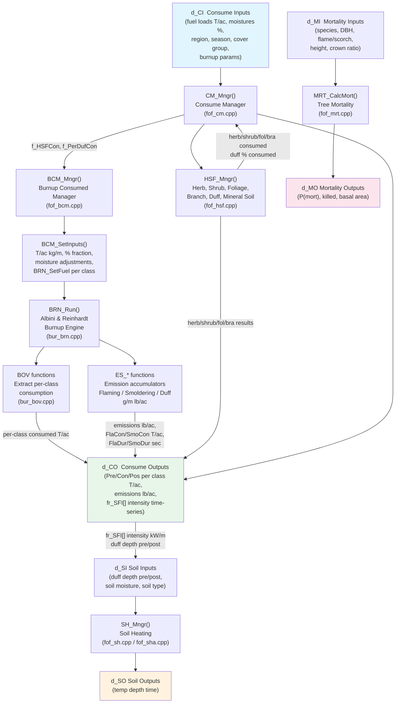
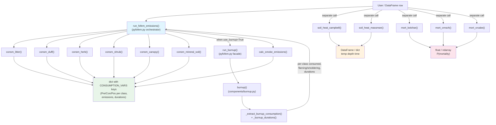

# pyfofem - Codebase Reference

This document describes the architecture, data flow, and conventions of both the
Python `pyfofem` library and the C++ FOFEM reference it ports.  It serves as the
single source of truth for contributors and reviewers.

---

## Repository Layout

```text
pyfofem/
|-- src/pyfofem/                   # <- Python library (the deliverable)
|   |-- __init__.py                #    Public API re-exports
|   |-- pyfofem.py                 #    Core orchestrator module
|   |-- components/
|   |   |-- burnup.py              #    Albini & Reinhardt burnup engine
|   |   |-- burnup_calcs.py        #    Burnup adapters / class mapping
|   |   |-- consumption_calcs.py   #    Consumption equations
|   |   |-- emission_calcs.py      #    Emissions modes
|   |   |-- mortality_calcs.py     #    Mortality equations
|   |   |-- tree_flame_calcs.py    #    Fire behavior + geometry helpers
|   |   `-- soil_heating.py        #    Campbell + Massman HMV soil models
|   `-- supporting_data/
|       |-- species_codes_lut.csv  #    Species <-> FOFEM-code mapping
|       `-- FOFEM6.7/              #    Bundled FOFEM data files
|
|-- dependencies/fofem_cpp/        # <- Official C++ FOFEM reference source
|   |-- FOF_UNIX/                  #    Portable core science code
|   |-- FOF_DLL/                   #    Windows DLL + Massman HMV solver
|   |-- FOF_GUI/                   #    Windows .NET GUI
|   `-- SWIG/                      #    Auto-generated C# interop
|
|-- docs/reference/
|   |-- code/burnup/               #    Standalone burnupw.cpp baseline
|   `-- papers/                    #    Literature references
|
|-- tests/
|   |-- fofem_emissions_example.py
|   |-- test_cpp_comparison.py
|   |-- compare_cpp_python.py
|   `-- test_data/
|       |-- test_inputs/
|       `-- _results/
|
|-- CODEBASE.md                    # <- This file
|-- MISSING_COMPONENTS.md
`-- README.md
```

---

### Current parity/testing additions

- `tests/test_cpp_comparison.py` provides direct Python-vs-C++ parity assertions.
- `tests/compare_cpp_python.py` runs scripted multi-case comparisons.
- `tests/fofem_emissions_example.py` is the current emissions batch/example driver.
- `dependencies/fofem_cpp/FOF_UNIX/test_harness.cpp` is the parameterized C++ CSV harness (`fofem_test`).

## Architecture Overview

### Python Library (`src/pyfofem/`)

The library is organised as a top-level orchestrator module (`pyfofem.py`)
plus multiple specialized modules under `components/`. Every public function accepts
both scalar and NumPy array inputs (internally converting to arrays and
converting back via `_is_scalar` / `_maybe_scalar`).

| Layer | Files | Responsibility |
|-------|-------|----------------|
| **Public API** | `__init__.py` | Re-exports all public symbols from `pyfofem.py` and `components/` |
| **Core Orchestrator** | `pyfofem.py` | High-level facades (`run_fofem_mortality`, `run_fofem_emissions`) and pipeline wiring |
| **Burnup Engine** | `components/burnup.py` | Albini & Reinhardt post-frontal combustion simulation (ported from C++) |
| **Burnup Facade/Adapters** | `components/burnup_calcs.py` | `run_burnup`, cell workers, summary extraction, class ordering/mapping |
| **Consumption Equations** | `components/consumption_calcs.py` | Litter/duff/herb/shrub/canopy/mineral-soil equations and carbon |
| **Emissions** | `components/emission_calcs.py` | `legacy` / `default` / `expanded` emissions modes and EF CSV loading |
| **Mortality** | `components/mortality_calcs.py` | `mort_crnsch`, `mort_bolchar`, `mort_crcabe` |
| **Tree/Flame Utilities** | `components/tree_flame_calcs.py` | Scorch/flame/char/canopy helper calculations |
| **Soil Heating** | `components/soil_heating.py` | Campbell (1D equilibrium) and Massman HMV (non-equilibrium) models using `scipy.integrate.solve_ivp` |
| **Data** | `supporting_data/` | Species lookup CSV, emission factor CSV, bundled FOFEM 6.7 files |

### C++ Reference (`dependencies/fofem_cpp/`)

The C++ codebase follows a **manager-pattern** with struct-in / struct-out
interfaces.  Each subsystem has:
- An **input struct** (`d_CI`, `d_SI`, `d_MI`) with an `*_Init()` function
- An **output struct** (`d_CO`, `d_SO`, `d_MO`)
- A **manager function** (`CM_Mngr`, `SH_Mngr`, `MRT_CalcMort`)

Key build targets in `CMakeLists.txt`:
- `fofem` - standalone CLI executable (from `FOF_UNIX/`)
- `fofem_debug_c` - shared library
- `FOFEMd` - DLL with SWIG C# bindings
- `fofem_test` - parameterized C++ CSV harness for parity testing

| C++ Module | Key Files | Python Equivalent |
|------------|-----------|-------------------|
| Consume Manager | `fof_cm.cpp` | `run_fofem_emissions()` |
| HSF Manager (herb/shrub/fol/duff/mineral) | `fof_hsf.cpp` | `consm_herb()`, `consm_shrub()`, `consm_canopy()`, `consm_duff()`, `consm_mineral_soil()`, `consm_litter()` |
| Burnup Consumed Manager | `fof_bcm.cpp` | `run_burnup()` + `_extract_burnup_consumption()` |
| Burnup Engine | `bur_brn.cpp` / `burnupw.cpp` | `components/burnup.py -> burnup()` |
| Burn Output Vectors | `bur_bov.cpp` | `_extract_burnup_consumption()` |
| Smoke Emissions | `bur_brn.cpp` (ES_* functions) | `calc_smoke_emissions()` |
| New Emission System | `fof_nes.cpp` | `calc_smoke_emissions(mode='expanded')` |
| Soil Heating (Campbell) | `fof_sh.cpp`, `fof_sha.cpp` | `soil_heat_campbell()` |
| Soil Heating (Massman HMV) | `FOF_DLL/HMV_Model.cpp`, `SolveHMV.cpp`, `CrankNicolson.cpp`, etc. | `soil_heat_massman()` |
| Tree Mortality | `fof_mrt.cpp` | `mort_crnsch()`, `mort_crcabe()`, `mort_bolchar()` |
| Display / I/O | `fof_disp.cpp` | N/A (Python returns dicts/DataFrames) |
| Cover-type Lookup | `CVT_SAF.cpp`, `CVT_NVCS.cpp`, `CVT_FCCS.cpp` |  Not ported |
| Batch Processing | `FOF_GUI/Bat_Mai.cpp`, `BAT_*.cpp` |  Not ported |

---

## Data Flow

### C++ FOFEM Pipeline (official)



### Python pyfofem Pipeline



---

## Key C++ Files (`FOF_UNIX/`) and Responsibilities

### Entry Points and Managers

| File | Function(s) | Purpose |
|------|-------------|---------|
| `ansi_mai.cpp` | `main()`, `ConEmiSoi()` | CLI entry point; sample code demonstrating the full pipeline |
| `fof_cm.cpp` | `CM_Mngr()` | **Master orchestrator**  calls `HSF_Mngr` then `BCM_Mngr`, sums totals |
| `fof_hsf.cpp` | `HSF_Mngr()`, `Calc_Herb()`, `Calc_Shrub()`, `Calc_CrownFoliage()`, `Calc_CrownBranch()` | Non-burnup fuel consumption (herb, shrub, foliage, branch, duff, mineral soil) |
| `fof_bcm.cpp` | `BCM_Mngr()`, `BCM_SetInputs()`, `BCM_DW10M_Adj()`, `BCM_DW1k_MoiRot()` | Converts T/ackg/m, applies moisture adjustments, feeds fuel to burnup, extracts results |

### Burnup Engine

| File | Function(s) | Purpose |
|------|-------------|---------|
| `bur_brn.cpp` | `BRN_Init()`, `BRN_SetFuel()`, `BRN_SetFireDat()`, `BRN_Run()`, `BRN_CheckData()` | FOFEM's wrapper around the Albini/Reinhardt burnup simulation; also hosts emission accumulators (`ES_*`) |
| `bur_bov.cpp` | `BOV_Init()`, `BOV_Entry()`, `BOV_Get()`, `BOV_Get3()` | Burn Output Vectors  maps burnup's sorted component indices back to named fuel classes (litter, DW1, DW10, DW100, DW1kSnd, DW1kRot by size) |

### Fuel Consumption Sub-Models

| File | Equations | Purpose |
|------|-----------|---------|
| `fof_duf.cpp` | Eqs 120 | Duff consumption and depth reduction |
| `fof_lem.cpp` | Eqs 997999 | Litter consumption (including SE and Pine Flatwoods) |
| `fof_sd.cpp` | Eq 10+ | Mineral soil exposure |
| `fof_hsf.cpp` | Eqs 22236 | Herb and shrub consumption (region/cover-group dispatch) |

### Emissions

| File | Purpose |
|------|---------|
| `bur_brn.cpp` (ES_* functions) | Default Ward et al. 1993 emission factors; accumulates flaming/smoldering/duff emissions in g/m |
| `fof_nes.cpp` | "New Emission System"  loads `Emission_Factors.csv`, provides per-group factors for 8 vegetation types |
| `fof_co.h` | `d_CO` output struct with `f_PM10F`, `f_PM25S`, etc. in **lb/acre** |

### Soil Heating

| File | Purpose |
|------|---------|
| `fof_sh.cpp`, `fof_sha.cpp` | Campbell 1D equilibrium model; receives `fr_SFI[]` intensity time-series from burnup |
| `FOF_DLL/HMV_Model.cpp`, `SolveHMV.cpp`, `CrankNicolson.cpp`, `cal*.cpp` (~50 files) | Full Massman non-equilibrium heat-moisture-vapor PDE solver. **Only in FOF_DLL**, not FOF_UNIX. |

### Mortality

| File | Purpose |
|------|---------|
| `fof_mrt.cpp` | Species-specific mortality equations; dispatches by species code to crown scorch, bole char, or crown volume models |
| `fof_iss.h` | Internal species struct (bark coefficients, equation codes) |

### Data Structures

| File | Struct | Fields | Purpose |
|------|--------|--------|---------|
| `fof_ci.h` | `d_CI` | ~60 fields | All consume inputs: fuel loads (T/ac), moistures (%), region, season, cover group, burnup parameters, emission factor settings |
| `fof_co.h` | `d_CO` | ~100 fields | All consume outputs: Pre/Con/Pos per class (T/ac), emissions (lb/ac), `fr_SFI[]` intensity array, FlaCon/SmoCon, durations |
| `fof_sh.h` / `fof_sh2.h` | `d_SI` / `d_SO` | ~30 fields | Soil heating input/output |
| `fof_mrt.h` | `d_MI` / `d_MO` | ~25 fields | Mortality input/output |
| `fof_sgv.h` | `d_SGV` | 6 fields | Per-timestep fire intensity record for soil heating |
| `bur_bov.h` | (internal) |  | Burn output vector index mapping |

---

## Unit Conventions

| Context | Loads | Depth | Moisture | Temperature | Emissions | Intensity |
|---------|-------|-------|----------|-------------|-----------|-----------|
| **C++ external API** | T/acre | inches | % (whole) | C | lb/acre | kW/m^2 |
| **C++ burnup internal** | kg/m^2 | meters | fraction | K |  | kW/m^2 |
| **Python `units='Imperial'`** | T/acre | inches | % (whole) | C | lb/acre | kW/m^2 |
| **Python `units='SI'`** | kg/m^2 | cm | % (whole) | C | g/m^2 | kW/m^2 |
| **Python burnup engine** | kg/m^2 | meters | fraction | K (internal) |  | kW/m^2 |

### Key C++ conversion functions (in `fof_util.cpp`)
- `TPA_To_KiSq()`  T/acre -> kg/m^2
- `KgSq_To_TPA()`  kg/m^2 -> T/acre
- `GramSqMt_To_Pounds()`  g/m^2 -> lb/acre

### Python constants (in `pyfofem.py`)
- `_TPAC_TO_KGPM2 = 1/4.4609`  T/acre -> kg/m^2
- `_KGPM2_TO_TPAC = 4.4609`  kg/m^2 -> T/acre
- `_IN_TO_CM = 2.54`  inches -> cm

---

## Implicit Assumptions and Gotchas

### 1. C++ moisture adjustments (historical gap now resolved)

The C++ `BCM_SetInputs()` applies moisture adjustments before feeding burnup:

| Fuel Class | C++ Adjustment | Python `run_fofem_emissions` |
|------------|----------------|------------------------------|
| 1-hr | `DW10_moisture - 0.02` | Uses `dw10_moist / 100 - 0.02` |
| 10-hr | `DW10_moisture` (as-is) | Uses `dw10_moist / 100` |
| 100-hr | `DW10_moisture + 0.02` | Uses `dw10_moist / 100 + 0.02` |
| 1000-hr sound | `DW1000_moisture / 100` | Same |
| 1000-hr rotten | `DW1000_moisture / 100 * 2.5` (capped at 3.0) | Same as C++ |

**RESOLVED:** The rotten moisture multiplier (`e_DW1000hr_AdjRot = 2.5`, capped at 3.0) and the +/-0.02 fine-fuel adjustments from `BCM_DW10M_Adj()` are now implemented in `run_fofem_emissions()`.

Current Python behavior now matches C++ for burnup-input moisture adjustments:
- 1-hr uses `dw10_moist/100 - 0.02`
- 10-hr uses `dw10_moist/100`
- 100-hr uses `dw10_moist/100 + 0.02`
- rotten 1000-hr uses `min((dw1000_moist/100) * 2.5, 3.0)`

### 2. C++ ensures at least one burnable fuel particle is present

`BCM_SetInputs()` injects `f_Load = 0.0000001` into 1-hr wood when needed so burnup has at least one fuel particle (notably duff-only scenarios). **RESOLVED:** Python mirrors this with `1e-7` kg/m^2 DW1 injection for duff-only/no-wood cases.

### 3. C++ litter handling: burnup always processes litter for emissions

Even when SouthEast or Pine Flatwoods equations compute litter consumption separately, the C++ still sends the consumed amount into burnup so it can calculate fire intensity and emissions from it (Note-2/3 in `BCM_Mngr`). The Python `run_fofem_emissions` sends the full pre-fire litter load into burnup and lets burnup consume it, then optionally overrides with the regional equation result.

### 4. `run_burnup()` returns a 3-tuple, not 2

Changed from `(results, summary)` to `(results, summary, class_order)` to
support mapping burnup's sorted component indices back to named fuel classes.
**External callers must unpack all three.**

### 5. Burnup sorts fuel classes internally

The burnup engine sorts particles by decreasing SAV (increasing size), then
moisture, then density.  The `BurnSummaryRow` list and `BurnResult.comp_flaming`
/ `comp_smoldering` arrays follow this **sorted** order, not the input order.
`class_order` (returned by `run_burnup`) provides the mapping.

### 6. Rotten wood: C++ uses `BRN_SetFuel("ROT", ...)` for lower density

In the C++, `BRN_SetFuel` with the `"ROT"` flag applies `dendry = 300 kg/m^3`
(vs. 513 for `"SND"`).  The Python replicates this via `_DENSITY_ROTTEN = 300`
and `_DENSITY_SOUND = 513` in both `run_fofem_emissions` and `run_burnup`
when rotten classes are provided.

### 7. Duff moisture validation prevents burnup from running

The burnup engine validates duff moisture in the range 0.1-1.972 (10-197.2%).
High duff moisture (common in spring burns) causes `BurnupValidationError`,
at which point `run_fofem_emissions` falls back to simplified percentage
defaults with `warnings.warn()`.

### 8. `hfi` units ambiguity

The `run_fofem_emissions` docstring describes `hfi` as "Head fire intensity
(kW/m)" (Byram's fireline intensity, energy per metre of fire front), but the
burnup engine expects `fi` as "fire intensity (kW/m^2)" (area-based).  The C++
`d_CI.f_INTENSITY` comment says "kW/m2 sq m".  **The Python passes the value
through without conversion.**

### 9. `comp_flaming` / `comp_smoldering` are rates, not masses

`BurnResult.comp_flaming[i]` stores the mass-loss **rate** (kg/m^2/s)
accumulated during that recording interval.  To get consumed mass, multiply
by the timestep `dt`.  `_extract_burnup_consumption()` handles this.

### 10. Emissions mode selection matters for parity

In C++, emissions can be calculated with:
- legacy/original `ES_Calc` (combustion-efficiency factors, selected when `f_CriInt < 0`)
- expanded `ES_Calc_NEW` (separate flaming/coarse-smolder/duff EF groups).

Python now exposes this explicitly via `calc_smoke_emissions(mode=...)` and
`run_fofem_emissions(em_mode=...)`:
- `legacy` for C++ GUI/original parity
- `default` for single-group EF CSV mode
- `expanded` for split-group EF CSV mode

### 11. C++ emissions are in g/m, converted to lb/acre at output

All `ES_*` functions return g/m.  `BCM_Mngr` converts to lb/acre via
`GramSqMt_To_Pounds()`.  The Python `calc_smoke_emissions` can output
either lb/acre (`units='Imperial'`) or g/m (`units='SI'`).

### 12. Season strings are normalized to canonical labels in Python

C++ defines `"Summer"`, `"Spring"`, `"Winter"`, `"Fall"`. Python normalizes
input season strings to canonical title-case labels before equation routing.

### 13. Soil heating is decoupled in Python

The C++ pipes `fr_SFI[]` (burnup intensity time-series) directly from `d_CO`
into `SH_Mngr`.  In Python, soil heating must be called separately.
`run_fofem_emissions` sets `Lay*` keys to `NaN`  the caller feeds burnup
results into `soil_heat_campbell()` or `soil_heat_massman()`.

### 14. C++ `cheat` upper limit is 3000, Python now matches

The C++ `bur_brn.h` changed the limit from 2000 to 3000.  ** RESOLVED: Python's `_FUEL_BOUNDS` now uses 3000 (matching C++).**

### 15. FlaDur/SmoDur units now aligned

C++ `d_CO.f_FlaDur` / `f_SmoDur` are in **seconds**.  ** RESOLVED: Python's `_burnup_durations()` and `run_fofem_emissions()` now return durations in seconds.**

---

## Mapping: Python CONSUMPTION_VARS  C++ d_CO Fields

| Python Key | C++ `d_CO` Field | Units (Imperial) |
|------------|------------------|------------------|
| `LitPre` / `LitCon` / `LitPos` | `f_LitPre` / `f_LitCon` / `f_LitPos` | T/acre |
| `DW1Pre` / `DW1Con` / `DW1Pos` | `f_DW1Pre` / `f_DW1Con` / `f_DW1Pos` | T/acre |
| `DW10Pre` / `DW10Con` / `DW10Pos` | `f_DW10Pre` / `f_DW10Con` / `f_DW10Pos` | T/acre |
| `DW100Pre` / `DW100Con` / `DW100Pos` | `f_DW100Pre` / `f_DW100Con` / `f_DW100Pos` | T/acre |
| `DW1kSndPre` / `DW1kSndCon` / `DW1kSndPos` | `f_Snd_DW1kPre` / `f_Snd_DW1kCon` / `f_Snd_DW1kPos` | T/acre |
| `DW1kRotPre` / `DW1kRotCon` / `DW1kRotPos` | `f_Rot_DW1kPre` / `f_Rot_DW1kCon` / `f_Rot_DW1kPos` | T/acre |
| `DufPre` / `DufCon` / `DufPos` | `f_DufPre` / `f_DufCon` / `f_DufPos` | T/acre |
| `DufDepPre` / `DufDepCon` / `DufDepPos` | `f_DufDepPre` / `f_DufDepCon` / `f_DufDepPos` | inches |
| `HerPre` / `HerCon` / `HerPos` | `f_HerPre` / `f_HerCon` / `f_HerPos` | T/acre |
| `ShrPre` / `ShrCon` / `ShrPos` | `f_ShrPre` / `f_ShrCon` / `f_ShrPos` | T/acre |
| `FolPre` / `FolCon` / `FolPos` | `f_FolPre` / `f_FolCon` / `f_FolPos` | T/acre |
| `BraPre` / `BraCon` / `BraPos` | `f_BraPre` / `f_BraCon` / `f_BraPos` | T/acre |
| `MSE` | `f_MSEPer` | % |
| `PM10F` / `PM10S` /  | `f_PM10F` / `f_PM10S` /  | lb/acre |
| `FlaDur` / `SmoDur` | `f_FlaDur` / `f_SmoDur` | sec |
| `FlaCon` / `SmoCon` | `f_FlaCon` / `f_SmoCon` | T/acre |

---

## Implementation Status

| Component | Status | Notes |
|-----------|--------|-------|
| Bark thickness |  Done | `calc_bark_thickness` |
| Scorch height / flame length / char height |  Done | `calc_scorch_ht`, `calc_flame_length`, `calc_char_ht` |
| Crown length / volume scorched |  Done | `calc_crown_length_vol_scorched` |
| Canopy cover |  Done | `calc_canopy_cover` |
| Carbon calculation |  Done | `calc_carbon` |
| Moisture regime lookup |  Done | `get_moisture_regime` |
| Litter consumption |  Done | `consm_litter` |
| Duff consumption |  Done | `consm_duff` |
| Herbaceous consumption |  Done | `consm_herb` |
| Shrub consumption |  Done | `consm_shrub` |
| Canopy consumption |  Done | `consm_canopy` |
| Mineral soil exposure |  Done | `consm_mineral_soil` |
| Burnup engine |  Done | `components/burnup.py`  verified against C++ `burnupw.cpp` |
| Burnup facade |  Done | `run_burnup` |
| Smoke emissions (legacy) |  Done | `calc_smoke_emissions(mode='legacy')` (C++ ES_Calc parity) |
| Smoke emissions (default) |  Done | `calc_smoke_emissions(mode='default')` |
| Smoke emissions (expanded) |  Done | `calc_smoke_emissions(mode='expanded')` |
| Master orchestrator |  Done | `run_fofem_emissions`  integrates burnup for woody/duff |
| Crown scorch mortality |  Done | `mort_crnsch` |
| Crown volume + cambium mortality |  Done | `mort_crcabe` |
| Bole char mortality |  Done | `mort_bolchar` |
| Soil heating  Campbell |  Done | `soil_heat_campbell` |
| Soil heating  Massman HMV |  Done | `soil_heat_massman` |
| Moisture adjustments (0.02, 2.5 rotten) |  Done | See `run_fofem_emissions()`  Gotcha #1 resolved |
| Zero-load guard (`1e-7` kg/m^2 in DW1) |  Done | See `run_fofem_emissions()`  Gotcha #2 resolved |
| Batch processing driver/example |  Done (example) | `tests/fofem_emissions_example.py` performs array/batch runs and writes CSV outputs |
| Cover-type auto-lookup (SAF/NVCS/FCC) |  Not started | C++: `CVT_*.cpp` / `fof_fccs.csv` |
| Weight distribution (1000-hr  size classes) |  Not started | C++: `cr_WD` in `d_CI` |
| Duration units reconciliation (sec vs min) |  Done | `_burnup_durations()` and `run_fofem_emissions()` now return seconds  Gotcha #15 resolved |


