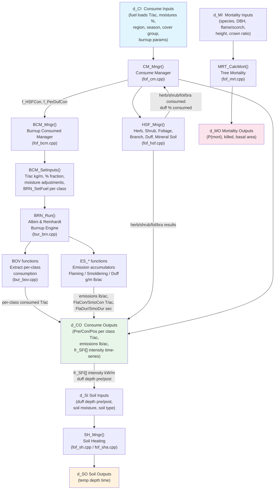
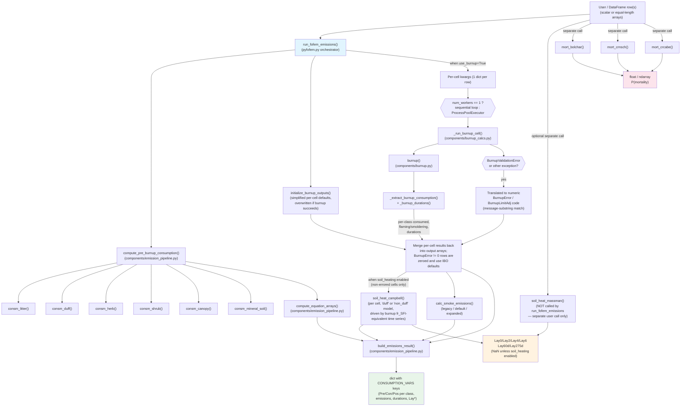

# pyfofem - Codebase Reference

This document describes the architecture, data flow, and conventions of both the
Python `pyfofem` library and the C++ FOFEM reference it ports.  It serves as the
single source of truth for contributors and reviewers.

---

## Repository Layout

```text
pyfofem/
|-- src/pyfofem/                       # <- Python library (the deliverable)
|   |-- __init__.py                    #    Public API re-exports (from pyfofem.py)
|   |-- pyfofem.py                     #    Core orchestrator module
|   |-- components/
|   |   |-- __init__.py                #    Re-exports every component's public symbols
|   |   |-- _component_helpers.py      #    Shared scalar/array plumbing (cross-cutting)
|   |   |-- burnup.py                  #    Albini & Reinhardt burnup engine
|   |   |-- burnup_calcs.py            #    Burnup adapters / class mapping / per-cell worker
|   |   |-- consumption_calcs.py       #    Consumption equations
|   |   |-- emission_calcs.py          #    Emissions modes
|   |   |-- emission_pipeline.py       #    run_fofem_emissions orchestration helpers
|   |   |-- mortality_calcs.py         #    Mortality equations
|   |   |-- tree_flame_calcs.py        #    Fire behavior + geometry helpers
|   |   `-- soil_heating.py            #    Campbell + Massman HMV soil models
|   `-- supporting_data/
|       |-- species_codes_lut.csv      #    Species <-> FOFEM-code mapping (runtime table, in the wheel)
|       |-- emissions_factors.csv      #    Emission-factor groups (runtime table, in the wheel)
|       `-- FOFEM6.7/                  #    Bundled FOFEM data files (NOT in the wheel)
|
|-- reference/fofem_cpp/               # <- Official C++ FOFEM reference source
|   |-- FOF_UNIX/                      #    Portable core science code
|   |-- FOF_DLL/                       #    Windows DLL + Massman HMV solver
|   |-- FOF_GUI/                       #    Windows .NET GUI
|   `-- SWIG/                          #    Auto-generated C# interop
|
|-- docs/reference/
|   |-- code/burnup/                   #    Standalone burnupw.cpp baseline
|   `-- papers/                        #    Literature references
|
|-- tests/                             #    pytest package (`tests/__init__.py`); testpaths=["tests"]
|   |-- __init__.py                    #    Package marker for `tests.*` qualified imports
|   |-- _support.py                    #    Shared path constants; never inserts src/ onto sys.path
|   |-- conftest.py                    #    Fixtures, marker registration, installed-only session hook
|   |-- run_unified_tests.py           #    `--suite core|full`, `--installed-only` test runner
|   |-- prepare_cpp_reference.py       #    Regenerates C++ reference fixtures
|   |-- compare_cpp_python_soil_heating.py       # Scripted Lay* parity comparison driver
|   |-- unit/                          #    Golden-CSV + non-C++-live unit tests
|   |   |-- test_consumption_golden.py #    Golden-value regression tests for consumption equations
|   |   |                                    (split from the pre-Phase-1 test_equations_golden.py;
|   |   |                                    keeps the CSV-driven parametrized coverage)
|   |   |-- test_burnup_golden.py      #    Golden-value regression tests for burnup()
|   |   |-- test_equation_routing.py   #    Equation-ID output regression tests (was test_emission_equation_ids.py)
|   |   |-- test_run_unified_tests_contract.py  # Phase 1: installed-only parent/child contract
|   |   |-- test_golden_manifest_validator.py   # Phase 2: manifest builder/validator (no live build)
|   |   |-- test_proc.py               #    Phase 2: bounded subprocess + process-tree kill helper
|   |   |-- test_tolerance_policy_completeness.py  # Phase 2: tolerance_policy.json schema/coverage
|   |   |-- test_tree_flame_contracts.py        # Phase 3: calc_scorch_ht / calc_flame_length contracts
|   |   |-- test_tree_flame_source_relations.py # Phase 3: calc_char_ht / calc_crown_length_vol_scorched
|   |   |                                         hand-derived vs pinned fof_mrt.cpp (no live parity)
|   |   |-- test_utility_contracts.py  #    Phase 3: calc_carbon + get_moisture_regime
|   |   |-- test_public_constants.py   #    Phase 3: all 11 exported constants/data objects
|   |   |-- test_runtime_data_resources.py      # Phase 3: both runtime CSVs (schema/provenance/resource)
|   |   `-- test_burnup_component_api.py        # Phase 3: FuelParticle/BurnResult/BurnSummaryRow/
|   |                                             BurnupValidationError/burnup
|   |-- integration/                   #    Full-pipeline (`run_fofem_emissions`) tests
|   |   |-- test_run_fofem_emissions.py         # Output-dict key/shape contract tests
|   |   |                                         (was test_run_fofem_emissions_output_keys.py)
|   |   `-- test_soil_heating_pipeline.py       # Invalid soil_family error-handling tests
|   |                                             (was test_soil_heating_invalid_soil_family.py)
|   |-- regression/                    #    Named historical-bug regression tests
|   |   |-- test_equations_golden_fixes.py      # Fix A-D classes (split from the pre-Phase-1
|   |   |                                         test_equations_golden.py)
|   |   `-- test_pr1_review_regressions.py
|   |-- cpp_parity_live/               #    Tests requiring the compiled C++ reference
|   |   |-- test_compare_cpp_python.py #    Python-vs-C++ multi-case parity assertions
|   |   |-- test_cpp_comparison.py     #    Python-vs-C++ parity vs. reference/fofem_cpp/load.txt, emis.txt
|   |   `-- test_soil_heating_cpp_parity.py     # Soil Lay* parity vs C++ soil.tmp
|   `-- test_data/
|       |-- test_inputs/
|       `-- _results/
|
|-- examples/
|   |-- emissions_batch.py             #    Batch/array usage driver, writes CSV output
|   `-- example_data/                  #    fofem_emissions_batch_test.csv
|
|-- docs/CODEBASE.md                   # <- This file
`-- README.md
```

---

### Current parity/testing additions

- `tests/cpp_parity_live/test_cpp_comparison.py` provides direct Python-vs-C++ parity assertions against `reference/fofem_cpp/load.txt` and `emis.txt`.
- `tests/cpp_parity_live/test_compare_cpp_python.py` runs scripted multi-case comparisons against the (pre-Phase-2) C++ CSV harness output.
- `tests/cpp_parity_live/test_soil_heating_cpp_parity.py` and `tests/compare_cpp_python_soil_heating.py` validate soil `Lay*` parity vs C++ `soil.tmp`.
- `tests/run_unified_tests.py --suite core|full` is the current publish-oriented test runner (see `README.md`).
- `examples/emissions_batch.py` (not under `tests/`) is the current emissions batch/example driver.
- `reference/fofem_cpp_overlay/source/FOF_UNIX/test_harness.cpp` (applied onto `reference/fofem_cpp/FOF_UNIX/test_harness.cpp`, never committed inside the submodule) is the **Phase 2** C++ oracle harness (`fofem_test`), superseding the old single-mode ("consume" only) harness this section previously described. It implements six modes — `consume`, `litter_eq`, `shrub_herb_eq`, `mortality`, `bark_thick`, `canopy_cover` — per `development/plans/gate0/05-harness-contract.md`; `soil_campbell` is Phase 5's. `mortality`/`bark_thick`/`canopy_cover` require an explicit `--species-csv <path>` (real production loader `MRT_LoadSpe()`, not `MRT_InitST()` — see that file's own header comment and the Gate 0 correction recorded in `03-cpp-crosswalk.md`/`05-harness-contract.md`).
- `tests/cpp_parity_live/_harness_support.py` locates the MSVC/CMake/Ninja toolchain (via `vswhere.exe`), builds `fofem_test.exe`, and drives it from Python.
- `tests/cpp_parity_live/_golden_manifest.py` builds/validates the provenance manifest every Phase 2 golden dataset carries (upstream SHA, overlay digests, compiler/toolchain identity, input/output/side-file hashes, generation timestamp, pyfofem commit, and exact scenario-applicable tolerance-policy references/divergences). Validation fails closed on omitted/cross-mode policy keys and re-derives the expected divergence list from the canonical route contract. Validated by `tests/unit/test_golden_manifest_validator.py` (no live build needed).
- `tests/cpp_parity_live/test_cpp_harness_contract.py` implements the full 19-row + 11a-11g self-test matrix from `gate0/05-harness-contract.md` §10 against the live compiled binary (192 tests as of Phase 2 final approval; requires the MSVC toolchain, skips cleanly if absent).
- `tests/cpp_parity_live/generate_phase2_goldens.py` generates the one qualifying golden dataset per mode under `tests/test_data/test_golden_output/phase2/<mode>/`, each with a `<mode>.manifest.json`. `--verify-only` proves deterministic regeneration without overwriting.

#### Phase 3 test architecture (2026-08-31) — Python-only, data, and relation-level contracts

Phase 3 adds six `tests/unit/` modules, all registered in `CORE_TESTS`
(`tests/run_unified_tests.py`). None builds or runs C++. Each module's
docstring classifies every test it contains as one of three categories,
and that classification is the durable convention for this suite:

- **(a) Python contract/equation test** — asserts documented equations, or
  explicitly identified current Python behaviour including known contract
  defects pinned for visibility, against hand-derived expected values. Makes
  no C++ parity claim, and does not endorse defective behaviour as desired
  API design.
- **(b) Source-relation cross-check** — hand-derived against a pinned C++
  expression that cannot be executed in isolation. Cites the exact
  pinned file:line. **Makes no executable-parity claim.**
- **(c) Executable C++ parity** — compares against output from a live
  pinned-C++ run. Phase 3 contains **none**; that lives in
  `tests/cpp_parity_live/` and the manifested `phase2/` goldens.

| Module | Covers | Category mix |
|---|---|---|
| `unit/test_tree_flame_contracts.py` | `calc_scorch_ht` (eq 8/9/10), `calc_flame_length` (Byram/Butler/Thomas/char-height) | all (a) |
| `unit/test_tree_flame_source_relations.py` | `calc_char_ht`, `calc_crown_length_vol_scorched` | (b) value tests, (a) shape/clamp/warning tests |
| `unit/test_utility_contracts.py` | `calc_carbon`, `get_moisture_regime` | (b) carbon factors, (a) everything else |
| `unit/test_public_constants.py` | all 11 exported constants/data objects | all (a) |
| `unit/test_runtime_data_resources.py` | both runtime CSVs + packaging/resource resolution | (a), plus one (b) provenance digest |
| `unit/test_burnup_component_api.py` | `FuelParticle`, `BurnResult`, `BurnSummaryRow`, `BurnupValidationError`, `burnup` | all (a) |

**Why `calc_scorch_ht`/`calc_flame_length` are never compared to C++.**
`fof_util.cpp:95-102` `Calc_Scorch` converts *flame length to scorch
height* and `fof_util.cpp:111-118` `Calc_Flame` converts *scorch height
back to flame length*; Python takes fire intensity (plus optional
ambient temperature and in-stand wind) and uses Byram/Butler/Thomas.
Different APIs — not parity oracles (Gate 0 `03-cpp-crosswalk.md` rows
6-7). `calc_char_ht` and `calc_crown_length_vol_scorched` have pinned
C++ expressions (`fof_mrt.cpp:396-397` and `:315-327`) whose
intermediates `f_Fl`/`f_CK`/`f_CSL` are `MRT_Calc` **locals** absent
from `d_MO` (finding F-30), so they get source-relation tests only.

**Runtime-resource-loading pattern (verified, not assumed).** Neither
loader uses `importlib.resources`. Both build a path from the defining
module's own `__file__`:

- `components/tree_flame_calcs.py` — `os.path.join(os.path.dirname(__file__),
  '..', 'supporting_data', 'species_codes_lut.csv')`, read **eagerly at
  import time** into `SPP_CODES`.
- `components/emission_calcs.py` — `_EF_CSV_DEFAULT`, same construction,
  read lazily and cached by `_load_ef_csv()`.

That is *package*-relative, not repo-relative, so it resolves correctly
from an installed wheel and is independent of the process's working
directory. `unit/test_runtime_data_resources.py` asserts both properties,
including a real child-process probe launched from an unrelated working
directory with `PYTHONPATH` cleared (bounded and process-tree-cleaned via
`tests/cpp_parity_live/_proc.run_bounded`). The one case the `__file__`
approach does **not** cover is a zipimported package, where
`importlib.resources` would be required; pyfofem ships a plain wheel, so
this is recorded as a known limitation, not a defect.

**Wheel-isolation mechanism.** Two layers, both required:

1. In-suite: `tests/run_unified_tests.py --installed-only` sets
   `PYFOFEM_INSTALLED_ONLY=1` on the pytest subprocess and
   `tests/conftest.py::pytest_sessionstart` aborts the session if
   `pyfofem` resolves beneath the checkout's `src/` (Phase 1 contract,
   covered by `unit/test_run_unified_tests_contract.py`). No test module
   anywhere inserts `src/` onto `sys.path`.
2. Out-of-checkout proof (run per phase, not part of the suite): build a
   wheel with `python -m build --wheel`, create a throwaway virtualenv
   **outside** the checkout, install only the wheel plus `pytest`/`psutil`,
   then run `--suite core --installed-only` and `--suite full
   --installed-only` with that interpreter. The wheel's contents are also
   asserted to be exactly the two runtime CSVs with no `.exe`/`.dll`/
   `.pdf`/`.ico`/`.lnk`/`.bat` — the packaging-config half of that
   assertion is in-suite
   (`unit/test_runtime_data_resources.py::test_packaging_config_ships_both_runtime_csvs_and_no_vendor_binaries`),
   which converts Gate 0 `06-runtime-tables.md` §3's *accidental*
   exclusion of `supporting_data/FOFEM6.7/` into an asserted contract.

**Version-brittleness note from that proof.** The isolated venv resolves
the newest dependency wheels (observed 2026-08-31: numpy 2.5.2, pandas
3.0.5, scipy 1.18.1, pytest 9.1.1), which caught one brittle assertion:
pandas 3.0 infers `StringDtype` where 1.x/2.x inferred `object`, so
text-column checks assert *value types* (`isinstance(value, str)`), never
dtype identity. This is an observation from one executed lane, **not** a
claim that pandas 3.x is a supported floor — the dependency support
matrix remains the release-readiness plan's Phase 3 work.

**Evidence-reconciliation pass (2026-08-31).** A follow-up
documentation-only pass corrected three claims that the Phase 3 tests had
already disproved by execution, and recorded two behaviours the tests pin
that were not previously written down anywhere durable. It changed no test
code, no production code, and no expected value:

- The char-height relation in the pinned mortality source is at
  `fof_mrt.cpp:396-397`, not `:394-395`. Every active citation was
  corrected; the earlier value survives only inside dated historical
  change records.
- `calc_scorch_ht`'s missing-input guard is **not** dead code. It fires
  for `None` and for object-dtype arrays containing `None`, and is inert
  only for a float array carrying `NaN`, so the real defect is a coverage
  gap rather than unreachable code. The separate `amb_t == 60`
  divide-by-zero is unaffected and still real.
- `calc_crown_length_vol_scorched(8.0, 10.0, 0.0)` returns
  `(0.0, nan, nan)` with two NumPy `RuntimeWarning`s, not `inf`/`nan`:
  `crown_length_scorched` is clipped to `[0, crown_depth]` before either
  division, so both divisions are `0/0`. C++ still returns `-1` with
  "Mortality Calculaton is attempting to Divide by 0"
  (`fof_mrt.cpp:329-333`), so the error-semantics divergence stands.
- Two dispatch behaviours are now recorded as findings rather than only in
  test comments: `calc_scorch_ht` selects its equation from `amb_t` alone,
  so an `instand_ws` supplied without an `amb_t` is silently discarded and
  equation 8 is used; and `calc_flame_length` gives `fire_intensity`
  undocumented precedence over `char_ht` when both are supplied. Both are
  **Python contract observations with no C++ oracle comparison**, and the
  tests that cover them pin *current* behaviour for visibility only — they
  are not an endorsement of either rule as correct API design.

#### Legacy/unverified golden audit (Phase 2, 2026-08-28)

None of the pre-Phase-2 golden files below carry a provenance manifest; do
not treat them as equivalent in rigor to the manifested `phase2/` goldens
above, and do not retroactively fabricate provenance for them:

| File | Status | Used by |
|---|---|---|
| `cpp_golden_summary.csv`, `cpp_golden_components.csv` | legacy/unverified — produced by the pre-Phase-2 single-mode harness | `test_compare_cpp_python.py` |
| `burnup_load_golden.csv`, `burnup_timeseries_golden.csv` | legacy/unverified | `test_burnup_golden.py` |
| `equation_unit_tests_golden.csv` | legacy/unverified | `test_consumption_golden.py` |
| `Emis.txt`, `Emission-Short-Default-Pound.csv`, `Emission-Summary-Default-Pound.csv`, `emissions_test_fromGUI_golden.csv` | legacy/unverified, and **orphaned** — not referenced by any currently active test module | none found |

> Note: as of this review, `MISSING_COMPONENTS.md` no longer exists in the repo root, and several test filenames previously documented here (`example_fofem_emissions_batch.py`, `compare_cpp_python.py`, `test_soil_cpp_parity.py`, `compare_cpp_python_soil.py`) have been renamed or moved — the listing above reflects the actual current filenames, verified 2026-08-26.

#### Phase 2 harness diagnostic builds (2026-08-28, round 3 correction pass) — tracked, reproducible record

Two builds are distinct, per the harness contract (`gate0/05-harness-contract.md` §11): the **golden/release build** (`reference/fofem_cpp/build/`, plain `cmake --build build --target fofem_test`, CMake's own `Debug` defaults — this is what `_harness_support.ensure_built()` produces and what every self-test/golden run uses) and the **diagnostic build** below (a separate directory, never used to generate an accepted golden). Toolchain: MSVC `cl.exe` 19.50.35728 (VS Build Tools 2026/18.4), MSVC toolset `14.50.35717`, CMake 4.2.3-msvc3, Ninja 1.12.1, all bundled inside the VS install and located via `vswhere.exe` (see `tests/cpp_parity_live/_harness_support.py`) — no hardcoded personal path, though the concrete install path below is THIS machine's actual discovered path (from `vswhere.exe`), substitute your own if it differs. Host: Windows 10 (10.0.19044), x86_64.

Every command below is genuine PowerShell (Windows PowerShell 5.1), tested end-to-end during this pass — no POSIX `\` line continuations, no mixed cmd.exe/PowerShell syntax. Run as ONE PowerShell invocation (sourcing `vcvars64.bat`'s environment does not persist across separate invocations/processes):

```powershell
$vsInstall = "C:\Program Files (x86)\Microsoft Visual Studio\18\BuildTools"
$vcvars = Join-Path $vsInstall "VC\Auxiliary\Build\vcvars64.bat"
$envLines = cmd.exe /c "call `"$vcvars`" >nul && set"
foreach ($line in $envLines) {
    if ($line -match "^([^=]+)=(.*)$") { Set-Item -Path "env:$($matches[1])" -Value $matches[2] }
}

# Golden/release build (CMake Debug defaults: /DWIN32 /D_WINDOWS /W3 /GR /EHsc,
# plus /MDd /Zi /Ob0 /Od /RTC1 from CMAKE_CXX_FLAGS_DEBUG)
cmake -S reference/fofem_cpp -B reference/fofem_cpp/build -G Ninja -DCMAKE_BUILD_TYPE=Debug
cmake --build reference/fofem_cpp/build --target fofem_test

# Diagnostic build: /W4 (stricter warnings) + /EHsc + MSVC AddressSanitizer,
# in a SEPARATE directory
cmake -S reference/fofem_cpp -B reference/fofem_cpp/build_diag -G Ninja `
      -DCMAKE_BUILD_TYPE=Debug "-DCMAKE_CXX_FLAGS=/W4 /EHsc /fsanitize=address"
cmake --build reference/fofem_cpp/build_diag --target fofem_test

# ASan's runtime DLL is not on PATH by default and must be copied next to
# the built exe (this machine's actual discovered MSVC toolset path):
$toolset = "C:\Program Files (x86)\Microsoft Visual Studio\18\BuildTools\VC\Tools\MSVC\14.50.35717"
Copy-Item "$toolset\bin\Hostx64\x64\clang_rt.asan_dynamic-x86_64.dll" reference\fofem_cpp\build_diag\

# /analyze static analysis, scoped to the harness's own file only (NOT the
# pinned FOF_UNIX/*.cpp sources, which are not ours to silence or fix)
$outDir = "$env:TEMP\analyze_out"
New-Item -ItemType Directory -Force -Path $outDir | Out-Null
Push-Location reference/fofem_cpp/FOF_UNIX
cl /nologo /c /EHsc /W4 /analyze test_harness.cpp "/Fo:$outDir\test_harness.obj"
Pop-Location
```

Selecting the diagnostic binary for a harness/pytest run uses the same, tested `FOFEM_TEST_HARNESS_EXE` override the Phase 2 test suite itself validates (`_harness_support.resolve_harness_exe()`, `test_cpp_harness_contract.py::test_harness_exe_override_rejects_a_nonexistent_path`/`test_harness_exe_override_is_used_when_valid`/`test_harness_exe_override_unset_resolves_to_default`) — it raises `HarnessConfigError` rather than silently falling back if the path does not exist:

```powershell
$env:FOFEM_TEST_HARNESS_EXE = "$(Get-Location)\reference\fofem_cpp\build_diag\fofem_test.exe"
python -m pytest tests/cpp_parity_live/test_cpp_harness_contract.py -q
```

**Results (2026-08-29, round 4 correction pass, against the harness as of this pass):**

- Golden/release build: 0 errors. Own file (`test_harness.cpp`) compiles with **zero warnings** even at `/W4` (stricter than the release build's own `/W3`). Warnings remain only in the pinned, untouched `FOF_UNIX/*.cpp` upstream sources (C4244/C4305/C4996/C4459/C4101/C4267 — narrowing conversions, deprecated CRT calls, shadowing, unused locals, size_t truncation) — pre-existing, not introduced by Phase 2, and out of scope to fix (pinned source).
- Full `test_cpp_harness_contract.py` matrix (192 tests) run against the NORMAL golden/release binary: **192 passed, 0 failed**.
- The SAME full 192-test matrix run against the ASan diagnostic binary via `FOFEM_TEST_HARNESS_EXE`, exactly as shown above: **192 passed, 0 failed** — a prior round's `test_harness_exe_override_unset_resolves_to_default` unconditionally asserted the override was unset, which was false whenever `FOFEM_TEST_HARNESS_EXE` was exported for the whole run (correctly reported then as "1 failed by design", but a diagnostic qualification gate may not contain an intentional failure); it now explicitly removes the override for its own scope via `monkeypatch.delenv`, so both runs are genuinely, completely green. 0 sanitizer findings across the full matrix in either run, including the malformed-input/fault-injection paths (unknown species, overlong fields at every distinct buffer-size class, malformed numeric syntax, malformed headers, non-contiguous groups, the `SMT_CalcCrnCov` unresolved-species guard path) and the real out-of-bounds read `SMT_CalcCrnCov` has for an unresolved species (`fof_mrt.cpp:1611-1640`, no `iX<0` check), which the harness's own guard prevents from ever executing — confirmed clean under ASan, not just by code inspection.
- `/analyze`: **0 findings** (previously one, fixed in round 3: `C6262`, "Function uses ~248 KB of stack", in `run_consume()`).

**`C6262` reconciliation (item 9 of the round 3 correction pass) — the prior round's attribution to `/RTC1` was WRONG, corrected here:**

The documented `/analyze` command above never included `/RTC1` — it is a bare `cl /c /EHsc /W4 /analyze` invocation, and `/RTC1` (a *runtime*-check flag) has no effect on `/analyze`'s *static* stack-usage estimate in the first place. Re-running the exact command with `/RTC1` absent still reproduced `C6262` at effectively the same size (248364 bytes) as before, disproving the earlier claim outright. The REAL cause, measured directly (a standalone `sizeof(d_CI)`/`sizeof(d_CO)` probe compiled against the same headers): `sizeof(d_CI) == 2900`, `sizeof(d_CO) == 240632`, combined `243532` bytes — accounting for essentially all of `run_consume()`'s ~248 KB frame (the remaining ~4.8 KB is ordinary per-function overhead: other locals, saved registers, alignment). `d_CI ci; d_CO co;` were plain stack locals inside `run_consume()`'s per-row loop (`test_harness.cpp:760-761`, harness-owned code, not pinned scientific source).

**Fix applied** (preferred option per the correction instructions, over merely re-documenting a stack-margin argument): `ci`/`co` are now heap-allocated via `std::unique_ptr<d_CI>`/`std::unique_ptr<d_CO>` with `d_CI&`/`d_CO&` references bound to them, so every existing `ci.`/`co.` access in the function body is unchanged. This is a harness-local, test-tooling-only change — no pinned `FOF_UNIX/*.cpp` source was touched, and `CI_Init`/`CO_Init`/the scientific call sequence are identical. Re-running `/analyze` after the fix confirms **0 findings** (verified directly above, not assumed); the full `test_cpp_harness_contract.py` matrix (192 tests, both the normal build and the ASan diagnostic build) was re-run afterward and passes identically to before the fix, confirming no functional/behavioral change.

`/RTC1` (Runtime Checks — uninitialized-variable and stack-frame-corruption detection) is CMake's own `CMAKE_CXX_FLAGS_DEBUG` default and is therefore already active on every golden/release build and every one of the hundreds of harness invocations across the self-test suite and golden generation this session — zero RTC aborts observed.

## Architecture Overview

### Python Library (`src/pyfofem/`)

The library is organised as a top-level orchestrator module (`pyfofem.py`)
plus multiple specialized modules under `components/`. Every public function accepts
both scalar and NumPy array inputs (internally converting to arrays and
converting back via `_is_scalar` / `_maybe_scalar`).

**Two re-export hops:** a component function reaches the package's public
surface via `components/__init__.py` → `pyfofem.py` (re-imported "for
backward compatibility," per its own top-of-file comment) → top-level
`__init__.py`. All three layers must be kept in sync when adding a new
public symbol.

| Layer | Files | Responsibility |
|-------|-------|----------------|
| **Public API** | `__init__.py` | Re-exports all public symbols from `pyfofem.py` and `components/` |
| **Core Orchestrator** | `pyfofem.py` | High-level facades (`run_fofem_mortality`, `run_fofem_emissions`) and pipeline wiring |
| **Emissions Pipeline Helpers** | `components/emission_pipeline.py` | Pure computation stages extracted from `run_fofem_emissions()`: `compute_pre_burnup_consumption()`, `initialize_burnup_outputs()`, `compute_equation_arrays()`, `build_emissions_result()` |
| **Shared Helpers** | `components/_component_helpers.py` | Cross-cutting scalar/array plumbing (`_is_scalar`, `_maybe_scalar`, `_to_str_arr`) used by multiple component modules |
| **Burnup Engine** | `components/burnup.py` | Albini & Reinhardt post-frontal combustion simulation (ported from C++) |
| **Burnup Facade/Adapters** | `components/burnup_calcs.py` | `run_burnup`, cell workers, summary extraction, class ordering/mapping |
| **Consumption Equations** | `components/consumption_calcs.py` | Litter/duff/herb/shrub/canopy/mineral-soil equations and carbon |
| **Emissions** | `components/emission_calcs.py` | `legacy` / `default` / `expanded` emissions modes and EF CSV loading |
| **Mortality** | `components/mortality_calcs.py` | `mort_crnsch`, `mort_bolchar`, `mort_crcabe` |
| **Tree/Flame Utilities** | `components/tree_flame_calcs.py` | Scorch/flame/char/canopy helper calculations |
| **Soil Heating** | `components/soil_heating.py` | Campbell (1D equilibrium) and Massman HMV (non-equilibrium) models using `scipy.integrate.solve_ivp` |
| **Data** | `supporting_data/` | Species lookup CSV, emission factor CSV, bundled FOFEM 6.7 files |

### C++ Reference (`reference/fofem_cpp/`)

The C++ codebase follows a **manager-pattern** with struct-in / struct-out
interfaces.  Each subsystem has:
- An **input struct** (`d_CI`, `d_SI`, `d_MI`) with an `*_Init()` function
- An **output struct** (`d_CO`, `d_SO`, `d_MO`)
- A **manager function** (`CM_Mngr`, `SH_Mngr`, `MRT_CalcMort`)

Key build targets in `CMakeLists.txt`:
- `fofem` - standalone CLI executable (from `FOF_UNIX/`)
- `fofem_debug_c` - shared library
- `FOFEMd` - DLL with SWIG C# bindings
- `fofem_test` - parameterized C++ CSV harness for parity testing

| C++ Module | Key Files | Python Equivalent |
|------------|-----------|-------------------|
| Consume Manager | `fof_cm.cpp` | `run_fofem_emissions()` |
| HSF Manager (herb/shrub/fol/duff/mineral) | `fof_hsf.cpp` | `consm_herb()`, `consm_shrub()`, `consm_canopy()`, `consm_duff()`, `consm_mineral_soil()`, `consm_litter()` |
| Burnup Consumed Manager | `fof_bcm.cpp` | `run_burnup()` + `_extract_burnup_consumption()` |
| Burnup Engine | `bur_brn.cpp` / `burnupw.cpp` | `components/burnup.py -> burnup()` |
| Burn Output Vectors | `bur_bov.cpp` | `_extract_burnup_consumption()` |
| Smoke Emissions | `bur_brn.cpp` (ES_* functions) | `calc_smoke_emissions()` |
| New Emission System | `fof_nes.cpp` | `calc_smoke_emissions(mode='expanded')` |
| Soil Heating (Campbell) | `fof_sh.cpp`, `fof_sha.cpp` | `soil_heat_campbell()` |
| Soil Heating (Massman HMV) | `FOF_DLL/HMV_Model.cpp`, `SolveHMV.cpp`, `CrankNicolson.cpp`, etc. | `soil_heat_massman()` |
| Tree Mortality | `fof_mrt.cpp` | `mort_crnsch()`, `mort_crcabe()`, `mort_bolchar()` |
| Display / I/O | `fof_disp.cpp` | N/A (Python returns dicts/DataFrames) |
| Cover-type Lookup | `CVT_SAF.cpp`, `CVT_NVCS.cpp`, `CVT_FCCS.cpp` |  Not ported |
| Batch Processing | `FOF_GUI/Bat_Mai.cpp`, `BAT_*.cpp` |  Not ported |

---

## Data Flow

### C++ FOFEM Pipeline (official)


```mermaid
flowchart TD
    CI["d_CI  Consume Inputs\n(fuel loads T/ac, moistures %,\nregion, season, cover group,\nburnup params)"]

    CM["CM_Mngr()\nConsume Manager\n(fof_cm.cpp)"]

    HSF["HSF_Mngr()\nHerb, Shrub, Foliage,\nBranch, Duff, Mineral Soil\n(fof_hsf.cpp)"]

    BCM["BCM_Mngr()\nBurnup Consumed Manager\n(fof_bcm.cpp)"]

    BSET["BCM_SetInputs()\nT/ac  kg/m, %  fraction,\nmoisture adjustments,\nBRN_SetFuel per class"]

    BRN["BRN_Run()\nAlbini & Reinhardt\nBurnup Engine\n(bur_brn.cpp)"]

    BOV["BOV functions\nExtract per-class\nconsumption\n(bur_bov.cpp)"]

    ES["ES_* functions\nEmission accumulators\nFlaming / Smoldering / Duff\ng/m  lb/ac"]

    CO["d_CO  Consume Outputs\n(Pre/Con/Pos per class T/ac,\nemissions lb/ac,\nfr_SFI[] intensity time-series)"]

    SI["d_SI  Soil Inputs\n(duff depth pre/post,\nsoil moisture, soil type)"]
    SH["SH_Mngr()\nSoil Heating\n(fof_sh.cpp / fof_sha.cpp)"]
    SO["d_SO  Soil Outputs\n(temp  depth  time)"]

    MI["d_MI  Mortality Inputs\n(species, DBH, flame/scorch,\nheight, crown ratio)"]
    MRT["MRT_CalcMort()\nTree Mortality\n(fof_mrt.cpp)"]
    MO["d_MO  Mortality Outputs\n(P(mort), killed, basal area)"]

    CI --> CM
    CM --> HSF
    HSF -->|"herb/shrub/fol/bra consumed\nduff % consumed"| CM
    CM -->|"f_HSFCon, f_PerDufCon"| BCM
    BCM --> BSET
    BSET --> BRN
    BRN --> BOV
    BRN --> ES
    BOV -->|"per-class consumed T/ac"| CO
    ES -->|"emissions lb/ac,\nFlaCon/SmoCon T/ac,\nFlaDur/SmoDur sec"| CO
    HSF -->|"herb/shrub/fol/bra results"| CO
    CM --> CO

    CO -->|"fr_SFI[] intensity kW/m\nduff depth pre/post"| SI
    SI --> SH
    SH --> SO

    MI --> MRT
    MRT --> MO

    style CI fill:#e1f5fe
    style CO fill:#e8f5e9
    style SO fill:#fff3e0
    style MO fill:#fce4ec
```

### Python pyfofem Pipeline


```mermaid
flowchart TD
    USER["User / DataFrame row(s)\n(scalar or equal-length arrays)"]

    RFE["run_fofem_emissions()\n(pyfofem.py orchestrator)"]

    PBC["compute_pre_burnup_consumption()\n(components/emission_pipeline.py)"]
    CL["consm_litter()"]
    CD["consm_duff()"]
    CH["consm_herb()"]
    CS["consm_shrub()"]
    CC["consm_canopy()"]
    CM["consm_mineral_soil()"]

    IBO["initialize_burnup_outputs()\n(simplified per-cell defaults,\noverwritten if burnup succeeds)"]

    CELLS["Per-cell kwargs (1 dict per row)"]
    POOL{{"num_workers == 1 ?\nsequential loop : ProcessPoolExecutor"}}
    RBC["_run_burnup_cell()\n(components/burnup_calcs.py)"]
    BE["burnup()\n(components/burnup.py)"]
    EX["_extract_burnup_consumption()\n+ _burnup_durations()"]
    ERRC{{"BurnupValidationError\nor other exception?"}}
    ECODE["Translated to numeric\nBurnupError / BurnupLimitAdj code\n(message-substring match)"]
    MERGE["Merge per-cell results back\ninto output arrays;\nBurnupError != 0 rows are\nzeroed and use IBO defaults"]

    SHC["soil_heat_campbell()\n(per cell, 'duff' or 'non_duff' model,\ndriven by burnup fr_SFI-equivalent time series)"]
    SHM["soil_heat_massman()\n(NOT called by run_fofem_emissions\n— separate user call only)"]
    SOUT["Lay0/Lay2/Lay4/Lay6\nLay60d/Lay275d\n(NaN unless soil_heating enabled)"]

    EQA["compute_equation_arrays()\n(components/emission_pipeline.py)"]
    CSE["calc_smoke_emissions()\n(legacy / default / expanded)"]
    BER["build_emissions_result()\n(components/emission_pipeline.py)"]

    OUT["dict with CONSUMPTION_VARS keys\n(Pre/Con/Pos per class,\nemissions, durations, Lay*)"]

    MB["mort_bolchar()"]
    MC["mort_crnsch()"]
    MK["mort_crcabe()"]
    MOUT["float / ndarray\nP(mortality)"]

    USER --> RFE
    RFE --> PBC
    PBC --> CL & CD & CH & CS & CC & CM
    RFE --> IBO
    RFE -->|"when use_burnup=True"| CELLS
    CELLS --> POOL
    POOL --> RBC
    RBC --> BE --> EX
    RBC --> ERRC
    ERRC -->|"yes"| ECODE
    EX -->|"per-class consumed,\nflaming/smoldering,\ndurations"| MERGE
    ECODE --> MERGE
    IBO --> MERGE
    MERGE -->|"when soil_heating enabled\n(non-errored cells only)"| SHC
    PBC --> EQA
    MERGE --> CSE
    SHC --> BER
    EQA --> BER
    CSE --> BER
    MERGE --> BER
    BER --> OUT

    USER -->|"optional separate call"| SHM
    SHC & SHM --> SOUT

    USER -->|"separate call"| MB & MC & MK
    MB & MC & MK --> MOUT

    style RFE fill:#e1f5fe
    style OUT fill:#e8f5e9
    style SOUT fill:#fff3e0
    style MOUT fill:#fce4ec
```

**Diagram notes (verified against `pyfofem.py` and `components/emission_pipeline.py` 2026-08-26):**
- `run_fofem_emissions()` no longer calls the six `consm_*` functions directly — that's done inside `compute_pre_burnup_consumption()`, one of four pipeline-stage helpers extracted from the orchestrator into `emission_pipeline.py`.
- Per-cell burnup dispatch is parallelizable: `num_workers == 1` runs a plain Python loop over `_run_burnup_cell()`; `num_workers > 1` dispatches the same function across a `concurrent.futures.ProcessPoolExecutor`, both wrapped in a `tqdm` progress bar when `show_progress=True`.
- A cell whose burnup run raises `BurnupValidationError` (or any other exception) never reaches `EX` — `_run_burnup_cell()` catches it and returns a numeric `BurnupError` code instead (see Gotcha below). Cells with `BurnupError != 0` have **all** of their per-cell consumption/duration outputs hard-zeroed before final assembly, not just the burnup-derived ones.
- `soil_heat_massman()` is fully implemented but is **not** wired into `run_fofem_emissions()` — only `soil_heat_campbell()` is. The `Lay*` outputs in `OUT` always come from Campbell.

---

## Key C++ Files (`FOF_UNIX/`) and Responsibilities

### Entry Points and Managers

| File | Function(s) | Purpose |
|------|-------------|---------|
| `ansi_mai.cpp` | `main()`, `ConEmiSoi()` | CLI entry point; sample code demonstrating the full pipeline |
| `fof_cm.cpp` | `CM_Mngr()` | **Master orchestrator**  calls `HSF_Mngr` then `BCM_Mngr`, sums totals |
| `fof_hsf.cpp` | `HSF_Mngr()`, `Calc_Herb()`, `Calc_Shrub()`, `Calc_CrownFoliage()`, `Calc_CrownBranch()` | Non-burnup fuel consumption (herb, shrub, foliage, branch, duff, mineral soil) |
| `fof_bcm.cpp` | `BCM_Mngr()`, `BCM_SetInputs()`, `BCM_DW10M_Adj()`, `BCM_DW1k_MoiRot()` | Converts T/ackg/m, applies moisture adjustments, feeds fuel to burnup, extracts results |

### Burnup Engine

| File | Function(s) | Purpose |
|------|-------------|---------|
| `bur_brn.cpp` | `BRN_Init()`, `BRN_SetFuel()`, `BRN_SetFireDat()`, `BRN_Run()`, `BRN_CheckData()` | FOFEM's wrapper around the Albini/Reinhardt burnup simulation; also hosts emission accumulators (`ES_*`) |
| `bur_bov.cpp` | `BOV_Init()`, `BOV_Entry()`, `BOV_Get()`, `BOV_Get3()` | Burn Output Vectors  maps burnup's sorted component indices back to named fuel classes (litter, DW1, DW10, DW100, DW1kSnd, DW1kRot by size) |

### Fuel Consumption Sub-Models

| File | Equations | Purpose |
|------|-----------|---------|
| `fof_duf.cpp` | Eqs 120 | Duff consumption and depth reduction |
| `fof_lem.cpp` | Eqs 997999 | Litter consumption (including SE and Pine Flatwoods) |
| `fof_sd.cpp` | Eq 10+ | Mineral soil exposure |
| `fof_hsf.cpp` | Eqs 22236 | Herb and shrub consumption (region/cover-group dispatch) |

### Emissions

| File | Purpose |
|------|---------|
| `bur_brn.cpp` (ES_* functions) | Default Ward et al. 1993 emission factors; accumulates flaming/smoldering/duff emissions in g/m |
| `fof_nes.cpp` | "New Emission System"  loads `Emission_Factors.csv`, provides per-group factors for 8 vegetation types |
| `fof_co.h` | `d_CO` output struct with `f_PM10F`, `f_PM25S`, etc. in **lb/acre** |

### Soil Heating

| File | Purpose |
|------|---------|
| `fof_sh.cpp`, `fof_sha.cpp` | Campbell 1D equilibrium model; receives `fr_SFI[]` intensity time-series from burnup |
| `FOF_DLL/HMV_Model.cpp`, `SolveHMV.cpp`, `CrankNicolson.cpp`, `cal*.cpp` (~50 files) | Full Massman non-equilibrium heat-moisture-vapor PDE solver. **Only in FOF_DLL**, not FOF_UNIX. |

### Mortality

| File | Purpose |
|------|---------|
| `fof_mrt.cpp` | Species-specific mortality equations; dispatches by species code to crown scorch, bole char, or crown volume models |
| `fof_iss.h` | Internal species struct (bark coefficients, equation codes) |

### Data Structures

| File | Struct | Fields | Purpose |
|------|--------|--------|---------|
| `fof_ci.h` | `d_CI` | ~60 fields | All consume inputs: fuel loads (T/ac), moistures (%), region, season, cover group, burnup parameters, emission factor settings |
| `fof_co.h` | `d_CO` | ~100 fields | All consume outputs: Pre/Con/Pos per class (T/ac), emissions (lb/ac), `fr_SFI[]` intensity array, FlaCon/SmoCon, durations |
| `fof_sh.h` / `fof_sh2.h` | `d_SI` / `d_SO` | ~30 fields | Soil heating input/output |
| `fof_mrt.h` | `d_MI` / `d_MO` | ~25 fields | Mortality input/output |
| `fof_sgv.h` | `d_SGV` | 6 fields | Per-timestep fire intensity record for soil heating |
| `bur_bov.h` | (internal) |  | Burn output vector index mapping |

---

## Unit Conventions

| Context | Loads | Depth | Moisture | Temperature | Emissions | Intensity |
|---------|-------|-------|----------|-------------|-----------|-----------|
| **C++ external API** | T/acre | inches | % (whole) | C | lb/acre | kW/m^2 |
| **C++ burnup internal** | kg/m^2 | meters | fraction | K |  | kW/m^2 |
| **Python `units='Imperial'`** | T/acre | inches | % (whole) | C | lb/acre | kW/m^2 |
| **Python `units='SI'`** | kg/m^2 | cm | % (whole) | C | g/m^2 | kW/m^2 |
| **Python burnup engine** | kg/m^2 | meters | fraction | K (internal) |  | kW/m^2 |

### Key C++ conversion functions (in `fof_util.cpp`)
- `TPA_To_KiSq()`  T/acre -> kg/m^2
- `KgSq_To_TPA()`  kg/m^2 -> T/acre
- `GramSqMt_To_Pounds()`  g/m^2 -> lb/acre

### Python constants (in `pyfofem.py`)
- `_TPAC_TO_KGPM2 = 1/4.4609`  T/acre -> kg/m^2
- `_KGPM2_TO_TPAC = 4.4609`  kg/m^2 -> T/acre
- `_IN_TO_CM = 2.54`  inches -> cm

---

## Implicit Assumptions and Gotchas

### 1. C++ moisture adjustments (historical gap now resolved)

The C++ `BCM_SetInputs()` applies moisture adjustments before feeding burnup:

| Fuel Class | C++ Adjustment | Python `run_fofem_emissions` |
|------------|----------------|------------------------------|
| 1-hr | `DW10_moisture - 0.02` | Uses `dw10_moist / 100 - 0.02` |
| 10-hr | `DW10_moisture` (as-is) | Uses `dw10_moist / 100` |
| 100-hr | `DW10_moisture + 0.02` | Uses `dw10_moist / 100 + 0.02` |
| 1000-hr sound | `DW1000_moisture / 100` | Same |
| 1000-hr rotten | `DW1000_moisture / 100 * 2.5` (capped at 3.0) | Same as C++ |

**RESOLVED:** The rotten moisture multiplier (`e_DW1000hr_AdjRot = 2.5`, capped at 3.0) and the +/-0.02 fine-fuel adjustments from `BCM_DW10M_Adj()` are now implemented in `run_fofem_emissions()`.

Current Python behavior now matches C++ for burnup-input moisture adjustments:
- 1-hr uses `dw10_moist/100 - 0.02`
- 10-hr uses `dw10_moist/100`
- 100-hr uses `dw10_moist/100 + 0.02`
- rotten 1000-hr uses `min((dw1000_moist/100) * 2.5, 3.0)`

### 2. C++ ensures at least one burnable fuel particle is present

`BCM_SetInputs()` injects `f_Load = 0.0000001` into 1-hr wood when needed so burnup has at least one fuel particle (notably duff-only scenarios). **RESOLVED:** Python mirrors this with `1e-7` kg/m^2 DW1 injection for duff-only/no-wood cases.

### 3. C++ litter handling: burnup always processes litter for emissions

Even when SouthEast or Pine Flatwoods equations compute litter consumption separately, the C++ still sends the consumed amount into burnup so it can calculate fire intensity and emissions from it (Note-2/3 in `BCM_Mngr`). The Python `run_fofem_emissions` sends the full pre-fire litter load into burnup and lets burnup consume it, then optionally overrides with the regional equation result.

### 4. `run_burnup()` returns a 3-tuple, not 2

Changed from `(results, summary)` to `(results, summary, class_order)` to
support mapping burnup's sorted component indices back to named fuel classes.
**External callers must unpack all three.**

### 5. Burnup sorts fuel classes internally

The burnup engine sorts particles by decreasing SAV (increasing size), then
moisture, then density.  The `BurnSummaryRow` list and `BurnResult.comp_flaming`
/ `comp_smoldering` arrays follow this **sorted** order, not the input order.
`class_order` (returned by `run_burnup`) provides the mapping.

### 6. Rotten wood: C++ uses `BRN_SetFuel("ROT", ...)` for lower density

In the C++, `BRN_SetFuel` with the `"ROT"` flag applies `dendry = 300 kg/m^3`
(vs. 513 for `"SND"`).  The Python replicates this via `_DENSITY_ROTTEN = 300`
and `_DENSITY_SOUND = 513` in both `run_fofem_emissions` and `run_burnup`
when rotten classes are provided.

### 7. Duff moisture validation prevents burnup from running

The burnup engine validates duff moisture in the range 0.1-1.972 (10-197.2%).
High duff moisture (common in spring burns) causes `BurnupValidationError`,
at which point `run_fofem_emissions` falls back to simplified percentage
defaults with `warnings.warn()`.

### 8. `hfi` units ambiguity

The `run_fofem_emissions` docstring describes `hfi` as "Head fire intensity
(kW/m)" (Byram's fireline intensity, energy per metre of fire front), but the
burnup engine expects `fi` as "fire intensity (kW/m^2)" (area-based).  The C++
`d_CI.f_INTENSITY` comment says "kW/m2 sq m".  **The Python passes the value
through without conversion.**

### 9. `comp_flaming` / `comp_smoldering` are rates, not masses

`BurnResult.comp_flaming[i]` stores the mass-loss **rate** (kg/m^2/s)
accumulated during that recording interval.  To get consumed mass, multiply
by the timestep `dt`.  `_extract_burnup_consumption()` handles this.

The field's own docstring in `components/burnup.py` still says "cumulative
mass consumed (kg/m2)", which is wrong.  **Phase 3 pinned the real (rate)
semantics** in
`tests/unit/test_burnup_component_api.py::test_burn_result_component_fields_are_rates_not_cumulative_mass`
using a dimensional discriminator rather than either wording: summing
`value * interval` over a real simulation's records reconstructs the mass
the summary row reports as consumed (measured 1.04x), while summing the raw
values — the reading the docstring implies — lands at 0.037x, more than an
order of magnitude low.  The docstring fix therefore cannot silently become
a behaviour change.  The docstring itself is **not** fixed by Phase 3
(test-only phase).

### 10. Emissions mode selection matters for parity

In C++, emissions can be calculated with:
- legacy/original `ES_Calc` (combustion-efficiency factors, selected when `f_CriInt < 0`)
- expanded `ES_Calc_NEW` (separate flaming/coarse-smolder/duff EF groups).

Python now exposes this explicitly via `calc_smoke_emissions(mode=...)` and
`run_fofem_emissions(em_mode=...)`:
- `legacy` for C++ GUI/original parity
- `default` for single-group EF CSV mode
- `expanded` for split-group EF CSV mode

### 11. C++ emissions are in g/m, converted to lb/acre at output

All `ES_*` functions return g/m.  `BCM_Mngr` converts to lb/acre via
`GramSqMt_To_Pounds()`.  The Python `calc_smoke_emissions` can output
either lb/acre (`units='Imperial'`) or g/m (`units='SI'`).

### 12. Season strings are normalized to canonical labels in Python

C++ defines `"Summer"`, `"Spring"`, `"Winter"`, `"Fall"`. Python normalizes
input season strings to canonical title-case labels before equation routing.

### 13. Soil heating integration in Python

The C++ pipes `fr_SFI[]` (burnup intensity time-series) directly from `d_CO`
into `SH_Mngr`. Python now mirrors this path inside `run_fofem_emissions`
when `soil_heating` is enabled:

- `soil_family` is required (GUI/C++ aliases are normalized internally).
- Soil moisture is resolved from `soil_moisture`, `soil_heating['soil_moisture']`,
  `moisture_regime`, or a clipped `duff_moist` fallback.
- Duff vs non-duff routing follows the C++-style branch, and `Lay*` outputs are
  populated in the returned dict.

When `soil_heating=False`, `Lay*` outputs remain `NaN`.

### 14. C++ `cheat` upper limit is 3000, Python now matches

The C++ `bur_brn.h` changed the limit from 2000 to 3000.  ** RESOLVED: Python's `_FUEL_BOUNDS` now uses 3000 (matching C++).**

### 15. FlaDur/SmoDur units now aligned

C++ `d_CO.f_FlaDur` / `f_SmoDur` are in **seconds**.  ** RESOLVED: Python's `_burnup_durations()` and `run_fofem_emissions()` now return durations in seconds.**

### 16. A burnup error zeroes *all* per-cell consumption outputs, not just burnup-derived ones

When a cell's `BurnupError != 0`, `run_fofem_emissions()`'s step 5b sets an
explicit list of ~30 per-cell arrays to `0.0` — including litter, herb,
shrub, foliage, branch, duff, and mineral-soil-exposure outputs that were
computed independently of burnup in step 4. This is broader than "burnup
didn't run, so skip burnup outputs": a duff-consumption result that
`consm_duff()` computed successfully is still discarded for that row if
burnup separately failed. Confirm this is the intended contract before
relying on non-burnup outputs from a row with a nonzero `BurnupError`.

### 17. `_run_burnup_cell()` maps exceptions to numeric codes by matching substrings in the exception message

`components/burnup_calcs.py`'s per-cell worker catches `BurnupValidationError`
and assigns a `BurnupError` code by checking whether specific substrings
(`'cannot dry fuel'`, `'no fuel ignited'`, `'duff moisture'`, `'sav'`, etc.)
appear in `str(exc).lower()`, with a hardcoded `_FUEL_ATTR_TO_CODE` dict for
the fuel-property checks. There is no structural link (e.g. an error-code
attribute on `BurnupValidationError`) between the message text raised in
`burnup.py`/`_check_fuel()`/`_check_fire()` and this matching table — editing
a raised message string in one place without updating the other can silently
misclassify (or fail to classify) a failure as `BurnupError=99` ("unexpected
burnup exception").

### 18. `soil_heat_massman()` is not integrated into `run_fofem_emissions()`

Only `soil_heat_campbell()` is called from the orchestrator's per-cell
soil-heating branch (`model='duff'` or `model='non_duff'`, selected by
whether pre-fire duff depth is positive). `soil_heat_massman()` — the full
non-equilibrium heat-moisture-vapor PDE solver documented as a "Done"
feature — is only reachable via a direct, separate call. The `Lay*` keys in
`run_fofem_emissions()`'s output dict always originate from Campbell,
regardless of which model a caller might assume from the README's mention of
both models.

### 19. `_to_str_arr()` duplication — Fixed 2026-08-26

**RESOLVED** (PR #1 Copilot review): `components/consumption_calcs.py`
imported the shared `_to_str_arr()` from `_component_helpers.py` but then
redefined it locally, shadowing the import — the local copy was
byte-for-byte identical logic, so the import was dead. Removed the local
duplicate; the module now uses the shared helper it already imported.

### 20. `calc_smoke_emissions()` return type annotation — Fixed 2026-08-26

**RESOLVED** (PR #1 Copilot review): Was annotated
`-> Dict[str, float]`, but every mode (legacy/default/expanded) always
returns `np.ndarray` values — the internal `_total()` helper coerces every
input through `np.asarray()`, so even scalar calls produce 0-d/1-element
arrays, never plain Python floats. Corrected to `Dict[str, np.ndarray]`.

### 21. `np.atleast_1d` doesn't flatten 2D+ input — Fixed 2026-08-26

**RESOLVED** (PR #1 Copilot review + deeper sweep): `np.atleast_1d()`
leaves already-≥1D input unchanged, including 2D+ arrays — unlike
`np.ravel()`, which always flattens to 1D. All three `mort_*` functions in
`mortality_calcs.py`, all of `consumption_calcs.py`'s input coercion, and
`pyfofem.py`'s `run_fofem_emissions()` broadcast step used
`np.atleast_1d(np.asarray(...))` (54 occurrences total), which meant a 2D
input produced a 2D boolean mask indexed against a 1D output array —
reproduced directly as `IndexError: too many indices for array: array is
1-dimensional, but 2 were indexed`. Swapped every occurrence to
`np.ravel()`, which is behavior-identical for scalar/1D input (the only
shapes any test or documented usage exercises) and only changes the
previously-broken 2D+ case. Regression coverage:
`tests/regression/test_pr1_review_regressions.py`.

### 22. `_FIRE_BOUNDS['fistart']` minimum didn't match C++ — Fixed 2026-08-26

**RESOLVED** (PR #1 Copilot review): Was `10.0`, contradicting its own
inline comment, the `_check_fire()` docstring's C++ bounds table, and
`_BURNUP_LIMIT_ERROR[10]`'s description, all three of which already said
`40.0`. Verified directly against the compiled C++ source
(`reference/fofem_cpp/FOF_UNIX/bur_brn.cpp:1144`,
`const double fir1 = 40.0`) rather than trusting Python's own internal
docs, since all three could in principle have inherited the same original
mistake. Fixed to `40.0`. No test used a value in the 10–40 kW/m² range
that this affects. Regression coverage:
`tests/regression/test_pr1_review_regressions.py::test_fistart_min_matches_cpp_reference`.

### 23. `_check_fire()` is dead code — three different, inconsistent bounds-handling paths exist

Found while fixing #22. `burnup()`'s `validate=True` path only calls
`_check_fuel()` (fuel-particle bounds); `_check_fire()` (fire-environment
bounds: `fistart`, `ti`, `u`, `d`, `tamb_c`, `dfm`), which has clean
raise-with-message semantics for every bound, is fully defined but never
invoked anywhere in production code or tests. Instead, two *different*,
ad hoc implementations exist, neither of which calls `_check_fire()`:

- `_run_burnup_cell()` (the actual worker `run_fofem_emissions()` uses,
  via `ProcessPoolExecutor`) — asymmetric per bound: values exceeding the
  *upper* limit are clipped (recording a `burnup_limit_adjust` code,
  1-6), values below the *lower* limit are rejected outright (returned as
  a numeric `burnup_error` code, 10-14) rather than clipped or raised as
  an exception — except `dfm` (min/max inverted: clipped low, rejected
  high) and `d`/fuel-bed-depth (clipped on *both* sides, no rejection
  path at all).
- `gen_burnup_in_file()` (a separate, standalone `.brn`-file-writing
  utility, not used by `run_fofem_emissions()`) — clips *both* sides
  unconditionally for every bound (`max(lo, min(x, hi))`), no error
  codes, no rejection path for anything.

So the same conceptual "is this fire-environment input valid" question
currently has three different, disagreeing answers depending on which of
the three code paths is asked. Left open pending explicit decision on
whether/how to consolidate these — potentially wiring `_check_fire()` in
as the single source of truth is a real behavior change for at least
`_run_burnup_cell()`'s current lower-bound-rejection cases (previously
returned a `burnup_error` code, would instead raise
`BurnupValidationError`).

### 24. No `_FIRE_BOUNDS` entry for C++'s duff-loading bounds

Found while fixing #22. C++'s `BRN_CheckData()` also validates duff
dry-weight loading (`wdf`) against `e_wdf1 = 0.022`, `e_wdf2 = 80.0`
kg/m² (`bur_brn.h`), but Python's `_FIRE_BOUNDS` has no `wdf` entry at
all — `_check_fire()`'s `wdf_load` parameter is only used to gate the
`dfm` (duff moisture) check, never validated against its own magnitude.
Left open pending explicit decision, and coupled to #23 since
`_check_fire()` isn't currently called regardless.

### 25. `BurnupValidationError` carries two different meanings and cannot be told apart structurally

`BurnupValidationError(ValueError)` (`components/burnup.py:262`) is documented
as "Raised when input parameters fall outside physically valid ranges", but it
is actually raised for two categorically different situations:

1. **Structural / range input validation** — `_check_fire()` and
   `_check_fuel()` (`burnup.py:309-370` and `:372-386`) reject out-of-range fire-environment
   and fuel-particle values, and `burnup()` itself rejects `ntimes <= 0` and an
   empty particle list (`burnup.py:745-747`). These are caller-input errors,
   detectable before the simulation starts.
2. **Runtime simulation outcomes** — after the simulation is already under way,
   `burnup()` raises the same exception type for
   `"Igniting fire cannot dry fuel"` (`burnup.py:860`, when the first
   fire-temperature estimate is too low to reach the drying temperature) and
   `"No fuel ignited"` (`burnup.py:900`, when no fuel component ignited within
   the simulated period). These are legitimate physical outcomes of valid
   inputs, not input-validation failures.

The pipeline's own worker copes with this: `_run_burnup_cell()`
(`components/burnup_calcs.py:261-291`) catches `BurnupValidationError` and
recovers the distinction by lowercasing the message and substring-matching it
into a numeric `BurnupError` code — `'cannot dry fuel'` becomes 15,
`'no fuel ignited'` becomes 16, and the input-validation cases map to 10-14,
20-29 and 91. See gotcha #17 for why that message-text matching is itself
fragile.

**The limitation is for direct callers of the public API.** A caller that does
`except BurnupValidationError` has no structural way to tell "your inputs were
invalid" from "your inputs were fine and nothing ignited" — the exception class
is the same, and it exposes no error-code attribute, no category attribute and
no subclass hierarchy. The only available discriminator is inspecting
`str(exc)`, which is exactly the fragile mechanism gotcha #17 warns about, and
which the exception's own docstring gives no contract for.

**`run_burnup()` does not resolve this.** `run_burnup()`
(`components/burnup_calcs.py:375-538`) calls `burnup()` directly — imported as
`_burnup` at `burnup_calcs.py:13` — outside any `try`/`except`, returns the
3-tuple `(results, summary, class_order)` (`:538`), and therefore **propagates**
`BurnupValidationError` to its caller exactly as `burnup()` does. It never
returns, exposes or computes a numeric `BurnupError` code. The numeric code
exists only inside the **private** worker `_run_burnup_cell()`
(`components/burnup_calcs.py:124-293`), which catches the exception and returns
a dict carrying `'burnup_error'`. That value reaches a public surface only
through the high-level pipeline: `run_fofem_emissions()` calls
`_run_burnup_cell()` per cell (`pyfofem.py:621` serially, `:628` through the
process pool), collects each cell's code into `burnup_err_arr`
(`pyfofem.py:637`), and `build_emissions_result()` emits it as the
`"BurnupError"` output key (`components/emission_pipeline.py:203`).

A caller that needs a structured numeric distinction must therefore use
`run_fofem_emissions()` and read its `"BurnupError"` output. Direct callers of
`burnup()` or `run_burnup()` have no structural discriminator at all, and must
inspect the exception message text if they need to tell the two meanings apart.

Documented as a known API ambiguity; the exception's behaviour is deliberately
unchanged. Resolving it properly (a category or code attribute, or distinct
subclasses for the two runtime outcomes) is a public-API change and needs
explicit sign-off, and it would also let gotcha #17's substring table be
replaced by a structural lookup.

---

## Mapping: Python CONSUMPTION_VARS  C++ d_CO Fields

| Python Key | C++ `d_CO` Field | Units (Imperial) |
|------------|------------------|------------------|
| `LitPre` / `LitCon` / `LitPos` | `f_LitPre` / `f_LitCon` / `f_LitPos` | T/acre |
| `DW1Pre` / `DW1Con` / `DW1Pos` | `f_DW1Pre` / `f_DW1Con` / `f_DW1Pos` | T/acre |
| `DW10Pre` / `DW10Con` / `DW10Pos` | `f_DW10Pre` / `f_DW10Con` / `f_DW10Pos` | T/acre |
| `DW100Pre` / `DW100Con` / `DW100Pos` | `f_DW100Pre` / `f_DW100Con` / `f_DW100Pos` | T/acre |
| `DW1kSndPre` / `DW1kSndCon` / `DW1kSndPos` | `f_Snd_DW1kPre` / `f_Snd_DW1kCon` / `f_Snd_DW1kPos` | T/acre |
| `DW1kRotPre` / `DW1kRotCon` / `DW1kRotPos` | `f_Rot_DW1kPre` / `f_Rot_DW1kCon` / `f_Rot_DW1kPos` | T/acre |
| `DufPre` / `DufCon` / `DufPos` | `f_DufPre` / `f_DufCon` / `f_DufPos` | T/acre |
| `DufDepPre` / `DufDepCon` / `DufDepPos` | `f_DufDepPre` / `f_DufDepCon` / `f_DufDepPos` | inches |
| `HerPre` / `HerCon` / `HerPos` | `f_HerPre` / `f_HerCon` / `f_HerPos` | T/acre |
| `ShrPre` / `ShrCon` / `ShrPos` | `f_ShrPre` / `f_ShrCon` / `f_ShrPos` | T/acre |
| `FolPre` / `FolCon` / `FolPos` | `f_FolPre` / `f_FolCon` / `f_FolPos` | T/acre |
| `BraPre` / `BraCon` / `BraPos` | `f_BraPre` / `f_BraCon` / `f_BraPos` | T/acre |
| `MSE` | `f_MSEPer` | % |
| `PM10F` / `PM10S` /  | `f_PM10F` / `f_PM10S` /  | lb/acre |
| `FlaDur` / `SmoDur` | `f_FlaDur` / `f_SmoDur` | sec |
| `FlaCon` / `SmoCon` | `f_FlaCon` / `f_SmoCon` | T/acre |

---

## Implementation Status

| Component | Status | Notes |
|-----------|--------|-------|
| Bark thickness |  Done | `calc_bark_thickness` |
| Scorch height / flame length / char height |  Done | `calc_scorch_ht`, `calc_flame_length`, `calc_char_ht` |
| Crown length / volume scorched |  Done | `calc_crown_length_vol_scorched` |
| Canopy cover |  Done | `calc_canopy_cover` |
| Carbon calculation |  Done | `calc_carbon` |
| Moisture regime lookup |  Done | `get_moisture_regime` |
| Litter consumption |  Done | `consm_litter` |
| Duff consumption |  Done | `consm_duff` |
| Herbaceous consumption |  Done | `consm_herb` |
| Shrub consumption |  Done | `consm_shrub` |
| Canopy consumption |  Done | `consm_canopy` |
| Mineral soil exposure |  Done | `consm_mineral_soil` |
| Burnup engine |  Done | `components/burnup.py`  verified against C++ `burnupw.cpp` |
| Burnup facade |  Done | `run_burnup` |
| Smoke emissions (legacy) |  Done | `calc_smoke_emissions(mode='legacy')` (C++ ES_Calc parity) |
| Smoke emissions (default) |  Done | `calc_smoke_emissions(mode='default')` |
| Smoke emissions (expanded) |  Done | `calc_smoke_emissions(mode='expanded')` |
| Master orchestrator |  Done | `run_fofem_emissions` integrates burnup for woody/duff and optional soil heating (`Lay*`) |
| Crown scorch mortality |  Done | `mort_crnsch` |
| Crown volume + cambium mortality |  Done | `mort_crcabe` |
| Bole char mortality |  Done | `mort_bolchar` |
| Soil heating  Campbell |  Done | `soil_heat_campbell` — the only model wired into `run_fofem_emissions()` |
| Soil heating  Massman HMV |  Done (standalone) | `soil_heat_massman` — implemented but not called by `run_fofem_emissions()`; see Gotcha #18 |
| Moisture adjustments (0.02, 2.5 rotten) |  Done | See `run_fofem_emissions()`  Gotcha #1 resolved |
| Zero-load guard (`1e-7` kg/m^2 in DW1) |  Done | See `run_fofem_emissions()`  Gotcha #2 resolved |
| Batch processing driver/example |  Done (example) | `examples/emissions_batch.py` performs array/batch runs and writes CSV outputs |
| C++ soil-heating parity checks |  Done | `tests/cpp_parity_live/test_soil_heating_cpp_parity.py` + `tests/compare_cpp_python_soil_heating.py` |
| Cover-type auto-lookup (SAF/NVCS/FCC) |  Not started | C++: `CVT_*.cpp` / `fof_fccs.csv` |
| Weight distribution (1000-hr  size classes) |  Not started | C++: `cr_WD` in `d_CI` |
| Duration units reconciliation (sec vs min) |  Done | `_burnup_durations()` and `run_fofem_emissions()` now return seconds  Gotcha #15 resolved |


