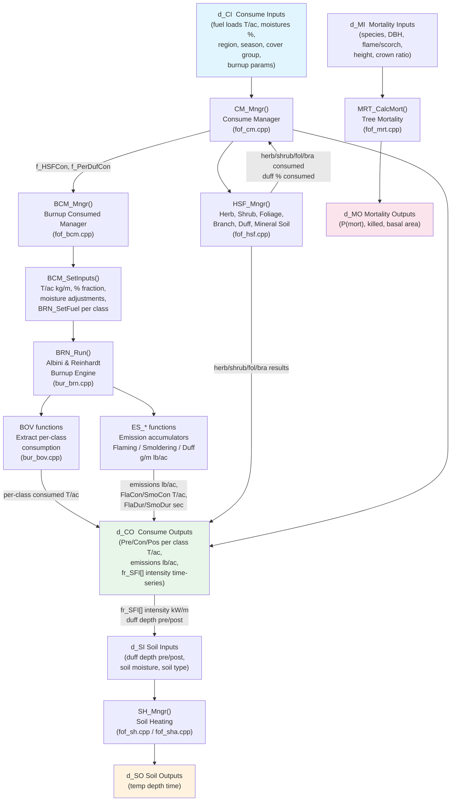
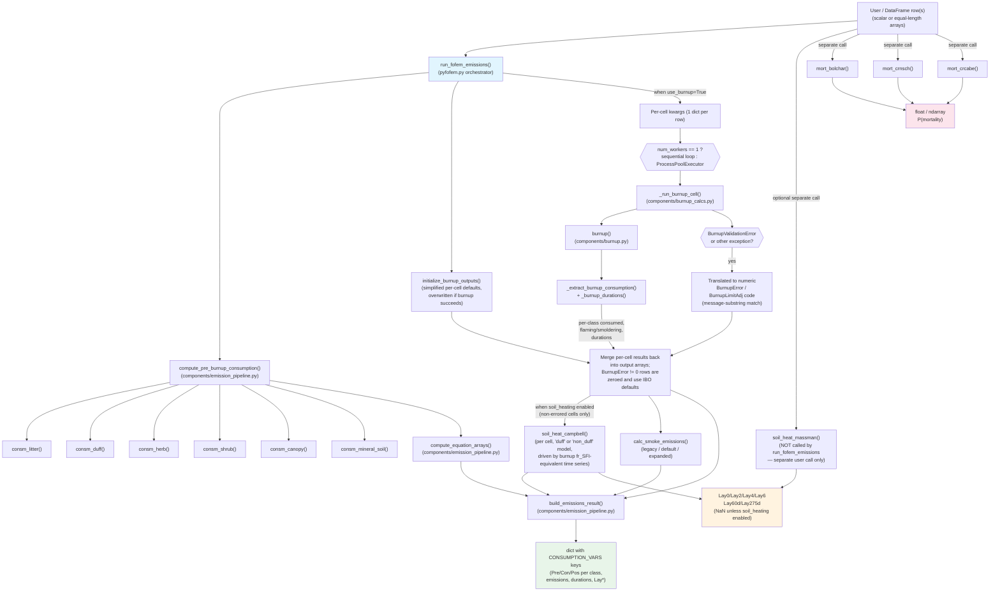

# pyfofem - Codebase Reference

This document describes the architecture, data flow, and conventions of both the
Python `pyfofem` library and the C++ FOFEM reference it ports.  It serves as the
single source of truth for contributors and reviewers.

---

## Repository Layout

```text
pyfofem/
|-- src/pyfofem/                       # <- Python library (the deliverable)
|   |-- __init__.py                    #    Public API re-exports (from pyfofem.py)
|   |-- pyfofem.py                     #    Core orchestrator module
|   |-- components/
|   |   |-- __init__.py                #    Re-exports every component's public symbols
|   |   |-- _component_helpers.py      #    Shared scalar/array plumbing (cross-cutting)
|   |   |-- burnup.py                  #    Albini & Reinhardt burnup engine
|   |   |-- burnup_calcs.py            #    Burnup adapters / class mapping / per-cell worker
|   |   |-- consumption_calcs.py       #    Consumption equations
|   |   |-- emission_calcs.py          #    Emissions modes
|   |   |-- emission_pipeline.py       #    run_fofem_emissions orchestration helpers
|   |   |-- mortality_calcs.py         #    Mortality equations
|   |   |-- tree_flame_calcs.py        #    Fire behavior + geometry helpers
|   |   `-- soil_heating.py            #    Campbell + Massman HMV soil models
|   `-- supporting_data/
|       |-- species_codes_lut.csv      #    Species <-> FOFEM-code mapping (runtime table, in the wheel)
|       |-- emissions_factors.csv      #    Emission-factor groups (runtime table, in the wheel)
|       |-- fofem_bark_thickness.csv   #    Complete C++ bark-thickness extraction (runtime table, in the wheel)
|       |-- fofem_crnsch_eq1_bark.csv  #    C++ Equation-1 small-tree bark slopes (runtime table, in the wheel)
|       `-- FOFEM6.7/                  #    Bundled FOFEM data files (NOT in the wheel)
|
|-- reference/fofem_cpp/               # <- Official C++ FOFEM reference source
|   |-- FOF_UNIX/                      #    Portable core science code
|   |-- FOF_DLL/                       #    Windows DLL + Massman HMV solver
|   |-- FOF_GUI/                       #    Windows .NET GUI
|   `-- SWIG/                          #    Auto-generated C# interop
|
|-- docs/reference/
|   |-- code/burnup/                   #    Standalone burnupw.cpp baseline
|   `-- papers/                        #    Literature references
|
|-- tests/                             #    pytest package (`tests/__init__.py`); testpaths=["tests"]
|   |-- __init__.py                    #    Package marker for `tests.*` qualified imports
|   |-- _support.py                    #    Shared path constants; never inserts src/ onto sys.path
|   |-- conftest.py                    #    Fixtures, marker registration, installed-only session hook
|   |-- run_unified_tests.py           #    `--suite core|full`, `--installed-only` test runner
|   |-- prepare_cpp_reference.py       #    Regenerates C++ reference fixtures
|   |-- compare_cpp_python_soil_heating.py       # Scripted Lay* parity comparison driver
|   |-- unit/                          #    Golden-CSV + non-C++-live unit tests
|   |   |-- test_consumption_golden.py #    Golden-value regression tests for consumption equations
|   |   |                                    (split from the pre-Phase-1 test_equations_golden.py;
|   |   |                                    keeps the CSV-driven parametrized coverage)
|   |   |-- test_burnup_golden.py      #    Golden-value regression tests for burnup()
|   |   |-- test_equation_routing.py   #    Equation-ID output regression tests (was test_emission_equation_ids.py)
|   |   |-- test_run_unified_tests_contract.py  # Phase 1: installed-only parent/child contract
|   |   |-- test_golden_manifest_validator.py   # Phase 2: manifest builder/validator (no live build)
|   |   |-- test_proc.py               #    Phase 2: bounded subprocess + process-tree kill helper
|   |   |-- test_tolerance_policy_completeness.py  # Phase 2: tolerance_policy.json schema/coverage
|   |   |-- test_tree_flame_contracts.py        # Phase 3: calc_scorch_ht / calc_flame_length contracts
|   |   |-- test_tree_flame_source_relations.py # Phase 3: calc_char_ht / calc_crown_length_vol_scorched
|   |   |                                         hand-derived vs pinned fof_mrt.cpp (no live parity)
|   |   |-- test_utility_contracts.py  #    Phase 3: calc_carbon + get_moisture_regime
|   |   |-- test_public_constants.py   #    Phase 3: all 11 exported constants/data objects
|   |   |-- test_runtime_data_resources.py      # Phase 3: runtime CSVs (schema/provenance/resource)
|   |   `-- test_burnup_component_api.py        # Phase 3: FuelParticle/BurnResult/BurnSummaryRow/
|   |                                             BurnupValidationError/burnup
|   |-- integration/                   #    Full-pipeline (`run_fofem_emissions`) tests
|   |   |-- test_run_fofem_emissions.py         # Output-dict key/shape contract tests
|   |   |                                         (was test_run_fofem_emissions_output_keys.py)
|   |   `-- test_soil_heating_pipeline.py       # Invalid soil_family error-handling tests
|   |                                             (was test_soil_heating_invalid_soil_family.py)
|   |-- regression/                    #    Named historical-bug regression tests
|   |   |-- test_equations_golden_fixes.py      # Fix A-D classes (split from the pre-Phase-1
|   |   |                                         test_equations_golden.py)
|   |   `-- test_pr1_review_regressions.py
|   |-- cpp_parity_live/               #    Tests requiring the compiled C++ reference
|   |   |-- test_compare_cpp_python.py #    Python-vs-C++ multi-case parity assertions
|   |   |-- test_cpp_comparison.py     #    Python-vs-C++ parity vs. reference/fofem_cpp/load.txt, emis.txt
|   |   `-- test_soil_heating_cpp_parity.py     # Soil Lay* parity vs C++ soil.tmp
|   `-- test_data/
|       |-- test_inputs/
|       `-- _results/
|
|-- examples/
|   |-- emissions_batch.py             #    Batch/array usage driver, writes CSV output
|   `-- example_data/                  #    fofem_emissions_batch_test.csv
|
|-- docs/CODEBASE.md                   # <- This file
`-- README.md
```

---

### Current parity/testing additions

Test docstrings and xfail reasons no longer cite `F-##` finding-tracking IDs
by number — they keep the underlying evidence (root cause, measured values,
file:line citations) inline instead. For the full dated forensic history
behind a resolved defect, see the gitignored
`development/plans/gate0/04-findings.md` register.

Below and throughout the rest of this document, "Phase N" in dated prose
(e.g. "Phase 4 correction pass", "Phase 8 test architecture") refers to the
historical chronological work-slice of the original comprehensive test-suite
plan — it does not name a current code identifier. The golden datasets that
tracking once produced are now named descriptively instead:
`phase2`→`canonical`, `phase4`→`expanded_matrix`, `phase5`→`soil_campbell`,
`phase6`→`emissions_equivalence`, `phase7`→`burnup_extended`. Likewise, the
`test_phaseN_*.py` files those phases added have been renamed to describe
what they check rather than when they were written (the C++-comparison ones
also moved into `tests/unit/cpp/`), and `tests/cpp_parity_live/`'s own
`_phaseN_contract.py`/`generate_phaseN_goldens.py` infrastructure was renamed
to match.

- `tests/cpp_parity_live/test_cpp_comparison.py` provides direct Python-vs-C++ parity assertions against `reference/fofem_cpp/load.txt` and `emis.txt`.
- `tests/cpp_parity_live/test_compare_cpp_python.py` runs scripted multi-case comparisons against the (pre-Phase-2) C++ CSV harness output.
- `tests/cpp_parity_live/test_soil_heating_cpp_parity.py` and `tests/compare_cpp_python_soil_heating.py` validate soil `Lay*` parity vs C++ `soil.tmp`.
- `tests/run_unified_tests.py --suite core|full` is the current publish-oriented test runner (see `README.md`).
- `examples/emissions_batch.py` (not under `tests/`) is the current emissions batch/example driver.
- `reference/fofem_cpp_overlay/source/FOF_UNIX/test_harness.cpp` (applied onto `reference/fofem_cpp/FOF_UNIX/test_harness.cpp`, never committed inside the submodule) is the **Phase 2** C++ oracle harness (`fofem_test`), superseding the old single-mode ("consume" only) harness this section previously described. It implements six modes — `consume`, `litter_eq`, `shrub_herb_eq`, `mortality`, `bark_thick`, `canopy_cover` — per `development/plans/gate0/05-harness-contract.md`; **the input/output schema version is declared PER MODE** (`test_harness.cpp`'s `MODES[]` table, mirrored by `MODE_SCHEMA_VERSIONS` in `tests/cpp_parity_live/_golden_manifest.py` and enforced by `validate_manifest()`): `mortality` is at **v2** since the 2026-09-01 Phase 4 correction pass (added `density_tpa`, renamed `ckr_pct` to `ckr_rating`, widened the mode's error rule — see F-45), every other mode is at v1, and each mode rejects every version but its own; `soil_campbell` is Phase 5's (16-column INPUT schema, corrected from an original 13-column draft -- item-1 audit closed the `f_DufLoaPre`/`f_DufConPer`/`f_DufMoi` initialization gap; bumped v1->v2 by the Campbell duff-forcing correction pass (2026-09-16, see Gotcha #29), which appended three OUTPUT-only summary columns exposing the pinned `DuffBurn()`'s outputs directly -- no input schema change; a real, manifested 13-scenario golden dataset exists under `tests/test_data/test_golden_output/soil_campbell/` as of Part 3, 2026-09-03. HISTORICAL (2026-09-03 scientific-triage pass, F-52): a real Python-vs-C++ comparison at the time found the two solvers structurally different -- 16-49 degC divergence even with every Python-consumed soil-property input aligned to the pinned C++ table -- so this dataset's comparisons were then documented cross-implementation characterization, not a parity claim. SUPERSEDED 2026-09-18 (F-70 third round, then the Campbell-backend consolidation pass): a real, isolated `bulk_density`/`particle_density` unit-conversion transcription error was found and fixed, and all 11 committed Phase 5 scenarios (5 families x both routes) now match this same live C++ harness to well under 0.01 degC over their whole recorded trajectories -- `tolerance_policy.json`'s `soil_campbell.duff`/`nonduff` routes are `"status": "verified"`, not `"unverified"`/`"contract_only"`; see F-51/F-52/F-70). `mortality`/`bark_thick`/`canopy_cover` require an explicit `--species-csv <path>` (real production loader `MRT_LoadSpe()`, not `MRT_InitST()` — see that file's own header comment and the Gate 0 correction recorded in `03-cpp-crosswalk.md`/`05-harness-contract.md`).
- `tests/cpp_parity_live/_harness_support.py` locates the MSVC/CMake/Ninja toolchain (via `vswhere.exe`), builds `fofem_test.exe`, and drives it from Python.
- `tests/cpp_parity_live/_golden_manifest.py` builds/validates the provenance manifest every Phase 2 golden dataset carries (upstream SHA, overlay digests, compiler/toolchain identity, input/output/side-file hashes, generation timestamp, pyfofem commit, and exact scenario-applicable tolerance-policy references/divergences). Validation fails closed on omitted/cross-mode policy keys and re-derives the expected divergence list from the canonical route contract. Validated by `tests/unit/test_golden_manifest_validator.py` (no live build needed).
- `tests/cpp_parity_live/test_cpp_harness_contract.py` implements the full 19-row + 11a-11g self-test matrix from `gate0/05-harness-contract.md` §10 against the live compiled binary (192 tests as of Phase 2 final approval; requires the MSVC toolchain, skips cleanly if absent).
- `tests/cpp_parity_live/generate_canonical_goldens.py` generates the one qualifying golden dataset per mode under `tests/test_data/test_golden_output/canonical/<mode>/`, each with a `<mode>.manifest.json`. `--verify-only` proves deterministic regeneration without overwriting.

#### Phase 3 test architecture (2026-08-31) — Python-only, data, and relation-level contracts

Phase 3 adds six `tests/unit/` modules, all registered in `CORE_TESTS`
(`tests/run_unified_tests.py`). None builds or runs C++. Each module's
docstring classifies every test it contains as one of three categories,
and that classification is the durable convention for this suite:

- **(a) Python contract/equation test** — asserts documented equations, or
  explicitly identified current Python behaviour including known contract
  defects pinned for visibility, against hand-derived expected values. Makes
  no C++ parity claim, and does not endorse defective behaviour as desired
  API design.
- **(b) Source-relation cross-check** — hand-derived against a pinned C++
  expression that cannot be executed in isolation. Cites the exact
  pinned file:line. **Makes no executable-parity claim.**
- **(c) Executable C++ parity** — compares against output from a live
  pinned-C++ run. Phase 3 contains **none**; that lives in
  `tests/cpp_parity_live/` and the manifested `canonical/` goldens.

| Module | Covers | Category mix |
|---|---|---|
| `unit/test_tree_flame_contracts.py` | `calc_scorch_ht` (FOFEM `Calc_Scorch` flame conversion plus eq 8/9/10), `calc_flame_length` (Byram/Butler/Thomas/char-height) | (a), plus (b) for the direct C++ flame conversion |
| `unit/test_tree_flame_source_relations.py` | `calc_char_ht`, `calc_crown_length_vol_scorched` | (b) value tests, (a) shape/clamp/warning tests |
| `unit/test_utility_contracts.py` | `calc_carbon`, `get_moisture_regime` | (b) carbon factors, (a) everything else |
| `unit/test_public_constants.py` | all 11 exported constants/data objects | all (a) |
| `unit/test_runtime_data_resources.py` | runtime CSVs + packaging/resource resolution | (a), plus provenance digests |
| `unit/test_burnup_component_api.py` | `FuelParticle`, `BurnResult`, `BurnSummaryRow`, `BurnupValidationError`, `burnup` | all (a) |

**Tree/flame C++ relationship and non-parity routes.**
When `calc_scorch_ht` receives `flame_length`, PyFOFEM converts metres to
feet, applies FOFEM's exact `Calc_Scorch` relationship at
`fof_util.cpp:89-102`, and converts the result back to metres. That direct
flame-length input takes precedence over intensity, ambient temperature, and
in-stand wind. The discussion below applies only to the intensity routes.

`fof_util.cpp:95-102` `Calc_Scorch` converts *flame length to scorch
height* and `fof_util.cpp:111-118` `Calc_Flame` converts *scorch height
back to flame length*. For its intensity-only routes, Python takes fire intensity (plus optional
ambient temperature and in-stand wind) and uses Byram/Butler/Thomas.
Different APIs — not parity oracles (Gate 0 `03-cpp-crosswalk.md` rows
6-7). `calc_char_ht` and `calc_crown_length_vol_scorched` have pinned
C++ expressions (`fof_mrt.cpp:396-397` and `:315-327`) whose
intermediates `f_Fl`/`f_CK`/`f_CSL` are `MRT_Calc` **locals** absent
from `d_MO` (finding F-30), so they get source-relation tests only.

The Butler intensity relationship is publication-validated (Alexander and
Cruz 2021, Table 1 and corrigendum), but its calibration traces to one
documented jack-pine crown-fire case. It is therefore exposed as a useful
empirical option, not as a general surface-fire relationship.

**Runtime-resource-loading pattern (verified, not assumed).** Neither
loader uses `importlib.resources`. All three build a path from the defining
module's own `__file__`:

- `components/tree_flame_calcs.py` — `os.path.join(os.path.dirname(__file__),
  '..', 'supporting_data', 'species_codes_lut.csv')`, read **eagerly at
  import time** into `SPP_CODES`.
- `components/emission_calcs.py` — `_EF_CSV_DEFAULT`, same construction,
  read lazily and cached by `_load_ef_csv()`.

- `components/mortality_calcs.py` uses the same package-relative construction
  to load `fofem_crnsch_eq1_bark.csv` at import time for Equation 1's
  DBH-under-one-inch bark fallback.

That is *package*-relative, not repo-relative, so it resolves correctly
from an installed wheel and is independent of the process's working
directory. `unit/test_runtime_data_resources.py` asserts these properties,
including a real child-process probe launched from an unrelated working
directory with `PYTHONPATH` cleared (bounded and process-tree-cleaned via
`tests/cpp_parity_live/_proc.run_bounded`). The one case the `__file__`
approach does **not** cover is a zipimported package, where
`importlib.resources` would be required; pyfofem ships a plain wheel, so
this is recorded as a known limitation, not a defect.

**Wheel-isolation mechanism.** Two layers, both required:

1. In-suite: `tests/run_unified_tests.py --installed-only` sets
   `PYFOFEM_INSTALLED_ONLY=1` on the pytest subprocess and
   `tests/conftest.py::pytest_sessionstart` aborts the session if
   `pyfofem` resolves beneath the checkout's `src/` (Phase 1 contract,
   covered by `unit/test_run_unified_tests_contract.py`). No test module
   anywhere inserts `src/` onto `sys.path`.
2. Out-of-checkout proof (run per phase, not part of the suite): build a
   wheel with `python -m build --wheel`, create a throwaway virtualenv
   **outside** the checkout, install only the wheel plus `pytest`/`psutil`,
   then run `--suite core --installed-only` and `--suite full
   --installed-only` with that interpreter. The wheel's contents are also
   asserted to be exactly the three runtime CSVs with no `.exe`/`.dll`/
   `.pdf`/`.ico`/`.lnk`/`.bat` — the packaging-config half of that
   assertion is in-suite
   (`unit/test_runtime_data_resources.py::test_packaging_config_ships_both_runtime_csvs_and_no_vendor_binaries`),
   which converts Gate 0 `06-runtime-tables.md` §3's *accidental*
   exclusion of `supporting_data/FOFEM6.7/` into an asserted contract.

**Version-brittleness note from that proof.** The isolated venv resolves
the newest dependency wheels (observed 2026-08-31: numpy 2.5.2, pandas
3.0.5, scipy 1.18.1, pytest 9.1.1), which caught one brittle assertion:
pandas 3.0 infers `StringDtype` where 1.x/2.x inferred `object`, so
text-column checks assert *value types* (`isinstance(value, str)`), never
dtype identity. This is an observation from one executed lane, **not** a
claim that pandas 3.x is a supported floor — the dependency support
matrix remains the release-readiness plan's Phase 3 work.

**Evidence-reconciliation pass (2026-08-31).** A follow-up
documentation-only pass corrected three claims that the Phase 3 tests had
already disproved by execution, and recorded two behaviours the tests pin
that were not previously written down anywhere durable. It changed no test
code, no production code, and no expected value:

- The char-height relation in the pinned mortality source is at
  `fof_mrt.cpp:396-397`, not `:394-395`. Every active citation was
  corrected; the earlier value survives only inside dated historical
  change records.
- `calc_scorch_ht`'s missing-input guard is **not** dead code. It fires
  for `None` and for object-dtype arrays containing `None`, and is inert
  only for a float array carrying `NaN`, so the real defect is a coverage
  gap rather than unreachable code. The separate `amb_t == 60`
  divide-by-zero is unaffected and still real.
- `calc_crown_length_vol_scorched(8.0, 10.0, 0.0)` returns
  `(0.0, nan, nan)` with two NumPy `RuntimeWarning`s, not `inf`/`nan`:
  `crown_length_scorched` is clipped to `[0, crown_depth]` before either
  division, so both divisions are `0/0`. C++ still returns `-1` with
  "Mortality Calculaton is attempting to Divide by 0"
  (`fof_mrt.cpp:329-333`), so the error-semantics divergence stands.
- Two dispatch behaviours are now recorded as findings rather than only in
  test comments: `calc_scorch_ht` selects its equation from `amb_t` alone,
  so an `instand_ws` supplied without an `amb_t` is silently discarded and
  equation 8 is used; and `calc_flame_length` gives `fire_intensity`
  undocumented precedence over `char_ht` when both are supplied. Both are
  **Python contract observations with no C++ oracle comparison**, and the
  tests that cover them pin *current* behaviour for visibility only — they
  are not an endorsement of either rule as correct API design.

#### Legacy/unverified golden audit (Phase 2, 2026-08-28)

None of the pre-Phase-2 golden files below carry a provenance manifest; do
not treat them as equivalent in rigor to the manifested `canonical/` goldens
above, and do not retroactively fabricate provenance for them:

| File | Status | Used by |
|---|---|---|
| `cpp_golden_summary.csv`, `cpp_golden_components.csv` | legacy/unverified — produced by the pre-Phase-2 single-mode harness | `test_compare_cpp_python.py` |
| `burnup_load_golden.csv`, `burnup_timeseries_golden.csv` | legacy/unverified | `test_burnup_golden.py` |
| `equation_unit_tests_golden.csv` | legacy/unverified | `test_consumption_golden.py` |
| `Emis.txt`, `Emission-Short-Default-Pound.csv`, `Emission-Summary-Default-Pound.csv`, `emissions_test_fromGUI_golden.csv` | legacy/unverified, and **orphaned** — not referenced by any currently active test module | none found |

> Note: as of this review, `MISSING_COMPONENTS.md` no longer exists in the repo root, and several test filenames previously documented here (`example_fofem_emissions_batch.py`, `compare_cpp_python.py`, `test_soil_cpp_parity.py`, `compare_cpp_python_soil.py`) have been renamed or moved — the listing above reflects the actual current filenames, verified 2026-08-26.

#### Phase 2 harness diagnostic builds (2026-08-28, round 3 correction pass) — tracked, reproducible record

Two builds are distinct, per the harness contract (`gate0/05-harness-contract.md` §11): the **golden/release build** (`reference/fofem_cpp/build/`, plain `cmake --build build --target fofem_test`, CMake's own `Debug` defaults — this is what `_harness_support.ensure_built()` produces and what every self-test/golden run uses) and the **diagnostic build** below (a separate directory, never used to generate an accepted golden). Toolchain: MSVC `cl.exe` 19.50.35728 (VS Build Tools 2026/18.4), MSVC toolset `14.50.35717`, CMake 4.2.3-msvc3, Ninja 1.12.1, all bundled inside the VS install and located via `vswhere.exe` (see `tests/cpp_parity_live/_harness_support.py`) — no hardcoded personal path, though the concrete install path below is THIS machine's actual discovered path (from `vswhere.exe`), substitute your own if it differs. Host: Windows 10 (10.0.19044), x86_64.

Every command below is genuine PowerShell (Windows PowerShell 5.1), tested end-to-end during this pass — no POSIX `\` line continuations, no mixed cmd.exe/PowerShell syntax. Run as ONE PowerShell invocation (sourcing `vcvars64.bat`'s environment does not persist across separate invocations/processes):

```powershell
$vsInstall = "C:\Program Files (x86)\Microsoft Visual Studio\18\BuildTools"
$vcvars = Join-Path $vsInstall "VC\Auxiliary\Build\vcvars64.bat"
$envLines = cmd.exe /c "call `"$vcvars`" >nul && set"
foreach ($line in $envLines) {
    if ($line -match "^([^=]+)=(.*)$") { Set-Item -Path "env:$($matches[1])" -Value $matches[2] }
}

# Golden/release build (CMake Debug defaults: /DWIN32 /D_WINDOWS /W3 /GR /EHsc,
# plus /MDd /Zi /Ob0 /Od /RTC1 from CMAKE_CXX_FLAGS_DEBUG)
cmake -S reference/fofem_cpp -B reference/fofem_cpp/build -G Ninja -DCMAKE_BUILD_TYPE=Debug
cmake --build reference/fofem_cpp/build --target fofem_test

# Diagnostic build: /W4 (stricter warnings) + /EHsc + MSVC AddressSanitizer,
# in a SEPARATE directory
cmake -S reference/fofem_cpp -B reference/fofem_cpp/build_diag -G Ninja `
      -DCMAKE_BUILD_TYPE=Debug "-DCMAKE_CXX_FLAGS=/W4 /EHsc /fsanitize=address"
cmake --build reference/fofem_cpp/build_diag --target fofem_test

# ASan's runtime DLL is not on PATH by default and must be copied next to
# the built exe (this machine's actual discovered MSVC toolset path):
$toolset = "C:\Program Files (x86)\Microsoft Visual Studio\18\BuildTools\VC\Tools\MSVC\14.50.35717"
Copy-Item "$toolset\bin\Hostx64\x64\clang_rt.asan_dynamic-x86_64.dll" reference\fofem_cpp\build_diag\

# /analyze static analysis, scoped to the harness's own file only (NOT the
# pinned FOF_UNIX/*.cpp sources, which are not ours to silence or fix)
$outDir = "$env:TEMP\analyze_out"
New-Item -ItemType Directory -Force -Path $outDir | Out-Null
Push-Location reference/fofem_cpp/FOF_UNIX
cl /nologo /c /EHsc /W4 /analyze test_harness.cpp "/Fo:$outDir\test_harness.obj"
Pop-Location
```

Selecting the diagnostic binary for a harness/pytest run uses the same, tested `FOFEM_TEST_HARNESS_EXE` override the Phase 2 test suite itself validates (`_harness_support.resolve_harness_exe()`, `test_cpp_harness_contract.py::test_harness_exe_override_rejects_a_nonexistent_path`/`test_harness_exe_override_is_used_when_valid`/`test_harness_exe_override_unset_resolves_to_default`) — it raises `HarnessConfigError` rather than silently falling back if the path does not exist:

```powershell
$env:FOFEM_TEST_HARNESS_EXE = "$(Get-Location)\reference\fofem_cpp\build_diag\fofem_test.exe"
python -m pytest tests/cpp_parity_live/test_cpp_harness_contract.py -q
```

**Results (2026-09-01, Phase 4 correction pass, against the harness as of
this pass — re-run in full because `test_harness.cpp` changed; supersedes
the 2026-08-29 round-4 run, whose matrix was 192 tests):**

- Golden/release build: 0 errors. Own file (`test_harness.cpp`) compiles with **zero warnings** even at `/W4` (stricter than the release build's own `/W3`). Warnings remain only in the pinned, untouched `FOF_UNIX/*.cpp` upstream sources (C4244/C4305/C4996/C4459/C4101/C4267 — narrowing conversions, deprecated CRT calls, shadowing, unused locals, size_t truncation) — pre-existing, not introduced by Phase 2, and out of scope to fix (pinned source).
- Full `test_cpp_harness_contract.py` matrix (**225** tests — the 192 of the round-4 run plus the 33 added for the `mortality` schema-v2 density/per-mode-schema-version contract) run against the NORMAL golden/release binary: **225 passed, 0 failed**.
- The SAME full 225-test matrix run against the ASan diagnostic binary via `FOFEM_TEST_HARNESS_EXE`, exactly as shown above (the diagnostic tree was deleted and rebuilt cold from the revised source first, not reused): **225 passed, 0 failed** — a prior round's `test_harness_exe_override_unset_resolves_to_default` unconditionally asserted the override was unset, which was false whenever `FOFEM_TEST_HARNESS_EXE` was exported for the whole run (correctly reported then as "1 failed by design", but a diagnostic qualification gate may not contain an intentional failure); it now explicitly removes the override for its own scope via `monkeypatch.delenv`, so both runs are genuinely, completely green. 0 sanitizer findings across the full matrix in either run, including the malformed-input/fault-injection paths (unknown species, overlong fields at every distinct buffer-size class, malformed numeric syntax, malformed headers, non-contiguous groups, the `SMT_CalcCrnCov` unresolved-species guard path) and the real out-of-bounds read `SMT_CalcCrnCov` has for an unresolved species (`fof_mrt.cpp:1611-1640`, no `iX<0` check), which the harness's own guard prevents from ever executing — confirmed clean under ASan, not just by code inspection.
- `/analyze` on the revised `test_harness.cpp`: **0 findings** (previously one, fixed in round 3: `C6262`, "Function uses ~248 KB of stack", in `run_consume()`). `/W4` on the harness's own file: **0 warnings**, unchanged by the schema-v2 edits.

**`C6262` reconciliation (item 9 of the round 3 correction pass) — the prior round's attribution to `/RTC1` was WRONG, corrected here:**

The documented `/analyze` command above never included `/RTC1` — it is a bare `cl /c /EHsc /W4 /analyze` invocation, and `/RTC1` (a *runtime*-check flag) has no effect on `/analyze`'s *static* stack-usage estimate in the first place. Re-running the exact command with `/RTC1` absent still reproduced `C6262` at effectively the same size (248364 bytes) as before, disproving the earlier claim outright. The REAL cause, measured directly (a standalone `sizeof(d_CI)`/`sizeof(d_CO)` probe compiled against the same headers): `sizeof(d_CI) == 2900`, `sizeof(d_CO) == 240632`, combined `243532` bytes — accounting for essentially all of `run_consume()`'s ~248 KB frame (the remaining ~4.8 KB is ordinary per-function overhead: other locals, saved registers, alignment). `d_CI ci; d_CO co;` were plain stack locals inside `run_consume()`'s per-row loop (`test_harness.cpp:760-761`, harness-owned code, not pinned scientific source).

**Fix applied** (preferred option per the correction instructions, over merely re-documenting a stack-margin argument): `ci`/`co` are now heap-allocated via `std::unique_ptr<d_CI>`/`std::unique_ptr<d_CO>` with `d_CI&`/`d_CO&` references bound to them, so every existing `ci.`/`co.` access in the function body is unchanged. This is a harness-local, test-tooling-only change — no pinned `FOF_UNIX/*.cpp` source was touched, and `CI_Init`/`CO_Init`/the scientific call sequence are identical. Re-running `/analyze` after the fix confirms **0 findings** (verified directly above, not assumed); the full `test_cpp_harness_contract.py` matrix (192 tests, both the normal build and the ASan diagnostic build) was re-run afterward and passes identically to before the fix, confirming no functional/behavioral change.

`/RTC1` (Runtime Checks — uninitialized-variable and stack-frame-corruption detection) is CMake's own `CMAKE_CXX_FLAGS_DEBUG` default and is therefore already active on every golden/release build and every one of the hundreds of harness invocations across the self-test suite and golden generation this session — zero RTC aborts observed.

#### F-70 `fofem_test_soidiag` diagnostic-observer build (2026-09-17) — tracked, reproducible record

A THIRD build, distinct from both the golden/release build and the ASan
diagnostic build above: `fofem_test_soidiag`, which swaps in the
overlay's `fof_soi_instr.cpp` (a byte-for-byte copy of the pinned
`fof_soi.cpp` plus two diagnostic hook calls — see that file's own
header comment for the full provenance/diff proof) in place of the real
`fof_soi.cpp`, with every other source unchanged. Never used to generate
an accepted golden — an instrumented OBSERVER of the real execution
path, not a distinct oracle. Same toolchain/host as above; uses the same
sourced `vcvars64.bat` environment:

```powershell
# Build the normal fofem_test target FIRST (proves it still builds
# clean whenever the diagnostic target is requested — see
# _harness_support.ensure_soidiag_built()) then the diagnostic target:
cmake -S reference/fofem_cpp -B reference/fofem_cpp/build -G Ninja -DCMAKE_BUILD_TYPE=Debug
cmake --build reference/fofem_cpp/build --target fofem_test
cmake --build reference/fofem_cpp/build --target fofem_test_soidiag
```

Selecting the diagnostic-observer binary uses the SAME
`FOFEM_TEST_HARNESS_EXE` override mechanism as the ASan build above —
set it on the CALLING process's own `os.environ` (`resolve_harness_exe()`
reads that directly, not any subprocess `env=` dict), e.g. via pytest's
`monkeypatch.setenv` in a test, or:

```powershell
$env:FOFEM_TEST_HARNESS_EXE = "$(Get-Location)\reference\fofem_cpp\build\fofem_test_soidiag.exe"
$env:FOFEM_TEST_SOIL_STATE_DIAG = "*"
python -m pytest tests/cpp_parity_live/test_cpp_harness_contract.py -k soil_state_diag -q
```

**Results (2026-09-17):** both targets build clean via
`_harness_support.ensure_soidiag_built()` (which calls `ensure_built()`
first) — zero compiler errors on either target; `fof_soi_instr.cpp`
compiles with the SAME pre-existing warning set as the real
`fof_soi.cpp` it copies (no NEW warnings from the two added hook calls).
The full pre-existing 77-test soil-related subset of
`test_cpp_harness_contract.py` re-passes against the rebuilt NORMAL
binary (proves the CMakeLists.txt/`fof_soi_instr.cpp` additions caused
zero regression); the new 11-test `test_soil_state_diag_*` subset passes
against the diagnostic binary, including
`test_soil_state_diag_normal_binary_output_unchanged`'s direct
byte-identical `_summary`/`_field` proof between the two binaries on the
SAME scenario. `REQUIRED_OVERLAY_FILES` (`_golden_manifest.py`) was
extended to include the new `source/FOF_UNIX/fof_soi_instr.cpp` entry —
without this, any subsequent golden regeneration would fail closed
(`overlay_file_digests has unexpected extra files`), since
`compute_overlay_digests()` walks the whole overlay directory
dynamically. All 5 phases were regenerated for real after this edit (see
F-70 in `gate0/04-findings.md` for the full before/after CSV hash
comparison).

#### Phase 4 test and dataset architecture (2026-08-31) — executed C++ oracle comparison for Tier-2 functions

Phase 4 is the first phase whose tests are category **(c) executable C++
parity** in the Phase 3 taxonomy above: every value it asserts is compared
against output from a live pinned-C++ run, not hand-derived. It **builds no
new harness mode** — it drives the same six Phase 2 modes and consumes their
output through a second, larger golden dataset tree.

| Module | Covers | Golden mode(s) |
|---|---|---|
| `unit/cpp/test_consumption_parity.py` | `consm_duff`, `consm_litter`, `consm_mineral_soil`, `consm_herb`, `consm_shrub`, `consm_canopy` | `consume`, `shrub_herb_eq`, `litter_eq` |
| `unit/cpp/test_emissions_parity.py` | `calc_smoke_emissions` in `legacy` and `expanded` modes | `consume` |
| `unit/cpp/test_mortality_parity.py` | `mort_crnsch`, `mort_bolchar`, `mort_crcabe` | `mortality` |
| `unit/cpp/test_tree_structure_parity.py` | `calc_bark_thickness`, `calc_canopy_cover` | `bark_thick`, `canopy_cover` |

All four are registered in `CORE_TESTS` (`tests/run_unified_tests.py`). They
read committed golden CSVs and require no MSVC toolchain; the live-build
generator that produces those CSVs is separate and lives in `FULL_EXTRA_TESTS`.

**Dataset tree.** `tests/test_data/test_golden_output/expanded_matrix/<mode>/` is a
sibling of `canonical/`, never a replacement for it. Each of the six modes
carries its input CSV, its output CSV(s), and a `<mode>.manifest.json`.
Phase 4 manifests carry **22** keys — Phase 2's 21 plus a `dataset` key that
names which tree the manifest describes, so a Phase 2 and a Phase 4 manifest
can never be silently interchanged. The pinned upstream SHA and the overlay
digest in every Phase 4 manifest match the Phase 2 values; the two trees are
generated from the same qualified binary.

**Generator.** `tests/cpp_parity_live/generate_expanded_matrix_goldens.py` reuses
Phase 2's promotion machinery rather than duplicating it — `_qualify_all`,
`_promote`, `_validate_staged_tree` and `verify_regeneration` are imported
from `generate_canonical_goldens`. `_promote(tmp_root, out_root, modes)` takes
its destination explicitly, and Phase 4 always passes its own `GOLDEN_ROOT`
(`_expanded_matrix_contract.py:49`), so the shared helpers cannot write into the
Phase 2 tree. `--verify-only` proves deterministic regeneration without
overwriting, exactly as in Phase 2.

**Scenario contract.** `tests/cpp_parity_live/_expanded_matrix_contract.py` holds the
scenario matrices, the golden-row accessors and the mode indices shared by all
four test modules, so scenario identity is defined once and consumed
everywhere rather than restated per module.

**Tolerance policy.** `tests/cpp_parity_live/tolerance_policy.json` gained six
`*_expanded_matrix` namespaces — `consume_expanded_matrix` (12 keys), `litter_eq_expanded_matrix` (2),
`shrub_herb_eq_expanded_matrix` (4), `mortality_expanded_matrix` (3), `bark_thick_expanded_matrix` (1) and
`canopy_cover_expanded_matrix` (1), 23 new entries in total. They are namespaced separately
from the Phase 2/Phase 3 keys, which are unchanged, so a Phase 4 tolerance can
never be applied to a Phase 2 comparison. Every entry carries a measured
justification naming the scenarios that agree, the maximum observed difference
among them, the scenarios that diverge, and the finding ID each divergence is
recorded under. `unit/test_tolerance_policy_completeness.py` is `_expanded_matrix`-aware
and enforces that coverage.

**One xfail mechanism, and it is now uniform.** Divergences are recorded as
`pytest.mark.xfail(strict=True, ...)`, applied one of two ways:

- A per-module `_maybe_xfail(request, table, case_id)` helper adds the
  marker at runtime from a module-level `*_XFAIL` table, present in the
  consumption, mortality and tree-structure modules.
- A `@pytest.mark.xfail(strict=True, reason=...)` decorator directly above
  the `def`, for a scenario-independent divergence.

Both forms wrap a REAL, EXECUTING assertion of the desired (post-fix)
behaviour — never an unconditional surrender. **Prior state, corrected in
the Phase 4 correction pass part 2 (2026-09-02):** five call sites (emissions
1, mortality 2, tree-structure 2) used the imperative `pytest.xfail(reason=
...)` form, which raises `_pytest.outcomes.XFailed` immediately and never
reaches a real assertion — under `--runxfail` these were vacuous passes, one
of independent review's round-1 findings. All five were rewritten to execute
the real desired-behaviour assertion (verified failing, with real measured
values, under `--runxfail`) and decorated `@pytest.mark.xfail(strict=True,
reason=...)` instead; the imperative form no longer appears anywhere in the
Phase 4 modules, enforced by a new AST-based meta-test,
`tests/unit/cpp/test_expanded_matrix_xfail_hygiene.py`, which also asserts every
`xfail` marker in the Phase 4 modules is `strict=True`.

Neither form is a skip: the Phase 4 modules add **zero** skips. The
module-level `pytest.mark.skipif(not golden_tree_exists(), ...)` guard that
previously fronted all four Phase 4 parity modules was ALSO removed in the
correction pass part 2 (independent review finding (2), fail-open on a
missing golden tree): each module now calls
`_expanded_matrix_contract.require_golden_tree()` directly at collection time, which
raises `FileNotFoundError` naming the exact missing/empty file(s) if the
committed dataset is incomplete — a loud collection error, never a silent
skip. `tests/unit/cpp/test_golden_tracking.py` duplicates this check as
an independently runnable test and additionally proves — via real,
STATE-INDEPENDENT `git` subprocess checks, valid whether the golden tree is
currently tracked or still untracked (correction pass 3, 2026-09-02; see
below) — that every required Phase 4 golden file is committable without
`-f`. See the `.gitignore` negation below.

**Phase 4 golden tree committability (correction pass part 2, 2026-09-02).**
`.gitignore`'s blanket `*.csv` rule (line 55, pre-dating Phase 4) silently
ignored every Phase 4 scientific CSV, so a normal `git add
tests/test_data/test_golden_output/expanded_matrix/` would have staged only the
`.json` manifests (independent review finding (3)). Fixed with one narrow
negation, `!tests/test_data/test_golden_output/expanded_matrix/**/*.csv`, added
directly below the fuel_analyst negations already there. Manifest `.json`
files were never matched by the `*.csv` rule and needed no change. Phase 2's
own goldens are unaffected and use a DIFFERENT, already-complete mechanism
(`git add -f` at commit time, when the Phase 2 golden tree was first
committed as `d1039d3`) — they do not need, and were not given, a gitignore
negation, since a file already tracked stays tracked regardless of
`.gitignore`. `.gitattributes` gained the matching
`tests/test_data/test_golden_output/expanded_matrix/** -text` line, mirroring
Phase 2's own rule, so Phase 4 manifest JSON hashes stay byte-stable across a
Windows checkout (no CRLF conversion).

**Trackability contract is STATE-INDEPENDENT, not "always untracked"
(correction pass 3, 2026-09-02).** The part-2 verification above (plain `git
check-ignore` reporting exit 1 for every file, plus a `git add --dry-run`
that stages all 21) is only true while the Phase 4 golden tree is
untracked, and both checks silently stop meaning what they claim once the
tree is actually committed:

- Plain `git check-ignore` (no `--no-index`) consults the index, so it
  reports an ALREADY-TRACKED path as "not ignored" (exit 1) regardless of
  whether a gitignore rule still pattern-matches it — it cannot distinguish
  "genuinely not excluded" from "excluded but saved by being tracked".
  `git check-ignore --no-index` evaluates the gitignore patterns against
  the path alone, ignoring the index entirely, and is the only form that is
  meaningful whether or not the file is currently tracked.
- `git add --dry-run` prints an `add '<path>'` line only for a path git
  would actually touch. A path that is already tracked AND unchanged has
  nothing to add, so git prints NOTHING for it (while still exiting 0) —
  "every required file appears in `git add --dry-run` stdout" silently
  starts failing the moment the golden tree is committed and clean.

The real, state-independent contract every required Phase 4 golden file
must satisfy (`tests/unit/cpp/test_golden_tracking.py`, rewritten in
correction pass 3): (1) not ignored per `git check-ignore --no-index`; (2)
EITHER already tracked (`git ls-files --error-unmatch` succeeds — nothing
further to add, `-f` is moot) OR, if untracked, staged by a real `git add
--dry-run` without any "ignored" warning. Both the plain-`check-ignore`
gotcha and the tracked-unchanged `add --dry-run` silence are reproduced
directly against a disposable temp git repository (never the real project
index) by dedicated tests in that same module.

**The one blocked branch family is now RESOLVED (F-45, 2026-09-01).** As
originally reported, the `mortality` mode could not produce a valid
`mort_crcabe` (crown-damage) oracle: `PFI_Calc` validates through
`ValidInput`, which requires `1 <= f_Den <= 20000`
(`fof_mrt.cpp:1854-1856`), and the `mortality` schema v1 had no density
column. `PFI_Calc` returns `0` — an ordinary probability — rather than a
negative sentinel, so under the harness's then-current `prob < 0` error rule
those rows were recorded `outcome=ok` with `prob=0.000000` and a non-empty
`err_text`: a value that looks like a result but is not one. The eleven
affected PFI species equations were recorded `BLOCKED-HARNESS`.

The Phase 4 correction pass fixed both halves in the harness. `mortality`
schema **v2** adds a `density_tpa` column wired to `d_MIS.f_Den`, and the
mode's error rule now treats EITHER a negative probability OR non-empty
`cr_ErrMes` as a model error (a row declared `ok` must additionally carry a
finite probability in `[0, 1]`). All eleven equations now have a real
executable oracle, and **zero `BLOCKED-HARNESS` rows remain** in
`07-branch-traceability.csv`: eight equations agree (`SF`, `WL`, `IC`, `ES`,
`RF`, `SP`, `PP`, `PK`; measured max |diff| 4.51e-07) and three are strict
xfails under the new **F-50** (`WF`, `WP`, `DF` — the equations carrying a
DBH term, whose Python coefficients are rounded centimetre conversions of the
pinned per-inch values). `BR-MRT-CD-VAL` is upgraded from `CONTRACT-ONLY` to
`EXPECT-PASS`: `ValidInput`'s density boundaries (1 and 20000 accepted, 0 and
20001 rejected) are now an executed, manifested oracle. The corrected
behaviour is *asserted* by `test_crodam_density_rejection_is_surfaced` and
`test_every_ok_golden_row_is_a_clean_oracle`, which replaced the old
blocked-state assertion.

**Findings.** Phase 4 added 14 finding IDs (F-35 through F-43 and F-45 through
F-49) to `development/plans/gate0/04-findings.md`, and its 2026-09-01
correction pass added **F-50** (three crown-damage equations use rounded
unit-converted DBH coefficients — the same defect class as F-47), bringing the
tracked total to 49. `F-44` was never allocated and is documented as a
deliberate gap rather than left to look like a lost finding. **F-45 is the
first finding in this register to be marked RESOLVED**; its original analysis
is preserved verbatim inside the entry, followed by what the correction pass
changed and measured.

#### Phase 8 test architecture (2026-09-10) — integration hardening

Phase 8 is the final implementation phase of the comprehensive test-suite
plan (see `development/plans/2026-08-26-comprehensive-test-suite-plan.md`).
It adds 7 `tests/unit/` modules, all registered in `CORE_TESTS` (pure Python,
no live C++ build needed):

- `test_array_isolation.py` (item A) — mixed-validity array isolation:
  burnup per-cell error isolation at the array level (a bad cell cannot
  contaminate a valid cell, and reordering cells preserves results after
  restoring order), plus mortality unsupported-species non-contamination and
  no-persistent-accumulator proofs.
- `test_serial_parallel_equivalence.py` (item B) — the FIRST test
  coverage anywhere in this repository for `run_fofem_emissions(num_workers>1)`
  (`ProcessPoolExecutor`); proves serial/parallel scientific and per-cell-error
  equivalence, deterministic repeats, output ordering, and child-process
  cleanup. Marked `@pytest.mark.multiprocessing` (the marker was registered in
  `pyproject.toml` but never previously applied anywhere).
- `test_mortality_facade.py` (item C) — `run_fofem_mortality()` facade
  coverage (previously **zero** coverage at any level); covers all three
  dispatch keys, case-insensitivity, invalid/missing/malformed arguments,
  parameter forwarding, and reconciles the facade's own docstring `Examples::`
  block against its real `(mort_function, params)` signature (F-65).
- `test_moisture_regime_integration.py` (item D) — moisture-regime
  behavior through `run_fofem_emissions()`/`consm_duff()`, not just the
  already-unit-tested `get_moisture_regime()` utility itself.
- `test_unit_system_contract.py` (item E) — SI/Imperial contract
  matrix across `run_fofem_emissions()`, `calc_smoke_emissions()`, and the
  `consm_*` family; found F-63 (SI-units docstring mismatch) and F-66 (a
  real, silently-wrong-result case-sensitivity defect: `units='si'` lowercase
  is NOT recognized by any `consm_*` function's exact-case `'SI'` check, even
  though `run_fofem_emissions()`'s own recognition is case-insensitive).
- `test_runner_completeness.py` (item F) — proves
  `run_unified_tests.py`'s existing `_validate_suite_coverage()` mechanism
  (recursive-glob-based, not marker/naming-based) holds for the real
  configuration, plus exactly-once CORE/FULL assignment and plain-pytest-vs-
  runner discovery agreement.
- `test_operational_hardening.py` (item G) — deterministic repeats,
  warning-count baseline, evidence-based runtime bound, hostile-Git-ownership
  support (reusing the pattern every phase's golden-tracking module already
  established), order-independence, and no-checkout-debris proofs. Existing
  Phase 2-7 golden `--verify-only` gates are re-run directly in the Phase 8
  acceptance audit, not duplicated as a new CORE test (that would require the
  live build, breaking CORE's no-toolchain guarantee).

**Findings.** Phase 8 added 4 finding IDs: F-63 (`consm_duff()`/
`consm_litter()` SI-units docstring mismatch), F-64 (a benign, environment-
specific pytest-`faulthandler` "access violation" dump reproducibly triggered
by the first-ever `num_workers>1` coverage — no process crash or wrong
result), F-65 (`run_fofem_mortality()`'s broken documented `Examples::` call
form), and F-66 (the `units='si'` lowercase silent-wrong-result defect),
bringing the tracked total to 66. No traceability-CSV rows were added — all
four are Python-contract/documentation findings with no distinct C++
scientific branch, following the same precedent F-33/F-34 established.

> **HISTORICAL — superseded 2026-09-10 (Phase 8 correction pass, responding
> to independent review).** Two claims above were corrected, not merely
> restated:
>
> 1. **F-64 was not "benign" merely because pytest exited 0.** The prior
>    pass's own module docstrings called it that without direct proof. The
>    correction pass instead structurally ELIMINATED the trigger: every
>    ``run_fofem_emissions(num_workers>1)`` call previously made directly
>    from a collected pytest node now runs through a non-collected driver
>    (`tests/cpp_parity_live/phase8_parallel_driver.py`) invoked as a PLAIN
>    ``python`` subprocess via `tests/cpp_parity_live/_phase8_driver_support.py`
>    (itself wrapping `tests/cpp_parity_live/_proc.py::run_bounded` with an
>    explicit timeout and closed stdin). Direct evidence: the identical
>    production call, run repeatedly (5/5) via a bare `python` subprocess
>    with no pytest/`faulthandler` involved, produces ZERO stderr output and
>    exits 0 every time - only invoking it from INSIDE a process where
>    pytest's own `faulthandler.enable()` has already installed a low-level
>    Windows exception handler produces the dump. What remains genuinely
>    UNKNOWN (not claimed either way): the exact underlying condition that
>    handler was intercepting. See `gate0/04-findings.md` F-64 for the full,
>    corrected record.
> 2. **F-66 does get its own traceability row.** Independent review
>    determined it is a real, silently-wrong numeric-result defect (not
>    documentation/tooling), so it does not follow the F-33/F-34 no-row
>    precedent — `BR-UNIT-SI-CASE` was added to
>    `gate0/07-branch-traceability.csv` (128 rows total, 46 `XFAIL-STRICT`).
>
> See `.claude/CLAUDE.md`'s Decisions Log for the complete, itemized
> correction-pass record (all 9 required corrections).

**Second Phase 8 correction pass (2026-09-11), responding to another
independent review** — 7 further items closed, all documentation-only
production-wise (test/docs edits only): (1) the NorthEast cover-group
labels used by the moisture-regime cross-product
(`test_moisture_regime_integration.py`) were unrecognized by
`consm_duff()`'s own `_REDJAC`/`_BALSAM` sets and silently fell through to
the generic fallback — fixed to the accepted `'RedJacPin'`/`'BalBRWSpr'`
labels, with a new executable discrimination test proving each reaches
its own distinct branch; the 96-case and 24-case matrices (including the
ordering invariant) were re-run with the corrected labels and continue to
pass. (2) The Phase 8 driver protocol (`_phase8_driver_support.py`) is
now an exact, fully-enforced schema — exactly one stdout line, stderr
exactly empty, `ok` a genuine JSON boolean, success/error payload key
sets exact, `error_type`/`error_message` typed as strings — with focused
regression tests for every rejection path; the stale
`test_phase8_parallel_driver_contract.py` reference in
`phase8_parallel_driver.py` (a module that does not exist) was corrected.
(3) The AST hygiene scan (`_direct_num_workers_gt1_calls`) now fails
closed on any `num_workers` value that is not provably the literal `1`
(a name, an expression, a literal other than `1`), not merely a literal
constant; new meta-tests prove it rejects a literal `2`, a name, and an
expression, while accepting absent `num_workers` and literal `1`. (4)
The forward/reversed file-order test now goes through the SAME fail-
closed `_assert_no_debris_and_clean_pytest_run` infrastructure every
other subprocess call in `test_operational_hardening.py` uses,
rather than a raw, unprotected `run_bounded` call. (5) The "bounded
representative call" test now runs the representative burnup call
through the Phase 8 driver (`run_phase8_batch`) with the evidence-based
bound as the driver subprocess's own timeout, plus a new deterministic
timeout-path regression using the `PHASE8_DRIVER_SIMULATE_SLEEP_S` test-
only hook. (6) F-66's scope was reconciled with executed evidence: three
new independent, single-scenario strict-`xfail` nodes
(`consm_duff`/`consm_herb`/`consm_shrub`) close the gap between the
finding's claim and what was actually executed under lowercase `'si'`;
all verified genuinely XFAIL normally and genuinely FAILING under
`--runxfail`. `BR-UNIT-SI-CASE`'s content was updated to cite all 5 now-
executed discriminating routes (row/status counts unchanged at 128/46).
(7) Wording corrected: "serial" now describes the COMPUTATION (a
single-process loop inside `run_fofem_emissions()`), never the PROCESS
PLACEMENT — both `num_workers=1` and `num_workers=2` calls in
`test_serial_parallel_equivalence.py` run inside the same kind of
bounded driver subprocess. Full validation: plain `pytest -q` **1502
passed, 138 xfailed** (baseline 1490/135, delta +12 passed/+3 xfailed,
fully reconciled); `--suite core` **1133 passed, 137 xfailed**; `--suite
full` **1502 passed, 138 xfailed** (matches plain); isolated-wheel
core/full match exactly; all five phases' `--verify-only` gates show
only the pre-existing, already-documented provenance-metadata-only
pattern (zero scientific CSV drift; no generator-source file was
touched this pass). See `.claude/CLAUDE.md`'s Decisions Log for the
complete, itemized record.

**Third Phase 8 mechanical correction pass (2026-09-11)** — two narrow
findings closed: (1) `invoke_phase8_driver()`'s error-path check
(`result.returncode != 0`) accepted ANY nonzero code alongside an
`ok: false` payload; now requires exactly `result.returncode == 1` (the
documented protocol), with 4 new regression tests (accepts rc=1, rejects
rc=0/rc=2/a negative Windows-crash-style code). (2)
`_assert_no_debris_and_clean_pytest_run()` previously took its post-run
snapshots only after `run_bounded()` returned normally, so a genuine
hang (`ProcTimeout`) skipped both post-run snapshots and every debris
comparison entirely; it now catches `ProcTimeout` around the subprocess
call, always runs both post-run snapshots and the comparison, and either
re-raises the original `ProcTimeout` unchanged (no debris) or raises a
combined `AssertionError ... from` the original `ProcTimeout` (debris
alongside a timeout, both causes preserved via chaining). Two new
regression tests use a synthetic hanging pytest target (never a
genuinely slow scientific call) to prove both outcomes, including
confirmed process-tree termination and cleanup of the deliberately
created debris file. Full validation: focused suite **207 passed, 6
xfailed** (baseline 201/6, +6/+0 exact); plain `pytest -q` **1508 passed,
138 xfailed** (baseline 1502/138, +6/+0 exact); `--suite core` **1139
passed, 137 xfailed**; `--suite full` **1508 passed, 138 xfailed**
(matches plain); all five `--verify-only` gates show zero scientific CSV
drift (no generator-source file touched); isolated-wheel re-verify
reasoned-and-skipped (zero files under `src/pyfofem/` touched — only test
support/test files). See `.claude/CLAUDE.md`'s Decisions Log for the
complete record.

## Architecture Overview

### Python Library (`src/pyfofem/`)

The library is organised as a top-level orchestrator module (`pyfofem.py`)
plus multiple specialized modules under `components/`. Every public function accepts
both scalar and NumPy array inputs (internally converting to arrays and
converting back via `_is_scalar` / `_maybe_scalar`).

**Two re-export hops:** a component function reaches the package's public
surface via `components/__init__.py` → `pyfofem.py` (re-imported "for
backward compatibility," per its own top-of-file comment) → top-level
`__init__.py`. All three layers must be kept in sync when adding a new
public symbol.

| Layer | Files | Responsibility |
|-------|-------|----------------|
| **Public API** | `__init__.py` | Re-exports all public symbols from `pyfofem.py` and `components/` |
| **Core Orchestrator** | `pyfofem.py` | High-level facades (`run_fofem_mortality`, `run_fofem_emissions`) and pipeline wiring |
| **Emissions Pipeline Helpers** | `components/emission_pipeline.py` | Pure computation stages extracted from `run_fofem_emissions()`: `compute_pre_burnup_consumption()`, `initialize_burnup_outputs()`, `compute_equation_arrays()`, `build_emissions_result()` |
| **Shared Helpers** | `components/_component_helpers.py` | Cross-cutting scalar/array plumbing (`_is_scalar`, `_maybe_scalar`, `_to_str_arr`) used by multiple component modules |
| **Burnup Engine** | `components/burnup.py` | Albini & Reinhardt post-frontal combustion simulation (ported from C++) |
| **Burnup Facade/Adapters** | `components/burnup_calcs.py` | `run_burnup`, cell workers, summary extraction, class ordering/mapping |
| **Consumption Equations** | `components/consumption_calcs.py` | Litter/duff/herb/shrub/canopy/mineral-soil equations and carbon |
| **Emissions** | `components/emission_calcs.py` | `legacy` / `default` / `expanded` emissions modes and EF CSV loading |
| **Mortality** | `components/mortality_calcs.py` | `mort_crnsch`, `mort_bolchar`, `mort_crcabe` |
| **Tree/Flame Utilities** | `components/tree_flame_calcs.py` | Scorch/flame/char/canopy helper calculations |
| **Soil Heating** | `components/soil_heating.py` | Campbell (1D equilibrium) is supported. Massman HMV is in development and deliberately unavailable pending a full, published-model validation. |
| **Data** | `supporting_data/` | Species lookup CSV, emission factor CSV, bundled FOFEM 6.7 files |

**Massman HMV availability (current, 2026-09-16).** The prior simplified
``soil_heat_massman()`` approximation is intentionally unavailable and is not
re-exported from either public API. It always raises ``NotImplementedError``.
Campbell is the only supported PyFOFEM soil-heating model until a full,
published-model Massman implementation is developed and validated.

### C++ Reference (`reference/fofem_cpp/`)

The C++ codebase follows a **manager-pattern** with struct-in / struct-out
interfaces.  Each subsystem has:
- An **input struct** (`d_CI`, `d_SI`, `d_MI`) with an `*_Init()` function
- An **output struct** (`d_CO`, `d_SO`, `d_MO`)
- A **manager function** (`CM_Mngr`, `SH_Mngr`, `MRT_CalcMort`)

Key build targets in `CMakeLists.txt`:
- `fofem` - standalone CLI executable (from `FOF_UNIX/`)
- `fofem_debug_c` - shared library
- `FOFEMd` - DLL with SWIG C# bindings
- `fofem_test` - parameterized C++ CSV harness for parity testing

| C++ Module | Key Files | Python Equivalent |
|------------|-----------|-------------------|
| Consume Manager | `fof_cm.cpp` | `run_fofem_emissions()` |
| HSF Manager (herb/shrub/fol/duff/mineral) | `fof_hsf.cpp` | `consm_herb()`, `consm_shrub()`, `consm_canopy()`, `consm_duff()`, `consm_mineral_soil()`, `consm_litter()` |
| Burnup Consumed Manager | `fof_bcm.cpp` | `run_burnup()` + `_extract_burnup_consumption()` |
| Burnup Engine | `bur_brn.cpp` / `burnupw.cpp` | `components/burnup.py -> burnup()` |
| Burn Output Vectors | `bur_bov.cpp` | `_extract_burnup_consumption()` |
| Smoke Emissions | `bur_brn.cpp` (ES_* functions) | `calc_smoke_emissions()` |
| New Emission System | `fof_nes.cpp` | `calc_smoke_emissions(mode='expanded')` |
| Soil Heating (Campbell) | `fof_sh.cpp`, `fof_sha.cpp` | `soil_heat_campbell()` |
| Soil Heating (Massman HMV) | `FOF_DLL/HMV_Model.cpp`, `SolveHMV.cpp`, `CrankNicolson.cpp`, etc. | `soil_heat_massman()` |
| Tree Mortality | `fof_mrt.cpp` | `mort_crnsch()`, `mort_crcabe()`, `mort_bolchar()` |
| Display / I/O | `fof_disp.cpp` | N/A (Python returns dicts/DataFrames) |
| Cover-type Lookup | `CVT_SAF.cpp`, `CVT_NVCS.cpp`, `CVT_FCCS.cpp` |  Not ported |
| Batch Processing | `FOF_GUI/Bat_Mai.cpp`, `BAT_*.cpp` |  Not ported |

---

## Data Flow

### C++ FOFEM Pipeline (official)


```mermaid
flowchart TD
    CI["d_CI  Consume Inputs\n(fuel loads T/ac, moistures %,\nregion, season, cover group,\nburnup params)"]

    CM["CM_Mngr()\nConsume Manager\n(fof_cm.cpp)"]

    HSF["HSF_Mngr()\nHerb, Shrub, Foliage,\nBranch, Duff, Mineral Soil\n(fof_hsf.cpp)"]

    BCM["BCM_Mngr()\nBurnup Consumed Manager\n(fof_bcm.cpp)"]

    BSET["BCM_SetInputs()\nT/ac  kg/m, %  fraction,\nmoisture adjustments,\nBRN_SetFuel per class"]

    BRN["BRN_Run()\nAlbini & Reinhardt\nBurnup Engine\n(bur_brn.cpp)"]

    BOV["BOV functions\nExtract per-class\nconsumption\n(bur_bov.cpp)"]

    ES["ES_* functions\nEmission accumulators\nFlaming / Smoldering / Duff\ng/m  lb/ac"]

    CO["d_CO  Consume Outputs\n(Pre/Con/Pos per class T/ac,\nemissions lb/ac,\nfr_SFI[] intensity time-series)"]

    SI["d_SI  Soil Inputs\n(duff depth pre/post,\nsoil moisture, soil type)"]
    SH["SH_Mngr()\nSoil Heating\n(fof_sh.cpp / fof_sha.cpp)"]
    SO["d_SO  Soil Outputs\n(temp  depth  time)"]

    MI["d_MI  Mortality Inputs\n(species, DBH, flame/scorch,\nheight, crown ratio)"]
    MRT["MRT_CalcMort()\nTree Mortality\n(fof_mrt.cpp)"]
    MO["d_MO  Mortality Outputs\n(P(mort), killed, basal area)"]

    CI --> CM
    CM --> HSF
    HSF -->|"herb/shrub/fol/bra consumed\nduff % consumed"| CM
    CM -->|"f_HSFCon, f_PerDufCon"| BCM
    BCM --> BSET
    BSET --> BRN
    BRN --> BOV
    BRN --> ES
    BOV -->|"per-class consumed T/ac"| CO
    ES -->|"emissions lb/ac,\nFlaCon/SmoCon T/ac,\nFlaDur/SmoDur sec"| CO
    HSF -->|"herb/shrub/fol/bra results"| CO
    CM --> CO

    CO -->|"fr_SFI[] intensity kW/m\nduff depth pre/post"| SI
    SI --> SH
    SH --> SO

    MI --> MRT
    MRT --> MO

    style CI fill:#e1f5fe
    style CO fill:#e8f5e9
    style SO fill:#fff3e0
    style MO fill:#fce4ec
```

### Python pyfofem Pipeline


```mermaid
flowchart TD
    USER["User / DataFrame row(s)\n(scalar or equal-length arrays)"]

    RFE["run_fofem_emissions()\n(pyfofem.py orchestrator)"]

    PBC["compute_pre_burnup_consumption()\n(components/emission_pipeline.py)"]
    CL["consm_litter()"]
    CD["consm_duff()"]
    CH["consm_herb()"]
    CS["consm_shrub()"]
    CC["consm_canopy()"]
    CM["consm_mineral_soil()"]

    IBO["initialize_burnup_outputs()\n(simplified per-cell defaults,\noverwritten if burnup succeeds)"]

    CELLS["Per-cell kwargs (1 dict per row)"]
    POOL{{"num_workers == 1 ?\nsequential loop : ProcessPoolExecutor"}}
    RBC["_run_burnup_cell()\n(components/burnup_calcs.py)"]
    BE["burnup()\n(components/burnup.py)"]
    EX["_extract_burnup_consumption()\n+ _burnup_durations()"]
    ERRC{{"BurnupValidationError\nor other exception?"}}
    ECODE["Translated to numeric\nBurnupError / BurnupLimitAdj code\n(message-substring match)"]
    MERGE["Merge per-cell results back\ninto output arrays;\nBurnupError != 0 rows are\nzeroed and use IBO defaults"]

    SHC["soil_heat_campbell()\n(per cell, 'duff' or 'non_duff' model,\ndriven by burnup fr_SFI-equivalent time series)"]
    SHM["soil_heat_massman()\n(NOT called by run_fofem_emissions\n— separate user call only)"]
    SOUT["Lay0/Lay2/Lay4/Lay6\nLay60d/Lay275d\n(NaN unless soil_heating enabled)"]

    EQA["compute_equation_arrays()\n(components/emission_pipeline.py)"]
    CSE["calc_smoke_emissions()\n(legacy / default / expanded)"]
    BER["build_emissions_result()\n(components/emission_pipeline.py)"]

    OUT["dict with CONSUMPTION_VARS keys\n(Pre/Con/Pos per class,\nemissions, durations, Lay*)"]

    MB["mort_bolchar()"]
    MC["mort_crnsch()"]
    MK["mort_crcabe()"]
    MOUT["float / ndarray\nP(mortality)"]

    USER --> RFE
    RFE --> PBC
    PBC --> CL & CD & CH & CS & CC & CM
    RFE --> IBO
    RFE -->|"when use_burnup=True"| CELLS
    CELLS --> POOL
    POOL --> RBC
    RBC --> BE --> EX
    RBC --> ERRC
    ERRC -->|"yes"| ECODE
    EX -->|"per-class consumed,\nflaming/smoldering,\ndurations"| MERGE
    ECODE --> MERGE
    IBO --> MERGE
    MERGE -->|"when soil_heating enabled\n(non-errored cells only)"| SHC
    PBC --> EQA
    MERGE --> CSE
    SHC --> BER
    EQA --> BER
    CSE --> BER
    MERGE --> BER
    BER --> OUT

    USER -->|"optional separate call"| SHM
    SHC & SHM --> SOUT

    USER -->|"separate call"| MB & MC & MK
    MB & MC & MK --> MOUT

    style RFE fill:#e1f5fe
    style OUT fill:#e8f5e9
    style SOUT fill:#fff3e0
    style MOUT fill:#fce4ec
```

**Diagram notes (verified against `pyfofem.py` and `components/emission_pipeline.py` 2026-08-26):**
- `run_fofem_emissions()` no longer calls the six `consm_*` functions directly — that's done inside `compute_pre_burnup_consumption()`, one of four pipeline-stage helpers extracted from the orchestrator into `emission_pipeline.py`.
- Per-cell burnup dispatch is parallelizable: `num_workers == 1` runs a plain Python loop over `_run_burnup_cell()`; `num_workers > 1` dispatches the same function across a `concurrent.futures.ProcessPoolExecutor`, both wrapped in a `tqdm` progress bar when `show_progress=True`.
- A cell whose burnup run raises `BurnupValidationError` (or any other exception) never reaches `EX` — `_run_burnup_cell()` catches it and returns a numeric `BurnupError` code instead (see Gotcha below). Cells with `BurnupError != 0` have **all** of their per-cell consumption/duration outputs hard-zeroed before final assembly, not just the burnup-derived ones.
- `soil_heat_massman()` is fully implemented but is **not** wired into `run_fofem_emissions()` — only `soil_heat_campbell()` is. The `Lay*` outputs in `OUT` always come from Campbell.

---

## Key C++ Files (`FOF_UNIX/`) and Responsibilities

### Entry Points and Managers

| File | Function(s) | Purpose |
|------|-------------|---------|
| `ansi_mai.cpp` | `main()`, `ConEmiSoi()` | CLI entry point; sample code demonstrating the full pipeline |
| `fof_cm.cpp` | `CM_Mngr()` | **Master orchestrator**  calls `HSF_Mngr` then `BCM_Mngr`, sums totals |
| `fof_hsf.cpp` | `HSF_Mngr()`, `Calc_Herb()`, `Calc_Shrub()`, `Calc_CrownFoliage()`, `Calc_CrownBranch()` | Non-burnup fuel consumption (herb, shrub, foliage, branch, duff, mineral soil) |
| `fof_bcm.cpp` | `BCM_Mngr()`, `BCM_SetInputs()`, `BCM_DW10M_Adj()`, `BCM_DW1k_MoiRot()` | Converts T/ackg/m, applies moisture adjustments, feeds fuel to burnup, extracts results |

### Burnup Engine

| File | Function(s) | Purpose |
|------|-------------|---------|
| `bur_brn.cpp` | `BRN_Init()`, `BRN_SetFuel()`, `BRN_SetFireDat()`, `BRN_Run()`, `BRN_CheckData()` | FOFEM's wrapper around the Albini/Reinhardt burnup simulation; also hosts emission accumulators (`ES_*`) |
| `bur_bov.cpp` | `BOV_Init()`, `BOV_Entry()`, `BOV_Get()`, `BOV_Get3()` | Burn Output Vectors  maps burnup's sorted component indices back to named fuel classes (litter, DW1, DW10, DW100, DW1kSnd, DW1kRot by size) |

### Fuel Consumption Sub-Models

| File | Equations | Purpose |
|------|-----------|---------|
| `fof_duf.cpp` | Eqs 120 | Duff consumption and depth reduction |
| `fof_lem.cpp` | Eqs 997999 | Litter consumption (including SE and Pine Flatwoods) |
| `fof_sd.cpp` | Eq 10+ | Mineral soil exposure |
| `fof_hsf.cpp` | Eqs 22236 | Herb and shrub consumption (region/cover-group dispatch) |

### Emissions

| File | Purpose |
|------|---------|
| `bur_brn.cpp` (ES_* functions) | Default Ward et al. 1993 emission factors; accumulates flaming/smoldering/duff emissions in g/m |
| `fof_nes.cpp` | "New Emission System"  loads `Emission_Factors.csv`, provides per-group factors for 8 vegetation types |
| `fof_co.h` | `d_CO` output struct with `f_PM10F`, `f_PM25S`, etc. in **lb/acre** |

### Soil Heating

| File | Purpose |
|------|---------|
| `fof_sh.cpp`, `fof_sha.cpp` | Campbell 1D equilibrium model; receives `fr_SFI[]` intensity time-series from burnup |
| `FOF_DLL/HMV_Model.cpp`, `SolveHMV.cpp`, `CrankNicolson.cpp`, `cal*.cpp` (~50 files) | Full Massman non-equilibrium heat-moisture-vapor PDE solver. **Only in FOF_DLL**, not FOF_UNIX. |

### Mortality

| File | Purpose |
|------|---------|
| `fof_mrt.cpp` | Species-specific mortality equations; dispatches by species code to crown scorch, bole char, or crown volume models |
| `fof_iss.h` | Internal species struct (bark coefficients, equation codes) |

### Data Structures

| File | Struct | Fields | Purpose |
|------|--------|--------|---------|
| `fof_ci.h` | `d_CI` | ~60 fields | All consume inputs: fuel loads (T/ac), moistures (%), region, season, cover group, burnup parameters, emission factor settings |
| `fof_co.h` | `d_CO` | ~100 fields | All consume outputs: Pre/Con/Pos per class (T/ac), emissions (lb/ac), `fr_SFI[]` intensity array, FlaCon/SmoCon, durations |
| `fof_sh.h` / `fof_sh2.h` | `d_SI` / `d_SO` | ~30 fields | Soil heating input/output |
| `fof_mrt.h` | `d_MI` / `d_MO` | ~25 fields | Mortality input/output |
| `fof_sgv.h` | `d_SGV` | 6 fields | Per-timestep fire intensity record for soil heating |
| `bur_bov.h` | (internal) |  | Burn output vector index mapping |

---

## Unit Conventions

| Context | Loads | Depth | Moisture | Temperature | Emissions | Intensity |
|---------|-------|-------|----------|-------------|-----------|-----------|
| **C++ external API** | T/acre | inches | % (whole) | C | lb/acre | kW/m^2 |
| **C++ burnup internal** | kg/m^2 | meters | fraction | K |  | kW/m^2 |
| **Python `units='Imperial'`** | T/acre | inches | % (whole) | C | lb/acre | kW/m^2 |
| **Python `units='SI'`** | kg/m^2 | cm | % (whole) | C | g/m^2 | kW/m^2 |
| **Python burnup engine** | kg/m^2 | meters | fraction | K (internal) |  | kW/m^2 |

### Key C++ conversion functions (in `fof_util.cpp`)
- `TPA_To_KiSq()`  T/acre -> kg/m^2
- `KgSq_To_TPA()`  kg/m^2 -> T/acre
- `GramSqMt_To_Pounds()`  g/m^2 -> lb/acre

### Python constants (in `pyfofem.py`)
- `_TPAC_TO_KGPM2 = 1/4.4609`  T/acre -> kg/m^2
- `_KGPM2_TO_TPAC = 4.4609`  kg/m^2 -> T/acre
- `_IN_TO_CM = 2.54`  inches -> cm

---

## Implicit Assumptions and Gotchas

### 1. C++ moisture adjustments (historical gap now resolved)

The C++ `BCM_SetInputs()` applies moisture adjustments before feeding burnup:

| Fuel Class | C++ Adjustment | Python `run_fofem_emissions` |
|------------|----------------|------------------------------|
| 1-hr | `DW10_moisture - 0.02` | Uses `dw10_moist / 100 - 0.02` |
| 10-hr | `DW10_moisture` (as-is) | Uses `dw10_moist / 100` |
| 100-hr | `DW10_moisture + 0.02` | Uses `dw10_moist / 100 + 0.02` |
| 1000-hr sound | `DW1000_moisture / 100` | Same |
| 1000-hr rotten | `DW1000_moisture / 100 * 2.5` (capped at 3.0) | Same as C++ |

**RESOLVED:** The rotten moisture multiplier (`e_DW1000hr_AdjRot = 2.5`, capped at 3.0) and the +/-0.02 fine-fuel adjustments from `BCM_DW10M_Adj()` are now implemented in `run_fofem_emissions()`.

Current Python behavior now matches C++ for burnup-input moisture adjustments:
- 1-hr uses `dw10_moist/100 - 0.02`
- 10-hr uses `dw10_moist/100`
- 100-hr uses `dw10_moist/100 + 0.02`
- rotten 1000-hr uses `min((dw1000_moist/100) * 2.5, 3.0)`

### 2. C++ ensures at least one burnable fuel particle is present

`BCM_SetInputs()` injects `f_Load = 0.0000001` into 1-hr wood when needed so burnup has at least one fuel particle (notably duff-only scenarios). **RESOLVED:** Python mirrors this with `1e-7` kg/m^2 DW1 injection for duff-only/no-wood cases.

### 3. C++ litter handling: burnup always processes litter for emissions

Even when SouthEast or Pine Flatwoods equations compute litter consumption separately, the C++ still sends the consumed amount into burnup so it can calculate fire intensity and emissions from it (Note-2/3 in `BCM_Mngr`). The Python `run_fofem_emissions` sends the full pre-fire litter load into burnup and lets burnup consume it, then optionally overrides with the regional equation result.

### 4. `run_burnup()` returns a 3-tuple, not 2

Changed from `(results, summary)` to `(results, summary, class_order)` to
support mapping burnup's sorted component indices back to named fuel classes.
**External callers must unpack all three.**

### 5. Burnup sorts fuel classes internally

The burnup engine sorts particles by decreasing SAV (increasing size), then
moisture, then density.  The `BurnSummaryRow` list and `BurnResult.comp_flaming`
/ `comp_smoldering` arrays follow this **sorted** order, not the input order.
`class_order` (returned by `run_burnup`) provides the mapping.

### 6. Rotten wood: C++ uses `BRN_SetFuel("ROT", ...)` for lower density

In the C++, `BRN_SetFuel` with the `"ROT"` flag applies `dendry = 300 kg/m^3`
(vs. 513 for `"SND"`).  The Python replicates this via `_DENSITY_ROTTEN = 300`
and `_DENSITY_SOUND = 513` in both `run_fofem_emissions` and `run_burnup`
when rotten classes are provided.

### 7. Duff moisture validation prevents burnup from running

The burnup engine validates duff moisture in the range 0.1-1.972 (10-197.2%).
High duff moisture (common in spring burns) causes `BurnupValidationError`,
at which point `run_fofem_emissions` falls back to simplified percentage
defaults with `warnings.warn()`.

### 8. `hfi` units ambiguity

The `run_fofem_emissions` docstring describes `hfi` as "Head fire intensity
(kW/m)" (Byram's fireline intensity, energy per metre of fire front), but the
burnup engine expects `fi` as "fire intensity (kW/m^2)" (area-based).  The C++
`d_CI.f_INTENSITY` comment says "kW/m2 sq m".  **The Python passes the value
through without conversion.**

### 9. `comp_flaming` / `comp_smoldering` are rates, not masses

`BurnResult.comp_flaming[i]` stores the mass-loss **rate** (kg/m^2/s)
accumulated during that recording interval.  To get consumed mass, multiply
by the timestep `dt`.  `_extract_burnup_consumption()` handles this.

The field's own docstring in `components/burnup.py` still says "cumulative
mass consumed (kg/m2)", which is wrong.  **Phase 3 pinned the real (rate)
semantics** in
`tests/unit/test_burnup_component_api.py::test_burn_result_component_fields_are_rates_not_cumulative_mass`
using a dimensional discriminator rather than either wording: summing
`value * interval` over a real simulation's records reconstructs the mass
the summary row reports as consumed (measured 1.04x), while summing the raw
values — the reading the docstring implies — lands at 0.037x, more than an
order of magnitude low.  The docstring fix therefore cannot silently become
a behaviour change.  The docstring itself is **not** fixed by Phase 3
(test-only phase).

### 10. Emissions mode selection matters for parity

In C++, emissions can be calculated with:
- legacy/original `ES_Calc` (combustion-efficiency factors, selected when `f_CriInt < 0`)
- expanded `ES_Calc_NEW` (separate flaming/coarse-smolder/duff EF groups).

Python now exposes this explicitly via `calc_smoke_emissions(mode=...)` and
`run_fofem_emissions(em_mode=...)`:
- `legacy` for C++ GUI/original parity
- `default` for single-group EF CSV mode
- `expanded` for split-group EF CSV mode

### 11. C++ emissions are in g/m, converted to lb/acre at output

All `ES_*` functions return g/m.  `BCM_Mngr` converts to lb/acre via
`GramSqMt_To_Pounds()`.  The Python `calc_smoke_emissions` can output
either lb/acre (`units='Imperial'`) or g/m (`units='SI'`).

### 12. Season strings are normalized to canonical labels in Python

C++ defines `"Summer"`, `"Spring"`, `"Winter"`, `"Fall"`. Python normalizes
input season strings to canonical title-case labels before equation routing.

### 13. Soil heating integration in Python

The C++ pipes `fr_SFI[]` (burnup intensity time-series) directly from `d_CO`
into `SH_Mngr`. Python now mirrors this path inside `run_fofem_emissions`
when `soil_heating` is enabled:

- `soil_family` is required (GUI/C++ aliases are normalized internally).
- Soil moisture is resolved from `soil_moisture`, `soil_heating['soil_moisture']`,
  `moisture_regime`, or a clipped `duff_moist` fallback.
- Duff vs non-duff routing follows the C++-style branch, and `Lay*` outputs are
  populated in the returned dict.

When `soil_heating=False`, `Lay*` outputs remain `NaN`.

### 14. C++ `cheat` upper limit is 3000, Python now matches

The C++ `bur_brn.h` changed the limit from 2000 to 3000.  ** RESOLVED: Python's `_FUEL_BOUNDS` now uses 3000 (matching C++).**

### 15. FlaDur/SmoDur units now aligned

C++ `d_CO.f_FlaDur` / `f_SmoDur` are in **seconds**.  ** RESOLVED: Python's `_burnup_durations()` and `run_fofem_emissions()` now return durations in seconds.**

### 16. A burnup error zeroes *all* per-cell consumption outputs, not just burnup-derived ones

When a cell's `BurnupError != 0`, `run_fofem_emissions()`'s step 5b sets an
explicit list of ~30 per-cell arrays to `0.0` — including litter, herb,
shrub, foliage, branch, duff, and mineral-soil-exposure outputs that were
computed independently of burnup in step 4. This is broader than "burnup
didn't run, so skip burnup outputs": a duff-consumption result that
`consm_duff()` computed successfully is still discarded for that row if
burnup separately failed. Confirm this is the intended contract before
relying on non-burnup outputs from a row with a nonzero `BurnupError`.

### 17. `_run_burnup_cell()` maps exceptions to numeric codes by matching substrings in the exception message

`components/burnup_calcs.py`'s per-cell worker catches `BurnupValidationError`
and assigns a `BurnupError` code by checking whether specific substrings
(`'cannot dry fuel'`, `'no fuel ignited'`, `'duff moisture'`, `'sav'`, etc.)
appear in `str(exc).lower()`, with a hardcoded `_FUEL_ATTR_TO_CODE` dict for
the fuel-property checks. There is no structural link (e.g. an error-code
attribute on `BurnupValidationError`) between the message text raised in
`burnup.py`/`_check_fuel()`/`_check_fire()` and this matching table — editing
a raised message string in one place without updating the other can silently
misclassify (or fail to classify) a failure as `BurnupError=99` ("unexpected
burnup exception").

**Phase 7 item A (2026-09-06, corrected in the same-named correction pass)
added executable coverage for every registered code in this table** —
`tests/unit/test_run_burnup_cell_error_codes.py`, 23 cases, driving the
real, unmodified `_run_burnup_cell()` through a genuine triggering `ckw`
dict or a legitimate module-level-constant monkeypatch (never a mock of
the matching logic itself), plus a completeness meta-test cross-checking
the full `_BURNUP_LIMIT_ERROR` table with no "unreachable" carve-out.
Codes 21/26/27 (`ash`/`cheat`/`condry`) were originally, and incorrectly,
reported as structurally unreachable (F-59) — that claim was retracted
after independent review showed `_check_fuel()` reads the *bound* for
each attribute from the mutable module-level `_FUEL_BOUNDS` dict on
every call, so patching only the applicable bound entry (not the
hardcoded value) drives the real codes; see F-59's retraction in
`gate0/04-findings.md` for the full evidence.

### 18. `soil_heat_massman()` is not integrated into `run_fofem_emissions()`

Only `soil_heat_campbell()` is called from the orchestrator's per-cell
soil-heating branch (`model='duff'` or `model='non_duff'`, selected by
whether pre-fire duff depth is positive). `soil_heat_massman()` — the full
non-equilibrium heat-moisture-vapor PDE solver documented as a "Done"
feature — is only reachable via a direct, separate call. The `Lay*` keys in
`run_fofem_emissions()`'s output dict always originate from Campbell,
regardless of which model a caller might assume from the README's mention of
both models.

### 19. `_to_str_arr()` duplication — Fixed 2026-08-26

**RESOLVED** (PR #1 Copilot review): `components/consumption_calcs.py`
imported the shared `_to_str_arr()` from `_component_helpers.py` but then
redefined it locally, shadowing the import — the local copy was
byte-for-byte identical logic, so the import was dead. Removed the local
duplicate; the module now uses the shared helper it already imported.

### 20. `calc_smoke_emissions()` return type annotation — Fixed 2026-08-26

**RESOLVED** (PR #1 Copilot review): Was annotated
`-> Dict[str, float]`, but every mode (legacy/default/expanded) always
returns `np.ndarray` values — the internal `_total()` helper coerces every
input through `np.asarray()`, so even scalar calls produce 0-d/1-element
arrays, never plain Python floats. Corrected to `Dict[str, np.ndarray]`.

### 21. `np.atleast_1d` doesn't flatten 2D+ input — Fixed 2026-08-26

**RESOLVED** (PR #1 Copilot review + deeper sweep): `np.atleast_1d()`
leaves already-≥1D input unchanged, including 2D+ arrays — unlike
`np.ravel()`, which always flattens to 1D. All three `mort_*` functions in
`mortality_calcs.py`, all of `consumption_calcs.py`'s input coercion, and
`pyfofem.py`'s `run_fofem_emissions()` broadcast step used
`np.atleast_1d(np.asarray(...))` (54 occurrences total), which meant a 2D
input produced a 2D boolean mask indexed against a 1D output array —
reproduced directly as `IndexError: too many indices for array: array is
1-dimensional, but 2 were indexed`. Swapped every occurrence to
`np.ravel()`, which is behavior-identical for scalar/1D input (the only
shapes any test or documented usage exercises) and only changes the
previously-broken 2D+ case. Regression coverage:
`tests/regression/test_pr1_review_regressions.py`.

### 22. `_FIRE_BOUNDS['fistart']` minimum didn't match C++ — Fixed 2026-08-26

**RESOLVED** (PR #1 Copilot review): Was `10.0`, contradicting its own
inline comment, the `_check_fire()` docstring's C++ bounds table, and
`_BURNUP_LIMIT_ERROR[10]`'s description, all three of which already said
`40.0`. Verified directly against the compiled C++ source
(`reference/fofem_cpp/FOF_UNIX/bur_brn.cpp:1144`,
`const double fir1 = 40.0`) rather than trusting Python's own internal
docs, since all three could in principle have inherited the same original
mistake. Fixed to `40.0`. No test used a value in the 10–40 kW/m² range
that this affects. Regression coverage:
`tests/regression/test_pr1_review_regressions.py::test_fistart_min_matches_cpp_reference`.

### 23. `_check_fire()` is dead code — three different, inconsistent bounds-handling paths exist

Found while fixing #22. `burnup()`'s `validate=True` path only calls
`_check_fuel()` (fuel-particle bounds); `_check_fire()` (fire-environment
bounds: `fistart`, `ti`, `u`, `d`, `tamb_c`, `dfm`), which has clean
raise-with-message semantics for every bound, is fully defined but never
invoked anywhere in production code or tests. Instead, two *different*,
ad hoc implementations exist, neither of which calls `_check_fire()`:

- `_run_burnup_cell()` (the actual worker `run_fofem_emissions()` uses,
  via `ProcessPoolExecutor`) — asymmetric per bound: values exceeding the
  *upper* limit are clipped (recording a `burnup_limit_adjust` code,
  1-6), values below the *lower* limit are rejected outright (returned as
  a numeric `burnup_error` code, 10-14) rather than clipped or raised as
  an exception — except `dfm` (min/max inverted: clipped low, rejected
  high) and `d`/fuel-bed-depth (clipped on *both* sides, no rejection
  path at all).
- `gen_burnup_in_file()` (a separate, standalone `.brn`-file-writing
  utility, not used by `run_fofem_emissions()`) — clips *both* sides
  unconditionally for every bound (`max(lo, min(x, hi))`), no error
  codes, no rejection path for anything.

So the same conceptual "is this fire-environment input valid" question
currently has three different, disagreeing answers depending on which of
the three code paths is asked. Left open pending explicit decision on
whether/how to consolidate these — potentially wiring `_check_fire()` in
as the single source of truth is a real behavior change for at least
`_run_burnup_cell()`'s current lower-bound-rejection cases (previously
returned a `burnup_error` code, would instead raise
`BurnupValidationError`).

**Phase 7 item B (2026-09-06) characterized all three paths with real
executable tests** — `tests/unit/test_fire_environment_bounds.py`, 37
cases, including `_FIRE_BOUNDS['fistart']`'s exact 40.0/1.0e5 boundary
plus `np.nextafter` float neighbors on all three paths, and one
cross-path test proving all three genuinely disagree on the identical
out-of-range `fistart` value. Current-behavior characterization only —
no strict xfail, since no "correct" consolidated contract has been
approved yet (this remains an open decision, unchanged by Phase 7).

### 24. No `_FIRE_BOUNDS` entry for C++'s duff-loading bounds

Found while fixing #22. C++'s `BRN_CheckData()` also validates duff
dry-weight loading (`wdf`) against `e_wdf1 = 0.022`, `e_wdf2 = 80.0`
kg/m² (`bur_brn.h`), but Python's `_FIRE_BOUNDS` has no `wdf` entry at
all — `_check_fire()`'s `wdf_load` parameter is only used to gate the
`dfm` (duff moisture) check, never validated against its own magnitude.
Left open pending explicit decision, and coupled to #23 since
`_check_fire()` isn't currently called regardless.

### 25. `BurnupValidationError` carries two different meanings and cannot be told apart structurally

`BurnupValidationError(ValueError)` (`components/burnup.py:262`) is documented
as "Raised when input parameters fall outside physically valid ranges", but it
is actually raised for two categorically different situations:

1. **Structural / range input validation** — `_check_fire()` and
   `_check_fuel()` (`burnup.py:309-370` and `:372-386`) reject out-of-range fire-environment
   and fuel-particle values, and `burnup()` itself rejects `ntimes <= 0` and an
   empty particle list (`burnup.py:745-747`). These are caller-input errors,
   detectable before the simulation starts.
2. **Runtime simulation outcomes** — after the simulation is already under way,
   `burnup()` raises the same exception type for
   `"Igniting fire cannot dry fuel"` (`burnup.py:860`, when the first
   fire-temperature estimate is too low to reach the drying temperature) and
   `"No fuel ignited"` (`burnup.py:900`, when no fuel component ignited within
   the simulated period). These are legitimate physical outcomes of valid
   inputs, not input-validation failures.

The pipeline's own worker copes with this: `_run_burnup_cell()`
(`components/burnup_calcs.py:261-291`) catches `BurnupValidationError` and
recovers the distinction by lowercasing the message and substring-matching it
into a numeric `BurnupError` code — `'cannot dry fuel'` becomes 15,
`'no fuel ignited'` becomes 16, and the input-validation cases map to 10-14,
20-29 and 91. See gotcha #17 for why that message-text matching is itself
fragile.

**The limitation is for direct callers of the public API.** A caller that does
`except BurnupValidationError` has no structural way to tell "your inputs were
invalid" from "your inputs were fine and nothing ignited" — the exception class
is the same, and it exposes no error-code attribute, no category attribute and
no subclass hierarchy. The only available discriminator is inspecting
`str(exc)`, which is exactly the fragile mechanism gotcha #17 warns about, and
which the exception's own docstring gives no contract for.

**`run_burnup()` does not resolve this.** `run_burnup()`
(`components/burnup_calcs.py:375-538`) calls `burnup()` directly — imported as
`_burnup` at `burnup_calcs.py:13` — outside any `try`/`except`, returns the
3-tuple `(results, summary, class_order)` (`:538`), and therefore **propagates**
`BurnupValidationError` to its caller exactly as `burnup()` does. It never
returns, exposes or computes a numeric `BurnupError` code. The numeric code
exists only inside the **private** worker `_run_burnup_cell()`
(`components/burnup_calcs.py:124-293`), which catches the exception and returns
a dict carrying `'burnup_error'`. That value reaches a public surface only
through the high-level pipeline: `run_fofem_emissions()` calls
`_run_burnup_cell()` per cell (`pyfofem.py:621` serially, `:628` through the
process pool), collects each cell's code into `burnup_err_arr`
(`pyfofem.py:637`), and `build_emissions_result()` emits it as the
`"BurnupError"` output key (`components/emission_pipeline.py:203`).

A caller that needs a structured numeric distinction must therefore use
`run_fofem_emissions()` and read its `"BurnupError"` output. Direct callers of
`burnup()` or `run_burnup()` have no structural discriminator at all, and must
inspect the exception message text if they need to tell the two meanings apart.

Documented as a known API ambiguity; the exception's behaviour is deliberately
unchanged. Resolving it properly (a category or code attribute, or distinct
subclasses for the two runtime outcomes) is a public-API change and needs
explicit sign-off, and it would also let gotcha #17's substring table be
replaced by a structural lookup.

### 26. `consm_shrub()`'s SE non-Pocosin Eq 16/234 branch — Fixed 2026-09-15 (F-67)

**RESOLVED.** C++'s `Equation_16`/`Equ_234_Per`
(`reference/fofem_cpp/FOF_UNIX/fof_hsf.cpp:229-274`) compute
`f_WPRE = f_Lit + f_Duff + f_DW10 + f_DW1` — litter + duff + 10-hr + 1-hr
dead woody fuel. `consm_shrub()` previously used only `pre_ll + pre_dl`
(litter + duff), with no public parameter to supply the other two terms at
all. Fixed: `consm_shrub()` gained optional `pre_dw1`/`pre_dw10` parameters
(defaulting to 0, so omitting them exactly reproduces prior behavior); the
Eq 16/234 branch now uses all four terms. `emission_pipeline.py`'s separate
post-hoc inline re-implementation of the same 4-term formula — previously
needed because the direct helper had no way to receive `dw10`/`dw1` — is
removed; `compute_pre_burnup_consumption()` now forwards `dw10_a`/`dw1_a`
straight into its own `consm_shrub()` call. A durable regression compares
the facade's shrub loads against the helper across nonzero `dw10`/`dw1`
loads and the zero-shrub guard. Confirmed against a live C++ oracle with
nonzero `dw10`/`dw1` via the `consume`-mode
`se-gen-entire-m050` golden scenario (`ShrCon`/`ShrPre` = 91.0408%,
matching the corrected 4-term Python result; the pre-fix 2-term formula
gave 86.489%). See finding F-67 (`gate0/04-findings.md`) and
`tests/unit/test_con01_con02_shrub_eq234.py`.

### 27. `consm_shrub()`'s SE non-Pocosin Eq 234 branch returned NaN for a zero fuel load — Fixed 2026-09-15 (F-68)

**RESOLVED.** C++ returns 0 (never NaN) whenever `f_W == 0`
(`fof_hsf.cpp:234-235`), `f_WPRE == 0` (`fof_hsf.cpp:238,271`), or
`f_ShrReg` (`= f_Shrub`) `== 0`
(`fof_hsf.cpp:243`, guarded a second time in `Calc_Shrub`,
`fof_hsf.cpp:182-186`). `consm_shrub()` previously mapped the `woody_pre
== 0` case onto the same NaN sentinel used to guard the fraction formula's
own division, with no subsequent override back to 0 — so a zero
litter+duff configuration with a nonzero shrub load silently returned NaN
instead of a valid 0%. Fixed with explicit `fire_weight == 0`,
`woody_pre == 0`, and `pre_sl == 0` overrides to exactly `0.0`; a negative
(physically invalid) sum still propagates as NaN unchanged — only exact
`== 0` cases are special-cased, so an unrelated invalid input is never
silently zeroed. The
zero-shrub-load case did not independently exhibit this defect (the
function's final division step already left that cell at 0 via its
`where=pre_sl>0` mask), confirmed by testing against the pre-fix code
directly. See finding F-68 (`gate0/04-findings.md`) and
`tests/unit/test_con01_con02_shrub_eq234.py`.

### 28. Python had no Coastal Plain forest-floor route — Fixed 2026-09-16 (F-39, Coastal Plain sub-finding)

**RESOLVED IN PART.** Coastal Plain (`cvr_grp` `'CP'`/`'CoastPlain'`,
case-insensitive) is a SouthEast COVER GROUP, not a region — C++'s
special route lives entirely inside `DUF_SouthEast()`
(`fof_duf.cpp:409-426`). `consm_litter()`, `consm_duff()`, and
`consm_mineral_soil()` previously had no Coastal Plain concept at all and
silently fell through to unrelated equations (ordinary SouthEast Eq
998/16 and Eq 10). Fixed: all three now detect Coastal Plain and route
through a new shared `_coastal_plain_forest_floor()` helper
(`consumption_calcs.py`), matching C++'s `Equ_CP_Per`/`Equ_CP_Red`/
`Equ_CP_MSE` (`fof_duf.cpp:1115-1249`, equation IDs 30/31/32) and
`_CalcCP_Lit`/`_ChkLitMoist` (`fof_hsf.cpp:83-127,614-626`) exactly —
litter is consumed first, duff receives only the excess beyond the full
pre-fire litter load; litter moisture is required and enforced to the
inclusive `[1.0, 100.0]` range; the pre-existing global `duff_moist <= 10`
(100% duff/depth) and `duff_load <= 0` (100% MSE) overrides both still
apply on top unchanged. A non-SouthEast region with a Coastal Plain cover
group now raises `ValueError` — PyFOFEM's own supported contract,
stricter than raw C++ (which would silently apply whatever OTHER regional
equation `reg` happens to select). Litter consumption for a Coastal Plain
cell comes solely from this route; Python's `run_fofem_emissions()`
pipeline has no independent Burnup litter accounting to double-count
against in the first place (unlike C++). Verified against the
already-committed `se-cp-entire-m050` Phase 4 golden scenario (no new
golden generation needed): `LitCon`/`DufPer`/`DufDepCon`/`MSE` all now
match C++ exactly (previously diverged by 9.75-56.22 percentage points /
20% of the litter load). **Two sibling gaps in the SAME finding (F-39)
remain open and unchanged**: White Pine-Hemlock (NorthEast, delegates to
`DUF_InteriorWest`) and Chaparral mineral soil (`Equ_19_MSE` = 100%) —
neither cover group is Coastal Plain and neither was touched by this fix.
See finding F-39 (`gate0/04-findings.md`) and
`tests/unit/test_f39_coastal_plain.py`.

### 29. `soil_heat_campbell(model="duff")`'s surface forcing used a static pre-fire duff depth and a load-independent burn rate — Fixed 2026-09-16 (F-69, the Campbell duff-forcing correction)

**RESOLVED.** Two previously-informal issues (task-prompt labels
"SOI-01"/"SOI-02", never tracked finding IDs before this fix) plus F-53's
percent-to-ratio defect, all in `soil_heating.py`'s pre-correction
`_duff_flux_and_duration()`/`_make_duff_flux_fn()`:

- **SOI-01 (static depth).** The duff-to-mineral-soil heat-transmission
  fraction was computed ONCE from the pre-fire `duff_depth` and held
  constant for the whole simulated burn, instead of being re-evaluated at
  the time-varying remaining depth as the duff layer burns down — matching
  the pinned C++ `SD_Mngr_New()` (`fof_sd.cpp:98-129`), which computes a
  linearly-decreasing `remaining_depth(t)` and re-evaluates `SD_HeatAdj()`
  each step. Since the transmitted-heat fraction DEcreases with depth, a
  thinning duff layer transmits progressively MORE heat over time than its
  pre-fire depth alone would predict — the pre-correction code understated
  this for any partial-consumption case.
- **SOI-02 (load-independent rate).** Burn duration/rate had no dependency
  on `duff_params['duff_load']` at all, despite the public docstring
  already documenting it as required. C++'s `DuffBurn()`
  (`bur_brn.cpp:1950-1986`) makes both direct, load-proportional functions
  of `wdf` (duff dry load, kg/m²).
- **F-53 (percent-to-ratio, previously CONFIRMED, now RESOLVED).** The
  documented whole-percent `duff_moisture` input was never converted to
  the ratio scale the burn-rate equation requires, zeroing surface flux
  for every realistic input.

**Fix.** `_duff_flux_and_duration()`/`_make_duff_flux_fn()` were removed
and replaced with three new private helpers, direct ports of the pinned
C++ contract:

- `_duff_burn_rate(wdf_kgm2, dfm_ratio, pct_consumed)` — ports `DuffBurn()`
  (`bur_brn.cpp:1950-1986`) exactly: `intensity_kw = 11.25 - 4.05*dfm`;
  `duration_s = 1e4*ff*wdf/(7.5-2.7*dfm)`; `consumed_rate = ff*wdf/duration_s`
  (`ff = pct_consumed/100`). Zero for `wdf_kgm2 <= 0` (a valid, non-error
  input — negative load included) or `dfm_ratio >= 1.96`, matching C++'s
  own guard exactly.
- `_duff_heat_fraction(remaining_depth_cm)` — ports `SD_HeatAdj()`
  (`fof_sd.cpp:294-313`) exactly (the same clipped double-exponential
  regression); monotonically decreasing in depth.
- `_duff_burn_profile(duff_params)` — orchestrates the above into a
  `remaining_depth_fn(t)`/`heat_fraction_fn(t)`/`flux_fn(t)` closure trio
  consumed unchanged by Campbell's existing ODE solver. `duff_load` is now
  a genuine required input (`ValueError` if missing/non-finite; a finite
  value `<= 0` is valid, not an error). `duff_moisture` is converted from
  percent to ratio exactly once, at this boundary (`dfm_ratio =
  duff_moisture_pct / 100.0`). An out-of-range `pct_consumed` raises
  `ValueError` — C++'s own out-of-range fallback
  (`ff = 0.837 - 0.426*dfm`, `bur_brn.cpp:1974-1975`) exists only for a
  standalone-Burnup-without-FOFEM path with no Campbell-contract
  equivalent, and is deliberately NOT ported.

**Two real unit traps caught by verifying C++'s actual arithmetic, not its
comments** (per this pass's own explicit discipline): (1) `DuffBurn()`'s
header comment wrongly calls `wdf` "kilograms per cubic meter" — the real
caller (`TPA_To_KiSq()`, `fof_util.cpp:543-549`, `f_TPA / 4.46`) proves it
is genuinely kg/m² (an areal load), matching every sibling pyfofem
consumption function's T/ac -> kg/m² convention; (2) `SD_HeatAdj()`'s
inch->cm conversion (`fof_sd.cpp:298-299`) is NOT the idealized `2.54` —
`InchtoMeter()` (`fof_sh.cpp:209-215`) divides by `39.37`, giving
`100.0/39.37 = 2.5400558...`, ported bit-for-bit as `_CPP_INCH_TO_CM`.

**Harness extension (class B evidence).** The already-linked
`soil_campbell` harness mode (`test_harness.cpp`) was extended with three
new output-only summary columns (`duff_burn_intensity_kw`,
`duff_burn_duration_s`, `duff_burn_consumed_per_sec`) via a minimal
`extern "C"` forward declaration of the real pinned `DuffBurn()` — NOT
`#include "bur_brn.h"` directly, which unconditionally `#define`s
`bool`/`true`/`false` with no `__cplusplus` guard (verified via a real
`C2440` compile error before switching approaches). Schema bumped v1->v2
(see `MODE_SCHEMA_VERSIONS`'s `soil_campbell` docstring in
`_golden_manifest.py`); five new self-tests
(`test_soil_duff_burn_*` in `test_cpp_harness_contract.py`) compare
Python's ported formulas against the real compiled C++ output at four
discriminating cases (normal, zero-load, moisture-threshold, and a
distinct partial-consumption case), matching to float precision. The C++
full soil-temperature result is deliberately NOT used as an equality
oracle anywhere in this evidence.

**Scope, explicitly preserved.** This is a forcing-INPUT correction, not a
Campbell/C++ PDE parity claim — F-52's structural model-difference
conclusion is unchanged (`duff`/`nonduff` `soil_campbell` routes remain
`"unverified"`); `soil_heat_massman()` is untouched and remains unavailable
(`NotImplementedError`); the pinned `reference/fofem_cpp/` submodule was
not modified (only the overlay, pyfofem's own maintained harness source).

**One real, fully-attributable full-suite-validation consequence**: the
legacy, pre-Gate-0 `test_soil_heating_cpp_parity.py::test_soil_lay_values_vs_cpp`
(compares against a static `reference/fofem_cpp/soil.tmp` snapshot, outside
the Phase 2-8 harness architecture) started failing once this fix landed —
its `duff_moist=10.0%` scenario was previously passing only because F-53's
bug zeroed forcing (coincidentally close to the reference); with real
forcing now flowing through, it exposes the SAME F-52 structural
divergence at 84.7 degC. Marked `xfail(strict=True)` citing F-52/F-69/F-53,
its own tolerances left unchanged.

See F-69/F-53 (`gate0/04-findings.md`),
`tests/unit/test_duff_forcing_correction.py`, and the `test_soil_duff_burn_*`
cases in `test_cpp_harness_contract.py`.

### 30. `soil_heat_campbell()` was ported to a coupled heat/moisture/vapor Newton solver, replacing the heat-only model — NUMERICALLY VERIFIED against pinned C++ (F-70, third round, 2026-09-18)

**RESOLVED — genuine numerical parity achieved and measured.** The
diagnostic passes below (2026-09-17) located but did not fix the
divergence; a third, narrowly-scoped pass (2026-09-18) found and fixed
the exact root cause: `_SOIL_FAMILY_DEFAULTS`'s `bulk_density`/
`particle_density` were divided by 1000 ("g/m^3 -> kg/m^3, for this
module's own SI convention") — harmless everywhere `bd`/`pd` are used
as the ratio `xs = bd/pd`, but silently corrupting `_soiltemp_step`'s
own `cp[i] = v[i]*(0.87*bd + 4.18e6*wn[i])/dt` heat-capacity term, the
ONE place `bd` is used as an absolute (non-ratio) value. Removing that
division (storing the pinned tables' raw literals, e.g. `1.23e6` not
`1230.0` for Coarse-Silt) resolved the divergence for every one of the
11 committed Phase 5 golden scenarios (all 5 soil families, both
duff/non-duff routes) to well under 0.001 degC max|diff|, measured
against the golden's own precise per-timestep `_field.csv` data. See
`gate0/04-findings.md` F-70's third-round entry for the complete
field-by-field crosswalk evidence, before/after values, and validation
counts. `tolerance_policy.json`'s `soil_campbell.duff`/`nonduff`
routes moved from `"unverified"` to `"verified"` (atol=0.01 degC,
rtol=0.0). The diagnostic facility gained a THIRD overlay-only hook,
`SoiDiagRecordSurfaceUpdate`/`_soisurfup.csv` (48 named fields covering
every quantity the surface-node Newton update reads or writes), which
is what actually isolated `cp1` as the first differing quantity — the
prior two hooks' fields (final-timestep-only state; 5-field
per-sub-iteration tn/p/residuals) could observe THAT a divergence
existed but not isolate WHICH of the many intermediate terms caused it.

By explicit user decision, F-52's "materially different
implementations, characterization is the permanent target" conclusion is
no longer acceptable — `soil_heat_campbell()` must eventually reproduce
the pinned C++ `SH_Mngr` soil-temperature outputs for equivalent inputs.
`_campbell_rhs`/`_de_vries_k`-driven `solve_ivp` (described by this file's
own status table below, now HISTORICAL for this function specifically)
was entirely replaced with a direct, function-for-function port of C++'s
real coupled solver: `fof_soi.cpp`'s `soiltemp_step`/`tcond`/
`watercontent`/`humidity`/`vaporpressure`/`slope`/`Kvap`/`Hv`, driven by
the same fixed-timestep outer clock loop `fof_sd.cpp`'s `SD_Mngr_New`
(duff)/`fof_se.cpp`'s `SE_Mngr_Array` (non-duff) use. A previously-missing
soil-family constant field (`recirc_water`, C++ `xwo` — distinct from
`extrap_water`/`xo`, which the old dict had conflated it with) was added,
and all 5 soil families' constants now match the pinned `sr_SD`/`sr_SE`
tables bit-for-bit (fully resolves F-51). A real ambient Stefan-Boltzmann
radiative floor (`5.67e-8*(start_temp+273)^4`, constant for the whole run,
added to whatever duff/fire forcing is present) was added to both routes
— previously entirely missing. Full crosswalk, evidence, and current
measured divergence: F-70 (`gate0/04-findings.md`).

**Diagnostic pass 1 (2026-09-17):** a new opt-in, overlay-only diagnostic
facility exposes real intermediate C++ solver state (`<prefix>_soidiag.csv`,
gated by `FOFEM_TEST_SOIL_DIAG`) — see `test_cpp_harness_contract.py`'s
`test_soil_diag_*` tests and the new `test_soil_solver_diagnostic_comparison.py`
module. Using it, forcing-value mismatch was RULED OUT as the divergence
source (Python's own forcing exactly reproduces the live C++ per-tick
surface flux); the divergence is confirmed to originate inside the Newton
solve itself, and is present from the very first converged timestep for
all three tested scenario categories. No isolated, directly-evidenced
transcription error in the core equations has been found yet.

**Diagnostic pass 2 / Campbell-1995 crosswalk (2026-09-17, same day,
STILL IN PROGRESS — this is a provenance/diagnostic-observability pass,
NOT a parity claim):** the paper Campbell et al. (1995) was read directly
(image-only PDF, rendered pages) and cross-walked equation-by-equation
against the pinned C++ source — every checked constant/formula
(watercontent's `ln(10^6)`≈13.82, humidity's `Mw`/`R`, vaporpressure's 5
Clausius-Clapeyron-style coefficients, the tortuosity `e_tor=0.66`, the
`Po`/`Patm` pressure ratio, the `6.2e-9*e_hc` mass-transfer coefficient,
the Stefan-correction 0.3 floor, the bottom-up cumulative vapor-flux
loop) matches the paper's own stated values/derivations exactly — the
pinned C++ solver is a faithful (if occasionally paper-simplified, e.g.
the documented "derivatives with respect to node i only" 2-variable
per-node linearization) implementation of the paper, not an independent
reinterpretation. One paper-vs-C++ discrepancy was found and is NOT a
Python bug candidate (Python must match C++, the numerical parity
target, not the paper where they differ): the paper specifies
emissivity=0.9 for the surface's outgoing Stefan-Boltzmann term; the
pinned C++ term (`5.67e-8*T^4`) carries no emissivity factor.

A second, deeper diagnostic facility was added
(`FOFEM_TEST_SOIL_STATE_DIAG`, `<prefix>_soistate.csv`/`_soisubiter.csv`)
requiring a SEPARATE, overlay-only diagnostic-observer CMake target,
`fofem_test_soidiag`, built from a byte-for-byte copy of the pinned
`fof_soi.cpp` (`fof_soi_instr.cpp`, verified via `sha256sum`/`diff`) plus
exactly two hook calls (one per converged timestep, one per Newton
sub-iteration) — see that file's own header comment for the full
provenance proof, and `_harness_support.ensure_soidiag_built()` for the
build. The normal `fofem_test` target is proven byte-identical before
and after (`test_soil_state_diag_normal_binary_output_unchanged`, plus
the full pre-existing 77-test soil harness-contract suite re-run against
the rebuilt normal binary). Using this facility, per-Newton-sub-iteration
tracing on the SOI-NOD-04-like dry non-duff scenario found the
divergence is present from sub-iteration 1 of timestep 0 itself (not
accumulated) — ruling out float32-vs-float64 precision width as the
mechanism (a faithful full-expression float32 replica of the Newton
sub-iteration matches the float64 Python port to 5 significant figures)
and tracing it instead to a near-singular linearized-Newton denominator
(~1e-4 magnitude, vs a ~1e-3 numerator) at this specific
dry-soil/high-forcing operating point — a shared sensitivity of both
implementations' identical linearization scheme, not a coding defect in
either. No non-finite/inconsistent/non-convergent C++ state was observed
(C++ converges in 3 sub-iterations, Python in 5 — both finite, both
"successful"), so this is explicitly NOT classified as "C++
ill-conditioning." No isolated, directly-evidenced Python transcription
error was found in this pass, so no production equation change was made.
`soil_heat_massman()` is untouched and remains unavailable
(`NotImplementedError`); the pinned `reference/fofem_cpp` submodule was
not modified by any of the three passes.

See F-70 (`gate0/04-findings.md`) for the full paper-to-C++ equation
classification table, the exact first-divergence evidence for every
required scenario, and the complete validation record;
`tests/cpp_parity_live/test_soil_solver_diagnostic_comparison.py`; the
`test_soil_diag_*`/`test_soil_state_diag_*` cases in
`test_cpp_harness_contract.py`.

**Diagnostic pass 3 / root-cause fix (2026-09-18): the divergence
described above is RESOLVED, not merely characterized further.** The
"near-singular linearization ... not a coding defect in either"
conclusion two paragraphs up was a correct OBSERVATION (the Jacobian
denominator genuinely is small at this operating point) but an
INCORRECT final conclusion — it was amplifying a real, exact, isolated
transcription error the pass-2 diagnostic facility could not see. A
third hook, `SoiDiagRecordSurfaceUpdate`/`_soisurfup.csv` (48 named
fields covering every quantity the surface-node Newton update reads or
writes, vs. pass 2's final-timestep-only state and 5-field
per-sub-iteration facilities), isolated the exact first differing
field: `cp1` (the `cp[i]` heat-capacity term), off by a factor of
~6.09x at the first sub-iteration (Python 105.035 vs C++ 639.550).
Root cause: `_SOIL_FAMILY_DEFAULTS`'s `bulk_density`/`particle_density`
were divided by 1000 for a "module SI convention" — harmless for the
ratio `xs = bd/pd` (the only OTHER use), but `cp[i]` uses `bd` as an
absolute value. Fixed by storing the pinned tables' raw, unconverted
literals for all 5 families. Result: all 11 committed Phase 5 golden
scenarios now agree with the live pinned C++ execution to well under
0.001 degC max|diff|, measured against the golden's own precise
`_field.csv` data. `tolerance_policy.json`'s `soil_campbell.duff`/
`nonduff` routes moved from `"unverified"` to `"verified"`. See F-70's
third-round entry in `gate0/04-findings.md` for the complete
field-by-field crosswalk table and validation counts.

---

## Mapping: Python CONSUMPTION_VARS  C++ d_CO Fields

| Python Key | C++ `d_CO` Field | Units (Imperial) |
|------------|------------------|------------------|
| `LitPre` / `LitCon` / `LitPos` | `f_LitPre` / `f_LitCon` / `f_LitPos` | T/acre |
| `DW1Pre` / `DW1Con` / `DW1Pos` | `f_DW1Pre` / `f_DW1Con` / `f_DW1Pos` | T/acre |
| `DW10Pre` / `DW10Con` / `DW10Pos` | `f_DW10Pre` / `f_DW10Con` / `f_DW10Pos` | T/acre |
| `DW100Pre` / `DW100Con` / `DW100Pos` | `f_DW100Pre` / `f_DW100Con` / `f_DW100Pos` | T/acre |
| `DW1kSndPre` / `DW1kSndCon` / `DW1kSndPos` | `f_Snd_DW1kPre` / `f_Snd_DW1kCon` / `f_Snd_DW1kPos` | T/acre |
| `DW1kRotPre` / `DW1kRotCon` / `DW1kRotPos` | `f_Rot_DW1kPre` / `f_Rot_DW1kCon` / `f_Rot_DW1kPos` | T/acre |
| `DufPre` / `DufCon` / `DufPos` | `f_DufPre` / `f_DufCon` / `f_DufPos` | T/acre |
| `DufDepPre` / `DufDepCon` / `DufDepPos` | `f_DufDepPre` / `f_DufDepCon` / `f_DufDepPos` | inches |
| `HerPre` / `HerCon` / `HerPos` | `f_HerPre` / `f_HerCon` / `f_HerPos` | T/acre |
| `ShrPre` / `ShrCon` / `ShrPos` | `f_ShrPre` / `f_ShrCon` / `f_ShrPos` | T/acre |
| `FolPre` / `FolCon` / `FolPos` | `f_FolPre` / `f_FolCon` / `f_FolPos` | T/acre |
| `BraPre` / `BraCon` / `BraPos` | `f_BraPre` / `f_BraCon` / `f_BraPos` | T/acre |
| `MSE` | `f_MSEPer` | % |
| `PM10F` / `PM10S` /  | `f_PM10F` / `f_PM10S` /  | lb/acre |
| `FlaDur` / `SmoDur` | `f_FlaDur` / `f_SmoDur` | sec |
| `FlaCon` / `SmoCon` | `f_FlaCon` / `f_SmoCon` | T/acre |

---

## Implementation Status

**Current correction (2026-09-16).** Massman HMV is **in development and
non-functional**. It is deliberately unavailable from the public APIs and its
direct component function raises ``NotImplementedError``. The detailed
Massman row below records the previous standalone approximation and Phase 6
investigation; it is historical, not a statement of current availability.

| Component | Status | Notes |
|-----------|--------|-------|
| Bark thickness |  Done | `calc_bark_thickness` |
| Scorch height / flame length / char height |  Done | `calc_scorch_ht`, `calc_flame_length`, `calc_char_ht` |
| Crown length / volume scorched |  Done | `calc_crown_length_vol_scorched` |
| Canopy cover |  Done | `calc_canopy_cover` |
| Carbon calculation |  Done | `calc_carbon` |
| Moisture regime lookup |  Done | `get_moisture_regime` |
| Litter consumption |  Done | `consm_litter` |
| Duff consumption |  Done | `consm_duff` |
| Herbaceous consumption |  Done | `consm_herb` |
| Shrub consumption |  Done | `consm_shrub` |
| Canopy consumption |  Done | `consm_canopy` |
| Mineral soil exposure |  Done | `consm_mineral_soil` |
| Burnup engine |  Done | `components/burnup.py`  verified against C++ `burnupw.cpp` |
| Burnup facade |  Done | `run_burnup` |
| Smoke emissions (legacy) |  Done | `calc_smoke_emissions(mode='legacy')` (C++ ES_Calc parity) |
| Smoke emissions (default) |  Done; C++ full-pipeline equivalence PROMOTED (Phase 6, F-54) | `calc_smoke_emissions(mode='default')` — a same-group `ES_Calc_NEW` configuration (`ef_flame_group == ef_smolder_group == ef_duff_group`, driven through the real `CM_Mngr -> BCM_Mngr -> Burnup` pipeline) reproduces Python `default` on the 14 flaming/smoldering totals to ~2e-07 max relative difference (measured at 3 distinct groups, `tests/test_data/test_golden_output/emissions_equivalence/`), reusing the pre-existing legacy/expanded tolerance (5e-07) verbatim. A deliberate mismatched-group negative control diverges by 53%, proving the comparison discriminates. This is full-pipeline equivalence under a same-group configuration, not isolated-`ES_Calc_NEW` parity, and not a general default==ES_Calc_NEW claim — see `tests/unit/cpp/test_default_emissions_equivalence.py`. |
| Smoke emissions (expanded) |  Done | `calc_smoke_emissions(mode='expanded')` |
| Master orchestrator |  Done | `run_fofem_emissions` integrates burnup for woody/duff and optional soil heating (`Lay*`) |
| Crown scorch mortality |  Done | `mort_crnsch` |
| Crown volume + cambium mortality |  Done | `mort_crcabe` |
| Bole char mortality |  Done | `mort_bolchar` |
| Soil heating  Campbell |  Done (Python); Phase 5 characterization complete; C++ parity is not claimed | `soil_heat_campbell` — the only model wired into `run_fofem_emissions()`. Full-model C++ parity was rejected as an inappropriate classification (F-52): the Python and C++ implementations represent materially different physics (C++'s `soiltemp_step` integrates coupled temperature/water-pressure/humidity/vapor state plus an ambient radiative floor Python's `_campbell_rhs` never represents at all), so "parity testing" was never the right frame — Phase 5's actual, now-complete scope is executed cross-implementation **characterization** (documented divergence, physical-invariant checks, structural/finiteness assertions), not a parity claim. Phase 5 Part 3 (2026-09-03): the `soil_campbell` C++ harness mode and a real, manifested, `--verify-only`-deterministic 13-scenario golden dataset exist (`tests/test_data/test_golden_output/soil_campbell/`); Python-side contract/source-relation and cross-implementation-characterization tests exist (`tests/unit/cpp/test_soil_campbell_contract.py`, `tests/unit/cpp/test_soil_campbell_characterization.py`). F-51 found Python's `_SOIL_FAMILY_DEFAULTS` soil-property constants do not match the pinned C++ table for 4 of 5 soil families. **F-52 (2026-09-03) established the deeper reason executable model equivalence is unproven for ANY family, including Coarse-Silt**: C++'s `soiltemp_step` integrates coupled temperature/water-pressure/humidity/vapor state plus an ambient radiative floor and recirculation parameters that Python's `soil_heat_campbell()` never represents — measured 16.1 degC max / 5.8 degC mean divergence on Coarse-Silt even with every Python-consumed input aligned to the pinned C++ table. The `duff`/`nonduff` `soil_campbell` tolerance-policy routes remain honestly `"unverified"`; `noig` is `"contract_only"`; this dataset's full-model C++-vs-Python comparisons are documented cross-implementation characterization, not parity, per F-52's recommended scope. A 2026-09-03 correction pass added a real per-row `time_s` column to `soil_campbell`'s `_field.csv` output (`time_index * SHA_GetInc()`, read directly from the harness), closing a prior gap where the Python-side full-field characterization test derived C++ time from an assumed constant step; a centrally-defined `CHARACTERIZATION_REGRESSION_PRECISION_DEGC` constant (`_soil_campbell_contract.py`) replaced raw regression-precision literals in the characterization module (a separate tuned `CHARACTERIZATION_SANITY_ENVELOPE_DEGC` bound was added then DELETED the same day after independent review found it was numerically equal to `SOI-DUF-06`'s own measured divergence, not independently derived), and duff/no-ignition characterization coverage was added alongside the existing non-duff coverage. **F-53 (CONFIRMED 2026-09-04)**: `_duff_flux_and_duration()` never converts the documented whole-percent `duff_moisture` input to the ratio scale its equation requires — Frandsen (1991), the actual primary source the FOFEM Guide's formula cites, defines its moisture ratio `R_M` as a mass ratio (0.0-0.8), and the pinned C++ independently performs the identical conversion in the identical call path (`fof_sd.cpp:100`, `f_DuffMoist = a_SD->f_DufMoi / 100.0;`, feeding `DuffBurn`, `bur_brn.cpp:1950`, whose own header comment states the parameter is a ratio in [0, 1.96], not a percent). This is a CONFIRMED Python defect, distinct from F-51/F-52's model-structural divergence: it is tracked as its own `soil_campbell.duff_moisture_unit` contract-defect route (`"known_divergent_strict_xfail"`, null `atol`/`rtol`, never scored as parity) and pinned by a strict `xfail`, `test_duff_route_should_produce_positive_surface_forcing_at_realistic_moisture`, asserting the desired (currently failing) behavior. No production code was changed — the fix remains a release-readiness decision requiring separate user authorization, not unfinished Phase 5 test-suite implementation (Phase 5 itself is complete, returned for independent review). **F-53 RESOLVED, and F-69 added, by the Campbell duff-forcing correction pass (2026-09-16)** — see Gotcha #29 below for the full description. In short: `_duff_flux_and_duration()`/`_make_duff_flux_fn()` were removed and replaced with `_duff_burn_rate()`/`_duff_heat_fraction()`/`_duff_burn_profile()`, direct ports of the pinned C++ `DuffBurn()` (`bur_brn.cpp:1950-1986`)/`SD_HeatAdj()` (`fof_sd.cpp:294-313`), fixing F-53's percent-to-ratio conversion and two further previously-informal forcing-shape defects (static pre-fire depth; load-independent burn rate) in the same pass. The strict xfail above is now a real passing test (`test_duff_route_produces_positive_surface_forcing_at_realistic_moisture`); the harness's `soil_campbell` mode gained a schema-v2 self-test extension (three new output-only columns exposing `DuffBurn()`'s outputs directly, compared to Python's port to float precision — class B evidence, `test_soil_duff_burn_*` in `test_cpp_harness_contract.py`). F-52's structural Campbell-vs-C++ model-difference conclusion is UNCHANGED — this pass corrects the forcing SHAPE, not the underlying PDE, so the `duff`/`nonduff` `soil_campbell` routes remain honestly `"unverified"`; only `duff_moisture_unit` moved from `"known_divergent_strict_xfail"` to `"contract_only"` (RESOLVED). `soil_heat_massman()` is explicitly untouched and remains unavailable — this correction concerns `soil_heat_campbell()` only. **CURRENT STATUS (2026-09-18, F-70 third round, supersedes the framing above as HISTORICAL): genuine numerical parity is now VERIFIED, not merely characterized.** By explicit user decision, F-52's "characterization is the permanent target" conclusion is no longer acceptable. `_campbell_rhs`/`_de_vries_k`-driven `solve_ivp` (described throughout this cell above) was entirely REMOVED and replaced with a direct port of C++'s real coupled `soiltemp_step` Newton solver — see Gotcha #30. All 5 soil families now match the pinned C++ table bit-for-bit (fully resolves F-51, not just "Coarse-Silt only"). A 2026-09-17 diagnostic pass built real C++ intermediate-state observability, ruled out forcing-value mismatch as the divergence source, and located (but had not yet fixed) a real divergence present from the very first Newton-converged timestep. A narrowly-scoped 2026-09-18 pass extended the diagnostic facility with a 48-field surface-node-update crosswalk, isolated the exact root cause (`_SOIL_FAMILY_DEFAULTS`'s `bulk_density`/`particle_density` divided by 1000, corrupting `_soiltemp_step`'s `cp[i]` heat-capacity term — the one place these values are used as an absolute rather than ratio quantity), and fixed it. All 11 committed Phase 5 golden scenarios (all 5 families, both routes) now agree with the live pinned C++ execution to well under 0.001 degC max|diff|. `soil_campbell.duff`/`nonduff` moved from `"unverified"` to `"verified"` (atol=0.01 degC). See `gate0/04-findings.md` F-70's third-round entry for the complete evidence. **Campbell-backend consolidation (2026-09-18, same-day follow-up pass):** the coupled Newton solver, formerly one 243-line `_soiltemp_step` function, was reorganized (pure code motion, zero arithmetic change, proven by exact bit-for-bit pre/post-refactor output equality across all 11 scenarios) into `_campbell_newton_boundary_init` (per-sub-iteration boundary setup), `_campbell_newton_node_update` (per-node residual/Jacobian/Newton update), and `_campbell_commit_timestep` (post-convergence state advance), with `_soiltemp_step` retained as the thin coupled-timestep orchestrator; the previously scattered duff-forcing helpers (`_duff_burn_profile`/`_duff_burn_rate`/`_duff_heat_fraction`, formerly interleaved with unrelated dead Massman code) were relocated alongside the rest of the Campbell backend and the whole block alphabetized per `AGENTS.md`. Public API, numerical behavior, and diagnostic-hook behavior are all unchanged. |
| Soil heating  Massman HMV |  Done (standalone); Python contract/source-relation coverage COMPLETE (Phase 6, corrected 2026-09-05 twice); C++ build feasibility CONFIRMED and independently reproducible, but scientific suitability NOT established (F-55/F-56/F-57/F-58) | `soil_heat_massman` — implemented but not called by `run_fofem_emissions()`; see Gotcha #18. `tests/unit/test_massman_hmv_contract.py` (20 tests) covers nominal behaviour, validation, output structure, determinism, a mass-conservation invariant, current solver-truncation-on-non-convergence behaviour (F-56, with a companion strict xfail pinning the desired behaviour), and a genuine executable proof (not a re-derivation) of the saturated-hydraulic-conductivity formula and family-default routing via `_massman_rhs`/`solve_ivp` monkeypatch spies. **F-55 (corrected 2026-09-05, twice)**: a tracked, independently reproducible diagnostic probe (`tests/cpp_parity_live/massman_fof_dll_probe.py` + `massman_fof_dll_probe_driver.cpp` — not collected by plain pytest or `--suite core`/`--suite full`, run manually) proved the pinned `FOF_DLL/` Massman HMV solver DOES build, link (80 pinned `FOF_DLL/*.cpp` files, zero duplicate-symbol warnings — the real, verified count; an earlier pass's disposable probe had miscounted this as 73), and run to completion twice with identical results for inputs within `BMSoil.h`'s own documented bounds — overturning the original "no CMake target == infeasible" claim (preserved as HISTORICAL in `04-findings.md`). A probe-hardening pass (same day) added a FOF_DLL git-cleanliness gate, SHA-256 provenance digests, a real closed stdin, exhaustive fail-closed schema validation (`tests/cpp_parity_live/test_massman_fof_dll_probe.py`, 19 tests, mocked — no FOF_DLL compile), and full-layer/full-sample measurement (not just layer 1's first/last). Measured exactly, against the git-clean pinned source: `hta_layers=21`, `hta_count=40` (840 total samples per field); heat/moisture/water-potential are ALL 840/840 non-finite and specifically NaN (`any_inf=0` for all three — not generic non-finite, confirmed NaN), while saved time is fully finite (840/840). This happens reproducibly regardless of whether the real call path's own (never-invoked) `Quincy1G()` auxiliary initializer is also called — so scientific suitability as a Python parity oracle remains NOT established, and current evidence weighs against it. **F-57 (corrected 2026-09-05, same day)**: the originally-claimed dataflow (`calxhiv1`'s `rhov`-zero fallback feeding `calgascomb`'s `mvapor`-zero fallback) is FALSE — `CrankNicolson.cpp` binds `calgascomb`'s `mvapor` parameter to `muv` (from `calmulaHMV`, computed from `tempk`/`tempki`/`TempR`/`temR`), never to `rhov` or `calxhiv1`'s output. What remains real, independent of that retracted claim: `calgascomb.cpp` divides unconditionally by a value (`mrat`) its own preceding zero-guard just set to zero — a real defect in the pinned reference's own arithmetic, not a build/link gap. **F-58 (new, 2026-09-05)**: `SolveHMV()` discards `CrankNicolson()`'s own per-timestep return value and always returns success regardless, so `HMV_Model`'s "1" return code is not reliable evidence that any internal step succeeded or that output is finite. Recovering a finite result would require patching the pinned oracle itself (out of scope) or undocumented additional state (risking copied-equation instrumentation, also out of scope), so per the plan's stop-and-report condition, no such attempt was made. No new C++ harness MODE, CMake build target, or permanent wrapper was added to `reference/fofem_cpp*` — the tracked probe builds in its own disposable temp directory only when run manually. Zero class (c) executable parity tests exist, now for a scientific rather than a build reason. |
| Moisture adjustments (0.02, 2.5 rotten) |  Done | See `run_fofem_emissions()`  Gotcha #1 resolved |
| Zero-load guard (`1e-7` kg/m^2 in DW1) |  Done | See `run_fofem_emissions()`  Gotcha #2 resolved |
| Batch processing driver/example |  Done (example) | `examples/emissions_batch.py` performs array/batch runs and writes CSV outputs |
| C++ soil-heating parity checks |  Done | `tests/cpp_parity_live/test_soil_heating_cpp_parity.py` + `tests/compare_cpp_python_soil_heating.py` |
| Cover-type auto-lookup (SAF/NVCS/FCC) |  Not started | C++: `CVT_*.cpp` / `fof_fccs.csv` |
| Weight distribution (1000-hr  size classes) |  Not started | C++: `cr_WD` in `d_CI` |
| Duration units reconciliation (sec vs min) |  Done | `_burnup_durations()` and `run_fofem_emissions()` now return seconds  Gotcha #15 resolved |
