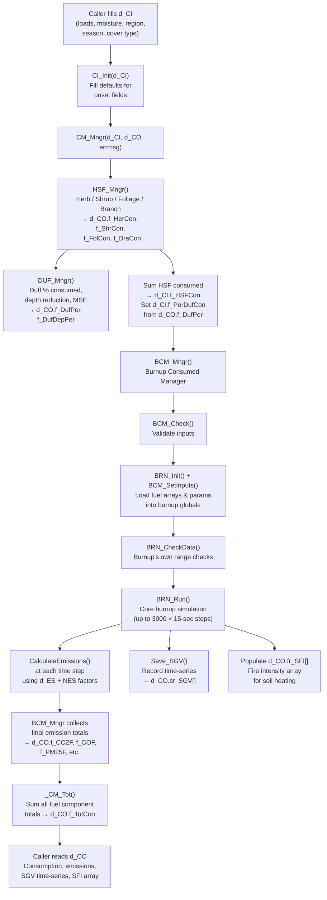
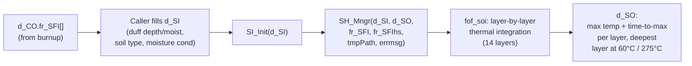
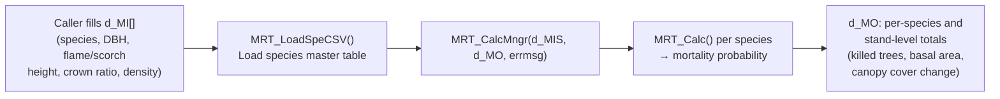

# FOFEM C++ Codebase Reference

**First Order Fire Effects Model (FOFEM)** — C++ scientific modeling library for predicting the effects of wildland fire on forest ecosystems at the stand level.

---

## Architecture Overview

FOFEM is a **procedural C++ library** with a C-compatible API. Despite being compiled as C++, it uses C-style structs passed by pointer rather than OOP classes. All public symbols are wrapped in `extern "C"` blocks for ABI stability.

The library is organized into **three independent modeling domains**, each with its own input/output structs and entry-point manager:

| Domain | Input Struct | Output Struct | Entry Point |
|---|---|---|---|
| Fuel Consumption + Emissions | `d_CI` | `d_CO` | `CM_Mngr()` |
| Soil Heating | `d_SI` | `d_SO` | `SH_Mngr()` |
| Tree Mortality | `d_MI` (per species) | `d_MO` | `MRT_Calc()` |

These domains are **not coupled at the C++ level** — the caller is responsible for passing outputs from one (e.g., fire intensity array from `d_CO`) as inputs to another (e.g., `d_SI.ar_FI`).

---

## Key Files and Responsibilities

### Source Directory: `FOF_UNIX/`

#### Consumption Pipeline

| File | Responsibility |
|---|---|
| `fof_ci.h` / `fof_ci.cpp` | `d_CI` struct — the primary input. Holds all fuel loads (tons/acre), moistures, burn parameters, cover type, region, season, fuel category, and emission group overrides. `CI_Init()` sets defaults; `CI_is*()` helpers check enum-like string fields. |
| `fof_co.h` / `fof_co.cpp` | `d_CO` struct — the primary output. Pre/consumed/post/percent for every fuel component; flaming and smoldering emission totals; the `fr_SFI[]` fire intensity time-series array (6000 slots) used downstream by soil heating. |
| `fof_cm.h` / `fof_cm.cpp` | `CM_Mngr()` — the top-level consumption entry point. Calls `HSF_Mngr()` first (non-burnup calcs), feeds those outputs into burnup inputs (`f_HSFCon`, `f_PerDufCon`), then calls `BCM_Mngr()`. Finishes by summing totals with `_CM_Tot()`. |
| `fof_bcm.h` / `fof_bcm.cpp` | `BCM_Mngr()` — Burnup Consumed Manager. Validates inputs (`BCM_Check`), initializes burnup globals, calls `BCM_SetInputs()` to load fuel arrays, then calls `BRN_Run()`. Collects burnup's emission and consumption outputs back into `d_CO`. |
| `bur_brn.h` / `bur_brn.cpp` | The core burnup simulation engine. `BRN_Run()` integrates fuel combustion over time using `Step()`, `DuffBurn()`, `FireIntensity()`, and `CalculateEmissions()`. Uses global arrays internally (not thread-safe). Writes optional output files if filenames are set in `d_CI`. Contains the `d_ES` emission accumulator struct. |
| `bur_bov.h` / `bur_bov.cpp` | BOV — Burnup Output Values. Collects and exposes burnup's intermediate results (remaining loads per time step) after `BRN_Run()` completes. |
| `fof_hsf.h` / `fof_hsf.cpp` | `HSF_Mngr()` — Herb/Shrub/Foliage/Branch consumption. Runs **before** burnup; its consumed totals (`f_HerCon`, `f_ShrCon`, `f_FolCon`, `f_BraCon`) are summed into `f_HSFCon` which burnup needs for initial fire intensity. |
| `fof_duf.h` / `fof_duf.cpp` | `DUF_Mngr()` — Duff consumption. Dispatches to region-specific equations (`DUF_InteriorWest`, `DUF_SouthEast`, etc.). Outputs percent consumed, depth reduction (inches), and mineral soil exposure (MSE). Called internally by `HSF_Mngr`. |

#### Emissions

| File | Responsibility |
|---|---|
| `fof_nes.h` / `fof_nes.cpp` | New Emission System. Reads `Emission_Factors.csv` at startup via `NES_Read()`. `NES_Get_Factor()` looks up emission factors by group number (1–8) and cover type code. Groups 3/7/8 are the defaults for flaming/smoldering/duff. The 15 kW/m² critical intensity threshold (`e_CriInt`) splits flaming vs. smoldering. |
| `fof_sgv.h` / `fof_sgv.cpp` | SGV — Sub-Gaseous Values. A 1500-slot time-series array capturing emissions and fuel state at each 15-second burnup time step. Populated inside burnup via `Save_SGV()`; read back out by `d_CO.sr_SGV[]`. |
| `Emission_Factors.csv` | Lookup table of emission factors for 200+ chemical species across 8 emission groups and multiple cover type codes. |

#### Soil Heating

| File | Responsibility |
|---|---|
| `fof_sh.h` / `fof_sh.cpp` | `SH_Mngr()` entry point. `d_SI` input struct (duff depth/moisture, soil type, moisture condition, fire intensity array pointer). `d_SO` output struct (max temperature and time-to-max for 14 soil layers, deepest layer reaching 60°C and 275°C). |
| `fof_soi.h` / `fof_soi.cpp` | Low-level soil thermal calculations — heat conduction, moisture content effects, layer-by-layer temperature integration. |
| `fof_sha.h` / `fof_sha.cpp` | Soil heating array management helpers. |

#### Tree Mortality

| File | Responsibility |
|---|---|
| `fof_mrt.h` / `fof_mrt.cpp` | `MRT_Calc()` — per-species mortality probability from scorch height or flame length and DBH. `MRT_LoadSpeCSV()` loads species master table. `MRT_CalcMngr()` accumulates stand-level totals into `d_MO`. |
| `fof_spp.h` | Species codes and FVS index numbers. |
| `fof_cct.h` | Crown coefficient table (`d_CCT`) for canopy cover calculations — indexed by FVS 2-char species code. |

#### Cover Type Classification

| File | Responsibility |
|---|---|
| `fof_ci.h` | Defines cover group string constants (`e_GrassGroup`, `e_Ponderosa`, `e_CoastPlain`, etc.) and their short CSV codes (`e_CVT_*`). |
| `CVT_SAF.cpp`, `CVT_NVCS.cpp`, etc. | Cover type lookup tables mapping SAF/NVCS/FCC/FCCS codes to FOFEM cover groups. |
| `fof_fccs.csv` | FCCS fuel bed data — fuel loads and characteristics for FCCS-classified fuel types. |

#### Support

| File | Responsibility |
|---|---|
| `fof_util.h` / `fof_util.cpp` | Utility functions: unit conversions, string helpers (`xstrcmpi`, `xstrupr` for cross-platform case-insensitive compare), math clamp helpers. |
| `cdf_util.h` / `cdf_util.cpp` | CDF/statistical utilities used in some duff and consumption equations. |
| `fof_ansi.h` | ANSI/cross-platform compatibility macros. |
| `fof_gen.h` | General shared constants. |
| `fof_unix.cpp` | Platform shims for Windows/Unix string functions. |
| `ansi_mai.cpp` | Standalone CLI entry point (`main()`) for the `fofem` executable target. |

#### Build

| File | Responsibility |
|---|---|
| `CMakeLists.txt` | Builds three targets: `fofem` (CLI executable), `fofem_debug_c` (shared lib, C API), `FOFEMd` (shared lib with SWIG C# wrapper). C++11. |
| `SWIG/fofem_csharp.i` | SWIG interface file mapping `d_CI→ConsumeDataInput`, `d_CO→ConsumeDataOutput`, `d_SI→SoilDataInput`, `d_SO→SoilDataOutput`, `CM_Mngr→ConsumeManager`. |
| `SWIG/fofem_csharp_wrap.cxx` | Generated SWIG wrapper (do not edit manually). |

---

## Data Flow

### Consumption + Emissions

### Soil Heating (separate call, uses d_CO outputs)

### Tree Mortality (fully independent)

---

## Implicit Assumptions and Gotchas

### Units are mixed and must be tracked carefully
- Fuel loads in `d_CI` and `d_CO`: **tons per acre (tpa)**
- Burnup works internally in **kg/m²** — `BCM_SetInputs()` converts before passing to `BRN_Run()`
- Emissions in `d_CO`: **pounds per acre**
- SGV time-series (`d_SGV`): **g/m²** for emissions, **kg/m²** for consumed fuel amounts
- Soil depth: **inches** in `d_CI`/`d_CO`, **centimeters** in `d_SO`
- Moisture: whole-number percentages (e.g., `50` not `0.50`)

### Burnup uses global state — not thread-safe
`BRN_Run()` and its callees use module-level global variables (arrays for fuel loads, temperatures, etc.). Calling `BRN_Init()` resets them but there is no mutex. Do not call from multiple threads.

### `d_CI` doubles as both input and inter-module scratch space
`f_HSFCon` and `f_PerDufCon` are documented as inputs to burnup, but in normal usage `CM_Mngr()` **overwrites** them after calling `HSF_Mngr()`. Callers who bypass `CM_Mngr()` and call `BCM_Mngr()` directly must populate these fields themselves.

### Soil heating requires manual wiring
The fire intensity time-series (`d_CO.fr_SFI[]` and `fr_SFIhs[]`) must be passed **explicitly** to `SH_Mngr()`. The consumption and soil heating subsystems do not call each other — the caller bridges them.

### Emission factor groups are integer strings, not enums
Groups are passed as `char[]` strings (`"3"`, `"7"`, `"8"`) to `NES_Get_Factor()`. The default groups are defined in `fof_nes.h` as `e_DefFlaGrp "3"`, `e_DefSmoGrp "7"`, `e_DefDufGrp "8"`. The 15 kW/m² `e_CriInt` threshold determines which group applies to coarse wood; duff always uses the duff group.

### Cover group and classification are separate concepts
`cr_CoverGroup` (e.g., `"Ponderosa"`, `"CoastPlain"`) is the FOFEM-internal routing key that drives which consumption equations get selected. `cr_CoverClass` + a cover type code (SAF/NVCS/FCC/FCCS) is the user-facing classification that maps *to* a cover group via the `CVT_*.cpp` lookup tables. Setting the wrong one silently routes to wrong equations.

### "No ignition" is a valid non-error return
`CM_Mngr()` returns `2` (not `0`) when burnup fails to ignite. In that case `d_CO` consumption fields are zeroed but the struct is otherwise valid. Callers must check the return code, not just test for `!= 0`.

### Duff lower-limit was changed from 0.446 to 0.1 tpa
`e_DufMin` in `fof_ci.h` and `e_wdf1` in `bur_brn.h` must stay in sync (both represent 0.1 tpa / 0.022 kg/m²). A comment in the source acknowledges the original limit was `0.446 tpa`; the change was made in July 2012. If FOFEM is updated, both defines must be changed together.

### Southeast/Coastal Plain litter is handled outside burnup
For SAF types 70, 83, and related Southeast/Coastal Plain cover types, `BCM_Mngr()` computes litter consumption via a regional equation (`LitterSouthEast()`) and passes the result to `d_CO` directly, **overriding** whatever burnup calculated for litter. Burnup still runs with litter loaded so that fire intensity is correct, but the consumed amount is replaced.

### The 1000-hr wood split (3/6/9/20-inch) is a UI convention
`f_DW1000` and `f_pcRot` exist for GUI display. The actual calculations use `f_Snd_DW3/6/9/20` and `f_Rot_DW3/6/9/20`. If calling the library directly (non-GUI), populate the size-class fields directly.

### Batch mode equation override
`cr_BatchEqu = "Yes"` switches `CM_Mngr()` to use duff depth-reduction percent (`f_DufDepPer`) instead of duff load percent (`f_DufPer`) when feeding `f_PerDufCon` to burnup. This is a legacy batch-file behavior and is easily missed.
